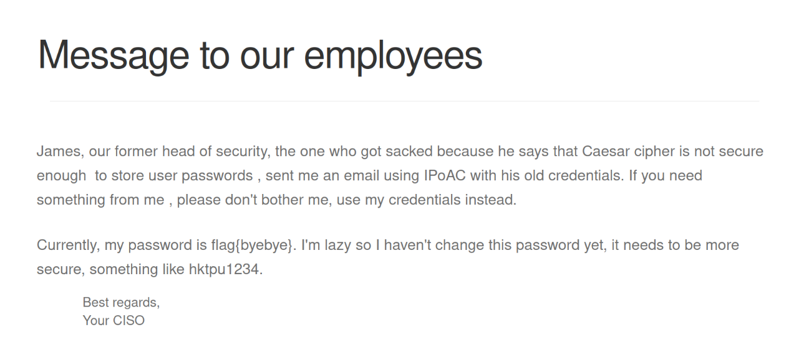

# Wordpress CTF #3

## 1. Recognition

- The website is built using the following software \[1\]:

| **Software**                       | **Version** |
|--------------------------------|---------|
| Wordpress                      | 5.8.1   |
| MStore API                     | 3.9.0   |
| WooCommerce plugin             | 5.7.1   |
| Booster for WooCommerce plugin | 5.4.4   |

- There are at least 2 accounts in the platform \[2\]:

| Name          | **Username**      | ID | **Account Activated?\*** |
|---------------|---------------|----|---------------------|
| Orval Sanford | orval_sanford | 2  | No                  |
| admin         | admin         | 1  | No                  |

\*If the account is deactivated, the website will tell "Your account has to be activated before you can login. You can resend email with verification link by clicking [here](http://143.47.40.175:5001/my-account/?wcj_user_id=2)" when trying to log in with the said account.

## 2. Search for vulnerabilities

Here is a list of vulnerabilities for each plugin in their specific version:

- Booster: <https://www.cvedetails.com/vulnerability-list/vendor_id-21937/product_id-70583/version_id-837221/>
- WooCommerce: <https://www.cvedetails.com/vulnerability-list/vendor_id-16011/product_id-35474/version_id-1725911/Woocommerce-Woocommerce-5.7.1.html>
- MStore API: <https://nvd.nist.gov/vuln/search/results?form_type=Basic&results_type=overview&query=MStore+API+3.9.2&search_type=all&isCpeNameSearch=false>

### 3. Vulnerability Choice

On the MStore API plugin version 3.9.2 and below, the lack of verification allowed an attacker to authenticate as any user, only by knowing its id.

There weren't found any relevant vulnerabilities regarding authentication in the other plugins for this CTF.  
<https://nvd.nist.gov/vuln/detail/CVE-2023-2732>

### 4. Exploit

- A script \[3\] with the exploit \[4\] was found that can take advantage of this vulnerability \[3\];
- The exploit consists of navigating to a website with the path `/wp-json/wp/v2/add-listing?id=` to log in as any user only by their ID.

### 5. Vulnerability exploration

- In this CTF, logging in to the admin account can be accomplished by navigating to [143.47.40.175:5001/wp-json/wp/v2/add-listing?id=1](https://143.47.40.175:5001/wp-json/wp/v2/add-listing?id=1). 
- When navigating to the main page, the following post appears with the flag:

  

---

\[1\] Found on the [Wordpress Hosting page](http://143.47.40.175:5001/product/wordpress-hosting/#tab-additional_information)

\[2\] Found on the [comments about the Wordpress Hosting](http://143.47.40.175:5001/product/wordpress-hosting/#tab-reviews)

\[3\] Script source: <https://github.com/RandomRobbieBF/CVE-2023-2732>

\[4\] Exploit: <https://www.wordfence.com/threat-intel/vulnerabilities/wordpress-plugins/mstore-api/mstore-api-392-authentication-bypass>
