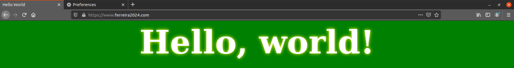
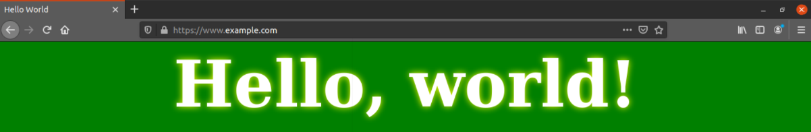

# Logbook #11

> Environment Setup:
>
> - Add server names to `/etc/hosts` file:
>   ```bash
>   # For the PKI Lab
>   10.9.0.80       www.ferreira2024.com
>   10.9.0.80       www.ferreira2024.com
>   ```

## Task 1: Becoming a Certificate Authority (CA)

1. Uncomment "unique_subject = no" in the configuration file openssl configuration file at /usr/lib/ssl/openssl.cnf.

2. Create a new folder to store CA related files:

   ```bash
   $ mkdir demoCA
   $ cd demoCA
   $ mkdir newcerts
   $ touch index.txt
   $ echo 1000 > serial
   $ touch serial
   $ vim serial   # write 1000 in the file
   ```

3. Generate the root certificate:

   ```bash
   $ openssl req -x509 -newkey rsa:4096 -sha256 -days 3650 -keyout ca.key -out ca.crt
   Generating a RSA private key
   .....................................................................................................................................++++
   ...............................................................................................................................................................................................++++
   writing new private key to 'ca.key'
   Enter PEM pass phrase:
   Verifying - Enter PEM pass phrase:  # The pass phrase is "l02g06"
   -----
   You are about to be asked to enter information that will be incorporated
   into your certificate request.
   What you are about to enter is what is called a Distinguished Name or a DN.
   There are quite a few fields but you can leave some blank
   For some fields there will be a default value,
   If you enter '.', the field will be left blank.
   -----
   Country Name (2 letter code) [AU]:PT
   State or Province Name (full name) [Some-State]:.
   Locality Name (eg, city) []:Porto
   Organization Name (eg, company) [Internet Widgits Pty Ltd]:FSI
   Organizational Unit Name (eg, section) []:.
   Common Name (e.g. server FQDN or YOUR name) []:PKI SeedLab
   Email Address []:.
   ```

4. See the decoded contents of X509 certificate:

   ```bash
   $ openssl x509 -in ca.crt -text -noout
   Certificate:
    Data:
        Version: 3 (0x2)
        Serial Number:
            37:b4:4c:72:96:c7:90:8f:9c:9e:97:4a:ef:5e:07:41:5b:7a:47:c7
        Signature Algorithm: sha256WithRSAEncryption
        Issuer: C = PT, L = Porto, O = FSI, CN = PKI SeedLab
        Validity
            Not Before: Dec 12 08:04:39 2024 GMT
            Not After : Dec 10 08:04:39 2034 GMT
        Subject: C = PT, L = Porto, O = FSI, CN = PKI SeedLab
        Subject Public Key Info:
            Public Key Algorithm: rsaEncryption
                RSA Public-Key: (4096 bit)
                Modulus:
                    00:e2:5e:c0:41:78:c4:81:3f:d7:a0:60:0a:3a:8d:
                    6a:94:4e:e1:5e:8a:5c:aa:9c:3f:a1:d9:16:18:74:
                    e7:22:48:d3:ab:09:55:4f:11:26:f0:a2:2a:78:98:
                    2a:6c:ed:09:58:0d:6f:b0:6e:80:20:ad:6c:f8:76:
                    21:1f:55:63:8e:42:99:c2:c6:bf:c2:80:9a:1e:16:
                    65:32:6c:bd:03:c3:e7:68:fd:b8:f5:23:7d:4d:03:
                    95:f1:54:0c:1f:d3:fe:f9:e0:15:fb:a0:bc:a9:7b:
                    b1:bc:18:5c:70:e2:70:5e:ff:bb:a8:74:ab:8b:2f:
                    50:cb:9c:76:bf:56:90:e4:1f:a9:b0:cb:66:2f:43:
                    8a:1a:74:d3:50:b1:6f:ec:f7:b8:c6:e0:e2:d4:b0:
                    92:61:47:6c:5d:3b:0d:2c:4f:11:a0:da:0f:bf:73:
                    19:78:4a:22:42:59:cd:47:bb:2a:49:79:aa:f0:31:
                    3b:3d:21:90:82:d1:81:3a:15:18:02:18:57:c2:12:
                    fe:cf:c9:9d:5a:aa:b2:ac:da:8e:b8:52:86:d8:b8:
                    f7:ba:e3:85:f3:31:8e:c0:09:04:cf:99:4c:5a:5c:
                    7f:f8:33:c3:f6:8f:b0:c7:1a:a9:44:3c:25:0f:73:
                    60:d0:6a:c3:d3:38:14:11:bc:2d:d9:8d:94:fc:81:
                    47:96:0b:e8:23:5b:97:66:7f:b9:8e:b1:4a:43:03:
                    84:72:f3:c1:2b:cf:cd:6c:00:7f:ab:bb:2c:19:e6:
                    2a:5f:33:9c:8e:f1:bc:0b:47:63:25:41:ad:9d:3f:
                    56:fe:59:d8:ec:e7:52:07:47:1f:19:6d:28:62:d4:
                    5f:b0:11:91:ce:5a:35:03:98:6f:0c:12:00:d7:a3:
                    8f:77:fe:22:05:a6:cd:af:55:84:09:a0:a3:b5:41:
                    75:4f:3f:4c:cf:7d:82:17:23:39:68:dd:6a:f5:9d:
                    93:50:a8:80:18:36:4a:43:74:fb:c3:c0:f7:24:3a:
                    01:a5:63:f2:c3:8f:b3:4b:6f:55:9d:e9:66:93:e2:
                    b5:1b:69:26:7b:f2:f9:a2:1d:f1:c5:0a:7a:51:15:
                    89:14:97:15:29:f0:88:3e:4f:ef:18:69:34:c8:b2:
                    2e:43:d8:f1:4d:1b:90:87:18:01:36:b5:c9:01:b3:
                    bd:85:7a:b8:0d:ee:2e:ff:9f:0d:86:9b:1b:4b:51:
                    1f:ce:c6:2c:f1:2e:df:1b:5c:cf:24:50:6b:9c:f0:
                    de:3d:06:a0:42:f4:75:2e:88:0d:73:34:d3:89:28:
                    fe:9f:a4:03:cd:61:2e:34:d3:31:5a:5d:59:72:f1:
                    2b:be:29:c9:e0:0f:86:4f:ff:58:7e:ec:5f:26:d2:
                    7c:a2:d9
                Exponent: 65537 (0x10001)
        X509v3 extensions:
            X509v3 Subject Key Identifier:
                1F:8E:C9:0B:8A:2C:0E:CD:9B:A6:FB:4B:51:DB:CD:BE:EF:11:B5:4C
            X509v3 Authority Key Identifier:
                keyid:1F:8E:C9:0B:8A:2C:0E:CD:9B:A6:FB:4B:51:DB:CD:BE:EF:11:B5:4C

            X509v3 Basic Constraints: critical
                CA:TRUE
    Signature Algorithm: sha256WithRSAEncryption
         4d:ac:83:25:11:52:43:75:24:19:a7:64:1f:f8:0a:18:70:aa:
         6c:6e:3a:3d:bf:6a:ab:d5:60:ae:c0:82:4f:89:fb:cf:91:f1:
         37:fc:51:ca:6d:70:94:c0:96:f0:73:fb:4b:86:f4:b1:8d:56:
         9a:4d:3d:77:2f:bf:9d:85:ad:17:b5:79:5e:51:50:e5:f8:c0:
         0b:29:a6:52:f5:73:5e:52:92:79:d2:e4:76:7c:6d:fc:0d:f4:
         c0:24:c5:53:4b:a5:55:40:36:40:dd:6b:46:48:8e:44:f8:8c:
         fe:03:f8:3f:5f:94:8e:c2:1a:f5:cf:64:c6:61:33:35:3e:99:
         1f:5a:46:03:7e:c4:cd:04:0f:fe:da:a5:10:44:2f:01:d2:f1:
         0f:8a:11:90:53:55:54:6b:8c:74:33:5c:e4:24:97:d3:07:55:
         14:ea:d5:87:8e:b8:19:15:0f:a9:35:2a:f4:1f:81:9b:55:a8:
         52:8d:7e:8f:f3:ad:47:59:4a:ed:80:65:f9:de:f0:fe:4d:1e:
         0d:64:5d:bc:f8:fc:5a:a7:30:71:3c:f7:98:d6:7d:79:7c:cf:
         e1:dd:ab:14:7e:03:42:39:d3:ff:e9:8d:73:1a:d3:60:77:e7:
         44:d7:65:9f:7f:20:77:5f:8d:d9:27:89:b2:7a:6f:60:e3:fb:
         2a:d5:58:5a:64:c9:55:52:fb:b8:91:0f:64:78:fd:4f:69:f3:
         ae:09:c6:95:5e:66:4f:e9:ea:f5:ac:b1:ea:20:d2:5a:90:0f:
         4d:04:e7:fc:36:64:a4:87:26:3b:cf:62:ce:44:b7:44:8e:59:
         97:48:8f:de:c5:7d:a1:aa:e1:30:f6:a8:9c:d2:e8:d6:f2:ab:
         a8:a5:52:78:24:6f:9b:aa:c7:59:b0:e0:c0:38:42:85:f0:b2:
         d9:40:a3:0f:73:31:d5:00:6d:13:89:34:02:b7:8a:e1:1f:ae:
         e4:23:46:0c:0d:67:56:d5:79:55:e5:3a:3a:a5:dc:f2:6a:8f:
         46:cc:25:b7:b1:51:c8:61:9b:e4:b3:b0:fc:6d:5d:9f:58:ec:
         9d:2e:9a:91:fc:00:82:96:dd:97:91:67:98:9c:be:b6:32:3f:
         0a:eb:3e:52:af:f4:ae:63:10:a7:d8:84:30:7d:4f:ef:05:61:
         6f:d4:55:1a:ca:7a:3d:36:e9:9f:01:aa:27:2f:64:cd:aa:82:
         80:71:b7:53:f2:96:54:ce:5a:83:bd:32:f9:b9:41:dc:67:a0:
         c5:42:f2:0f:97:63:3e:26:39:a3:53:cb:b0:92:88:4e:50:32:
         d4:9c:b8:fa:cd:75:2b:54:58:d4:49:69:c0:b6:73:87:7d:1b:
         a2:66:e6:71:4a:de:03:86
   ```

   ```bash
   $ openssl rsa -in ca.key -text -noout
   Enter pass phrase for ca.key:          # The pass phrase is "l02g06"
   RSA Private-Key: (4096 bit, 2 primes)
   modulus:
      00:e2:5e:c0:41:78:c4:81:3f:d7:a0:60:0a:3a:8d:
      6a:94:4e:e1:5e:8a:5c:aa:9c:3f:a1:d9:16:18:74:
      e7:22:48:d3:ab:09:55:4f:11:26:f0:a2:2a:78:98:
      2a:6c:ed:09:58:0d:6f:b0:6e:80:20:ad:6c:f8:76:
      21:1f:55:63:8e:42:99:c2:c6:bf:c2:80:9a:1e:16:
      65:32:6c:bd:03:c3:e7:68:fd:b8:f5:23:7d:4d:03:
      95:f1:54:0c:1f:d3:fe:f9:e0:15:fb:a0:bc:a9:7b:
      b1:bc:18:5c:70:e2:70:5e:ff:bb:a8:74:ab:8b:2f:
      50:cb:9c:76:bf:56:90:e4:1f:a9:b0:cb:66:2f:43:
      8a:1a:74:d3:50:b1:6f:ec:f7:b8:c6:e0:e2:d4:b0:
      92:61:47:6c:5d:3b:0d:2c:4f:11:a0:da:0f:bf:73:
      19:78:4a:22:42:59:cd:47:bb:2a:49:79:aa:f0:31:
      3b:3d:21:90:82:d1:81:3a:15:18:02:18:57:c2:12:
      fe:cf:c9:9d:5a:aa:b2:ac:da:8e:b8:52:86:d8:b8:
      f7:ba:e3:85:f3:31:8e:c0:09:04:cf:99:4c:5a:5c:
      7f:f8:33:c3:f6:8f:b0:c7:1a:a9:44:3c:25:0f:73:
      60:d0:6a:c3:d3:38:14:11:bc:2d:d9:8d:94:fc:81:
      47:96:0b:e8:23:5b:97:66:7f:b9:8e:b1:4a:43:03:
      84:72:f3:c1:2b:cf:cd:6c:00:7f:ab:bb:2c:19:e6:
      2a:5f:33:9c:8e:f1:bc:0b:47:63:25:41:ad:9d:3f:
      56:fe:59:d8:ec:e7:52:07:47:1f:19:6d:28:62:d4:
      5f:b0:11:91:ce:5a:35:03:98:6f:0c:12:00:d7:a3:
      8f:77:fe:22:05:a6:cd:af:55:84:09:a0:a3:b5:41:
      75:4f:3f:4c:cf:7d:82:17:23:39:68:dd:6a:f5:9d:
      93:50:a8:80:18:36:4a:43:74:fb:c3:c0:f7:24:3a:
      01:a5:63:f2:c3:8f:b3:4b:6f:55:9d:e9:66:93:e2:
      b5:1b:69:26:7b:f2:f9:a2:1d:f1:c5:0a:7a:51:15:
      89:14:97:15:29:f0:88:3e:4f:ef:18:69:34:c8:b2:
      2e:43:d8:f1:4d:1b:90:87:18:01:36:b5:c9:01:b3:
      bd:85:7a:b8:0d:ee:2e:ff:9f:0d:86:9b:1b:4b:51:
      1f:ce:c6:2c:f1:2e:df:1b:5c:cf:24:50:6b:9c:f0:
      de:3d:06:a0:42:f4:75:2e:88:0d:73:34:d3:89:28:
      fe:9f:a4:03:cd:61:2e:34:d3:31:5a:5d:59:72:f1:
      2b:be:29:c9:e0:0f:86:4f:ff:58:7e:ec:5f:26:d2:
      7c:a2:d9
   publicExponent: 65537 (0x10001)
   privateExponent:
      00:a5:7b:48:a6:54:07:aa:c8:a5:f3:aa:61:af:de:
      13:6c:a9:a1:5d:00:5e:af:a6:1b:6a:50:8d:33:81:
      ba:39:b8:ed:6b:9a:1e:0f:f7:e4:f4:82:47:f3:f2:
      a1:09:11:db:03:d0:86:b6:7e:81:11:e2:55:c7:e8:
      6b:5c:41:8a:ce:c3:67:2e:19:26:b3:a4:59:85:e7:
      2f:41:46:76:82:9b:22:bf:00:c3:c6:08:94:9f:c9:
      20:42:d4:03:2c:fd:47:e7:18:e6:59:15:6e:f5:a2:
      e4:12:31:e8:d9:e8:de:e6:c3:a2:46:8a:4b:a1:2b:
      0c:b0:5c:07:fe:e5:e4:73:af:a5:d8:05:49:05:02:
      25:a2:23:87:1a:f5:2b:72:1a:c1:ac:39:57:f8:cd:
      bf:a4:77:97:03:2c:98:fb:ac:2d:a1:dd:e7:27:38:
      98:04:f4:84:c8:e6:67:07:aa:0e:46:ba:37:b8:f0:
      f4:72:42:e8:26:89:cb:23:4f:aa:46:55:cf:49:a3:
      a3:3c:f9:11:1b:e7:af:48:67:59:6f:eb:7c:82:4f:
      ed:61:64:d4:56:2d:03:42:e5:14:ec:42:0f:ab:fa:
      f4:dd:d7:d1:c8:9b:d0:4a:2c:f6:52:58:79:6b:2b:
      18:3a:23:e2:55:b5:28:0e:b2:f6:fd:93:df:b7:1b:
      36:dd:5c:7a:c8:ef:94:3a:c5:2c:f0:35:0a:1c:c9:
      e2:ac:13:a3:80:81:be:32:7a:29:a9:a5:58:58:71:
      53:5d:a9:45:48:bb:bf:46:19:61:5c:58:a5:1a:60:
      c8:a1:57:53:dd:30:3f:cf:6f:10:65:b8:8a:46:0c:
      04:35:42:e9:ba:1b:d1:50:1e:5d:9d:60:b1:cd:4f:
      3c:fa:e5:1d:19:8d:68:2e:4f:25:ee:74:e6:a6:ee:
      7b:87:3d:51:6c:16:4e:36:5d:3a:b5:c0:ef:b2:c6:
      96:ba:e9:7e:6c:4f:6b:7c:1b:2e:ba:ca:c6:fb:41:
      62:db:3d:ba:31:c5:e3:80:53:43:f5:0d:e7:21:28:
      89:42:86:63:d3:47:c2:6e:3f:44:a3:93:30:2b:0e:
      34:e8:3f:6b:f0:32:84:9f:37:d6:3e:d8:1b:16:0f:
      ca:8d:ad:26:eb:94:11:cf:1e:25:f9:6f:21:c6:04:
      f3:11:15:31:f7:38:42:47:0e:4a:fe:c5:92:97:ea:
      70:03:cd:b5:42:87:08:28:e7:a7:d9:4d:0b:89:5e:
      3b:73:68:cf:08:63:65:30:5e:57:e7:33:5c:f0:64:
      f2:b1:f7:f9:06:38:0b:89:ec:a6:6e:82:be:4b:67:
      68:d6:cf:6f:0a:71:1b:10:e4:41:a5:f4:9a:51:b9:
      68:4e:b5
   prime1:
      00:f5:d0:58:4a:14:16:19:10:73:e1:3e:ae:f9:fe:
      52:0d:8b:27:1c:f9:b9:b0:98:73:37:73:47:1a:5f:
      6f:47:72:6d:db:65:3f:8d:97:7e:e7:25:68:2e:a8:
      52:2a:17:19:9b:f4:4e:45:6b:6f:d6:8a:85:b8:57:
      93:98:5a:2b:4a:6d:6d:bd:83:24:2c:1a:dc:ef:4b:
      af:4e:7d:0e:02:b5:a9:4b:cd:eb:3d:1d:45:f2:07:
      b5:54:06:30:1b:1f:f5:e2:1b:83:7f:c7:cf:42:af:
      f8:fb:c9:18:e9:8d:f0:34:7a:cb:4b:11:1a:f5:52:
      bf:7e:35:9d:cd:5a:c4:b0:9c:31:b0:70:d6:d5:ed:
      82:df:b0:d3:8c:1e:31:fc:f9:b9:bf:c0:e2:8d:b3:
      67:92:02:a2:83:51:f1:d1:95:aa:52:1e:54:40:98:
      7a:af:a4:b4:4c:ac:f8:7f:c0:4c:b5:33:55:bd:fd:
      4c:cd:8c:91:4b:d3:02:25:7b:63:3a:c7:9c:21:2f:
      04:48:7c:8b:ac:91:34:4f:d1:d4:4a:96:3f:8a:3b:
      ad:0a:95:bd:c8:a2:60:29:ea:a9:31:bd:a4:e0:ca:
      06:11:60:31:e8:d1:8c:10:38:09:46:97:d5:59:14:
      09:43:d3:98:8f:2d:35:bc:08:d1:9c:5d:43:78:52:
      f6:8b
   prime2:
      00:eb:c0:24:66:03:7b:03:52:60:d6:c1:41:c7:a9:
      cd:3a:ca:23:6d:70:34:95:76:b2:f9:da:f5:66:ef:
      95:2e:87:da:84:16:a1:df:4c:7f:8b:45:d1:e9:96:
      e8:d8:84:c6:06:a6:2f:e4:df:ed:c9:8c:f2:d1:85:
      64:80:b4:1e:40:95:a6:aa:db:c5:1c:45:c1:6a:aa:
      ee:f5:f9:a0:29:12:9c:b7:6d:16:1b:77:cb:6b:90:
      79:63:8c:61:1c:f0:25:18:0d:47:23:13:6c:41:b6:
      59:0b:f7:33:34:fd:8a:13:e3:01:d8:a6:ff:ca:d8:
      a6:04:be:a1:5b:be:97:38:5c:85:02:f6:96:77:70:
      35:61:52:ae:67:9b:57:d6:c9:46:0b:50:98:d7:ee:
      f2:b1:04:c9:a3:ef:7b:b8:d3:62:b7:a8:bf:4f:c6:
      12:79:a8:07:c5:44:c2:4b:00:ab:fd:a6:65:5d:15:
      11:f0:b6:03:90:ef:de:6a:66:86:45:23:2c:7b:0b:
      18:76:da:bb:45:20:f0:08:ba:0b:40:c3:15:28:95:
      13:d3:e8:c9:2e:35:7a:d3:3d:e6:20:c0:6d:fe:91:
      14:64:e3:6d:b9:72:56:7b:61:59:08:9f:b7:44:04:
      6a:61:d9:dd:09:93:80:56:5f:b3:6f:4e:d3:ae:68:
      5c:ab
   exponent1:
      00:b3:0c:dc:92:b1:08:db:9e:f1:59:7b:a8:46:ae:
      aa:23:f5:5d:3b:2c:e7:c6:2b:75:99:49:5d:dc:66:
      f1:8e:90:5a:56:f9:ec:0d:fd:f0:d0:fb:9d:64:86:
      f4:ba:75:f3:10:77:26:e0:47:fe:c1:be:4a:e2:d8:
      df:c8:94:bd:7d:cc:31:a8:5e:32:e5:f1:77:46:d2:
      d1:52:11:a3:37:f4:0c:ea:0b:87:33:0f:f4:97:f4:
      67:6f:59:c6:86:ab:84:15:fb:c6:90:38:01:cf:68:
      90:ab:0e:73:18:04:6c:98:3d:6d:81:33:67:78:94:
      9a:a9:9a:f2:63:d7:9e:f7:a9:fe:43:b0:1d:bc:db:
      f1:7d:70:b6:d7:14:53:83:1a:7f:e3:9d:e3:28:26:
      2a:e5:df:07:73:32:28:3b:6a:92:12:98:c6:f3:fa:
      5d:3b:3d:74:9b:79:4e:d4:f7:44:a8:a4:48:eb:47:
      eb:3e:ba:0a:47:b9:de:91:60:cc:09:cf:c5:f9:21:
      df:33:d1:8c:87:d9:88:ca:2f:64:3c:24:2f:0a:48:
      a7:a5:d3:26:d7:52:f7:4a:f1:03:e7:18:65:55:db:
      b2:09:cc:10:ee:ae:5c:20:a0:40:99:6c:15:5a:7a:
      4e:b9:5a:12:81:10:04:58:ff:ef:76:bf:34:5b:1b:
      cb:3b
   exponent2:
      00:a4:cf:56:a2:da:9c:0c:de:72:44:b0:26:44:67:
      38:ca:78:b5:fb:b4:0d:8e:cf:c4:9f:57:ab:67:a2:
      e6:2f:f9:59:92:2e:20:4b:f3:36:d7:2e:a0:69:24:
      ce:f3:4f:1f:01:56:fc:f4:8c:77:b8:07:89:59:60:
      5f:ba:7a:31:0c:05:92:d6:af:7d:45:1e:9e:f0:eb:
      3e:d3:47:07:e8:ae:d2:50:89:3a:83:49:64:34:76:
      73:e6:5c:25:28:0d:da:60:ce:27:85:25:f6:f0:99:
      81:f7:13:82:00:f1:9e:ad:f8:6d:3a:00:c5:a2:11:
      83:3e:9d:e6:40:35:25:92:89:5b:93:8e:bf:f2:0f:
      c7:c1:9a:03:c2:fa:9e:95:d1:6f:de:49:22:11:13:
      43:26:ed:a9:e9:a9:6a:5c:f3:aa:77:aa:c8:d4:04:
      2c:b6:4f:f9:de:b7:0a:fd:54:22:e8:d8:82:d4:67:
      fe:7a:c1:44:0c:f7:24:0e:4e:4e:5f:d7:0f:29:95:
      c0:2c:97:0d:84:6e:5a:60:3f:6f:ce:7e:93:34:23:
      c4:10:c9:14:9b:f1:57:44:86:69:73:4c:13:99:7b:
      e3:3e:04:a0:98:9c:8e:49:02:ed:33:52:34:d4:a0:
      21:9e:f6:a7:c8:22:0d:fe:54:39:24:ff:7e:8c:d6:
      f8:b1
   coefficient:
      00:d9:27:7e:61:08:26:9c:c0:30:fd:1c:61:2e:80:
      c8:c3:0b:4a:87:f2:21:7b:ce:9b:65:6c:44:fc:cd:
      00:c4:c5:fe:2d:a9:65:c2:3e:e5:67:70:59:70:44:
      14:ca:a5:6a:8d:1a:15:29:77:d3:77:57:93:cd:ae:
      c5:27:81:d9:94:3f:3d:26:a4:5f:4b:62:0d:8f:08:
      c9:e0:17:25:13:14:05:45:8e:79:e6:5d:aa:ae:98:
      53:35:c6:44:3e:09:31:b0:e9:c5:a5:2f:aa:2c:30:
      65:1a:d8:49:b1:48:dc:5d:df:34:53:09:bf:77:60:
      dd:07:29:b5:9f:f8:66:b7:08:be:51:02:63:f6:7b:
      bd:88:3d:95:b9:0c:ae:c1:ab:30:1b:8f:e7:18:be:
      66:26:80:82:5d:3a:a7:aa:60:d0:a9:38:a9:4e:ad:
      73:9d:78:76:56:9c:9e:08:77:1b:4a:42:da:35:3d:
      bf:86:5f:7f:ef:57:91:a2:c6:7c:51:90:ff:24:f4:
      8f:e5:6c:31:ed:e5:0c:d0:f8:b7:94:59:55:1e:7f:
      2c:77:d8:5e:5c:ac:f8:30:89:2b:85:0e:81:5f:cf:
      85:7a:12:48:c8:6e:59:3a:d6:1e:53:60:63:27:cd:
      4e:66:1b:b4:9f:44:1d:25:50:6a:d0:47:f5:21:05:
      a5:4f
   ```

#### What part of the certificate indicates this is a CA’s certificate?

The `X509v3 Basic Constraints` extension indicates that this is a CA certificate, as it has the value `CA:TRUE`.

#### What part of the certificate indicates this is a self-signed certificate?

The `issuer` and the `subject` of the certificate, that are identical.

#### In the RSA algorithm, we have a public exponent e, a private exponent d, a modulus n, and two secret numbers p and q, such that n = pq. Please identify the values for these elements in your certificate and key files.

- `e`: 65537 (0x10001)
- `d`: 00:a5:7b:48:a6:54:07:aa:... (Found in the private exponent field of the key file)
- `n`: 00:e2:5e:c0:41:78:c4:81:... (Found in the modulus field of the key file)
- `p`: 00:f5:d0:58:4a:14:16:19:... (Found in the prime1 field of the key file)
- `q`: 00:eb:c0:24:66:03:7b:03:... (Found in the prime2 field of the key file)

## Task 2: Generating a Certificate Request for Your Web Server

1. Generate a certificate request for the web server:
   ```bash
   openssl req -newkey rsa:2048 -sha256 \
      -keyout server.key -out server.csr \
      -subj "/CN=www.ferreira2024.com/O=Ferreira2024 Inc./C=US" \
      -passout pass:dees \
      -addext "subjectAltName = DNS:www.ferreira2024.com, \
                                DNS:www.ferreira2024A.com, \
                                DNS:www.ferreira2024B.com"
   ```

The decoded contents of the certificate request are as follows:

```bash
$ openssl req -in server.csr -text -noout
Certificate Request:
    Data:
        Version: 1 (0x0)
        Subject: CN = www.ferreira2024.com, O = Ferreira2024 Inc., C = US
        Subject Public Key Info:
            Public Key Algorithm: rsaEncryption
                RSA Public-Key: (2048 bit)
                Modulus:
                    00:e0:da:e9:cb:4c:2a:87:78:00:30:71:ac:f9:75:
                    7e:3d:b0:1c:db:9d:f7:de:32:cc:e5:20:88:0a:f1:
                    65:6b:ef:9f:40:83:c2:41:18:28:f2:75:d6:7f:a4:
                    2d:16:ee:63:d8:af:bf:bc:92:a8:3e:83:d6:a0:c0:
                    10:f2:88:41:3d:b4:3c:b0:a3:4f:82:67:7f:61:50:
                    80:db:04:7d:0d:07:eb:ab:07:a0:01:f5:57:7c:43:
                    a6:47:0e:40:6a:e8:28:19:f8:36:9d:e0:18:24:aa:
                    33:f4:f4:a0:7d:74:4f:d5:43:f3:4b:a8:b6:a5:fa:
                    de:70:a0:f0:ad:95:8f:37:60:48:10:1c:42:b5:58:
                    97:5b:83:d3:b6:77:f6:02:c2:4f:8a:73:56:00:ee:
                    e5:8a:4a:05:7d:ac:83:d1:14:60:e0:7a:ec:b0:0e:
                    a4:b3:af:5c:f7:8a:83:c4:2f:8c:87:a3:6b:3e:c0:
                    c2:8c:5a:8f:a7:5f:38:f5:04:38:a3:c0:11:16:ed:
                    c7:55:ae:fc:77:a7:9a:4a:c3:73:31:90:62:de:15:
                    04:f5:6f:83:98:98:82:9a:01:25:b6:97:e3:6f:b2:
                    bf:a3:52:b9:33:05:46:b5:f7:8e:00:4a:0b:97:76:
                    76:94:ea:cb:36:34:5f:d7:81:2a:14:15:96:0c:5c:
                    17:f1
                Exponent: 65537 (0x10001)
        Attributes:
        Requested Extensions:
            X509v3 Subject Alternative Name:
                DNS:www.ferreira2024.com, DNS:www.ferreira2024A.com, DNS:www.ferreira2024B.com
    Signature Algorithm: sha256WithRSAEncryption
         84:90:39:15:35:e5:46:fe:c3:f4:9f:36:24:b3:ff:de:71:e1:
         3e:ed:4f:fd:7e:13:68:9d:b8:9b:1e:07:cc:93:c7:07:05:aa:
         1d:7b:a4:93:1a:2f:a5:38:1e:90:f9:a3:42:82:4c:03:10:89:
         0e:81:ed:10:e3:6d:0b:ff:a4:17:25:43:87:8a:45:71:3f:06:
         31:0f:23:dc:fd:f2:f2:3f:df:f6:6e:ac:ba:43:8f:31:91:51:
         19:8c:4d:40:6c:8f:4b:06:a7:b7:86:b7:c7:2b:35:7e:10:79:
         f9:c6:1b:c0:2a:90:21:c0:fd:8c:dc:aa:19:a9:62:83:00:81:
         e9:02:52:a4:01:5e:e7:be:34:94:7c:68:20:10:8a:de:1b:18:
         10:f7:60:26:a4:f1:83:07:6d:21:8e:b2:99:60:ab:de:1f:18:
         50:83:e3:ad:fb:40:01:79:cf:8a:27:a0:48:83:3b:54:a1:1e:
         d2:bc:1a:b4:e6:6f:a2:80:34:c5:b5:32:d6:92:21:76:09:b3:
         7a:8e:59:ed:33:d9:f1:2c:cd:b0:9e:c3:d5:ad:3d:62:88:f9:
         90:17:11:17:e7:f8:ac:c6:af:66:53:46:09:dd:f2:0a:f5:74:
         fe:30:22:0c:8d:2c:00:4a:61:e6:86:30:ee:91:3d:80:fe:6d:
         ba:3b:7d:49
```

```bash
$ openssl rsa -in server.key -text -noout
Enter pass phrase for server.key:
RSA Private-Key: (2048 bit, 2 primes)
modulus:
    00:e0:da:e9:cb:4c:2a:87:78:00:30:71:ac:f9:75:
    7e:3d:b0:1c:db:9d:f7:de:32:cc:e5:20:88:0a:f1:
    65:6b:ef:9f:40:83:c2:41:18:28:f2:75:d6:7f:a4:
    2d:16:ee:63:d8:af:bf:bc:92:a8:3e:83:d6:a0:c0:
    10:f2:88:41:3d:b4:3c:b0:a3:4f:82:67:7f:61:50:
    80:db:04:7d:0d:07:eb:ab:07:a0:01:f5:57:7c:43:
    a6:47:0e:40:6a:e8:28:19:f8:36:9d:e0:18:24:aa:
    33:f4:f4:a0:7d:74:4f:d5:43:f3:4b:a8:b6:a5:fa:
    de:70:a0:f0:ad:95:8f:37:60:48:10:1c:42:b5:58:
    97:5b:83:d3:b6:77:f6:02:c2:4f:8a:73:56:00:ee:
    e5:8a:4a:05:7d:ac:83:d1:14:60:e0:7a:ec:b0:0e:
    a4:b3:af:5c:f7:8a:83:c4:2f:8c:87:a3:6b:3e:c0:
    c2:8c:5a:8f:a7:5f:38:f5:04:38:a3:c0:11:16:ed:
    c7:55:ae:fc:77:a7:9a:4a:c3:73:31:90:62:de:15:
    04:f5:6f:83:98:98:82:9a:01:25:b6:97:e3:6f:b2:
    bf:a3:52:b9:33:05:46:b5:f7:8e:00:4a:0b:97:76:
    76:94:ea:cb:36:34:5f:d7:81:2a:14:15:96:0c:5c:
    17:f1
publicExponent: 65537 (0x10001)
privateExponent:
    78:06:82:fc:01:19:46:9c:d8:c5:03:39:09:24:1d:
    92:02:3b:35:43:fa:76:c2:79:3a:e9:85:95:09:cc:
    50:b4:65:36:c3:de:62:6e:ea:14:9a:b0:38:0c:44:
    01:54:99:39:a6:7e:db:c3:11:49:e5:88:20:e0:c5:
    6b:21:2e:6a:28:96:a8:d7:53:ee:d1:1e:5e:ac:e1:
    4b:87:f6:d4:88:e0:d4:b7:ca:42:a1:5a:e4:bb:1b:
    bc:1c:30:68:a0:aa:1f:4a:ae:a4:d1:65:31:d5:24:
    cc:e1:f3:f5:63:ab:e5:b4:52:df:95:1c:82:37:0a:
    9b:e6:5c:f2:db:bd:ca:19:7b:d9:f3:9e:78:1a:bd:
    aa:b8:ca:ea:0d:1f:59:7a:65:84:74:70:2a:02:53:
    c5:7b:10:9a:78:9e:a8:03:dc:7b:d7:2b:13:fa:75:
    ef:e1:0d:b9:86:1c:c2:a1:34:fe:03:9b:91:07:38:
    ce:34:45:6c:b3:f9:b6:af:66:26:2e:45:2a:5f:2b:
    36:6e:c3:27:1d:67:71:5c:e9:dd:ce:21:37:d4:e8:
    b0:02:fc:92:59:db:78:d3:6b:c0:12:48:cc:b0:7e:
    e6:76:30:d6:b6:e6:33:cd:93:24:f2:22:c1:33:df:
    e1:f0:90:fc:6a:21:0c:e9:43:88:11:00:e3:8a:95:
    fd
prime1:
    00:f0:65:b7:89:e1:db:cb:36:22:79:22:77:b2:a8:
    0a:bd:3f:d3:80:cc:4a:bf:cc:11:28:e7:f3:65:44:
    e6:78:a2:49:32:a1:f4:49:9f:c3:34:88:26:46:f6:
    6f:ec:89:75:f5:e0:3d:3b:c4:c1:da:bc:e2:92:55:
    11:f6:02:60:5c:c0:47:f6:04:e0:28:8f:07:2e:2f:
    4c:33:40:0f:3e:26:56:cd:c2:06:0d:01:4a:8f:f0:
    20:53:91:07:cd:b3:be:fb:77:a2:ef:ba:5e:47:d1:
    0e:25:5a:24:eb:55:61:32:03:d0:92:a5:b3:e2:5c:
    2a:64:4d:16:45:b4:a4:df:c7
prime2:
    00:ef:72:f5:15:d2:c1:11:37:39:a2:9f:97:9b:94:
    c7:57:67:eb:01:25:5f:62:1f:bb:c8:d6:5f:e6:37:
    af:0a:9d:f5:42:93:5d:3b:f0:1b:ea:c5:51:9e:6c:
    f2:c9:69:05:5d:fa:0a:97:d3:be:5a:36:26:84:50:
    5d:2e:b4:fb:8a:ea:30:04:a1:9a:b8:70:3c:9e:15:
    20:3f:0d:7b:08:69:a1:a8:59:8f:ef:a9:87:b3:9b:
    aa:f1:56:cd:e8:2e:4a:92:d1:c7:6d:c1:eb:a3:3b:
    ac:77:58:c3:9e:33:f8:3c:c2:91:57:5f:69:ba:70:
    69:3f:33:28:8c:d9:91:3a:87
exponent1:
    2f:ae:8d:3c:0d:0f:72:7c:17:54:5d:90:ce:5f:e4:
    59:6b:3a:81:56:84:11:0c:e1:ee:72:2b:65:cf:c7:
    c2:ef:b5:83:14:7a:86:cb:e8:85:17:e8:37:b5:13:
    b8:1f:ff:c4:b8:28:8d:1d:56:b2:13:3b:01:79:5c:
    29:a6:89:04:7c:a3:09:5a:28:38:03:3e:92:5b:91:
    4a:ad:0f:18:ed:b3:d3:f6:03:0b:3b:51:55:c1:74:
    37:ff:11:44:2c:bd:d9:d4:fd:fd:7c:c2:cc:8d:db:
    b7:6e:ec:d9:bc:c2:9d:90:02:23:c4:38:2c:d2:c9:
    19:c1:ec:84:00:f3:9e:eb
exponent2:
    2a:43:f0:5e:d9:c4:9a:75:55:07:0f:84:83:41:cf:
    ad:ed:f9:dd:49:eb:7c:36:7d:bf:05:98:07:da:ec:
    5a:c3:66:f7:49:6b:bb:98:b6:54:ca:5f:8d:c7:4d:
    53:9f:e6:02:a0:90:1e:1c:92:0c:fa:61:f2:18:fd:
    59:b1:38:75:5c:c0:fd:10:49:6f:24:e0:8e:46:cc:
    5a:54:d6:d2:b5:52:83:94:cb:83:52:39:51:ca:b8:
    71:c1:10:b7:5a:f4:6e:d5:f8:8d:b7:1d:10:c3:07:
    be:49:3c:be:40:0e:21:2b:76:dc:25:4b:54:4d:63:
    46:74:91:43:cb:63:87:21
coefficient:
    43:0d:c8:dc:e8:d4:28:dc:4c:f8:cb:98:27:67:03:
    60:a1:9d:93:1a:18:94:74:85:db:48:93:b1:c7:36:
    c1:48:a4:e7:91:ee:c1:67:00:39:60:46:cb:c8:6d:
    72:f7:2a:af:43:bc:dc:8b:c4:5d:39:20:df:6f:1b:
    11:9a:43:21:89:f4:d5:dd:23:a6:ac:34:d6:c6:1c:
    47:ee:00:03:36:ef:43:17:9a:60:9d:9b:c6:1d:52:
    02:15:04:21:51:45:63:83:8f:af:5d:87:f0:b1:a3:
    f7:ca:0c:3d:79:0c:fd:fa:2b:13:3c:b4:ca:5c:f1:
    03:58:13:5f:30:87:d9:91
```

## Task 3: Generating a Certificate for your server

1. In the openssl.cnf file, allow for copy_extensions by uncommenting `copy_extensions = copy` in the `[ CA_default ]` section.
2. Turn the certificate signing request into an actual certificate by signing it with the CA:

   ```bash
   $ openssl ca -config /usr/lib/ssl/openssl.cnf -policy policy_anything \
      -md sha256 -days 3650 \
      -in server.csr -out server.crt -batch \
      -cert ca.crt -keyfile ca.key
   Using configuration from /usr/lib/ssl/openssl.cnf
   Enter pass phrase for ca.key:
   Check that the request matches the signature
   Signature ok
   Certificate Details:
         Serial Number: 4096 (0x1000)
         Validity
               Not Before: Dec 12 09:29:30 2024 GMT
               Not After : Dec 10 09:29:30 2034 GMT
         Subject:
               countryName               = US
               organizationName          = Ferreira2024 Inc.
               commonName                = www.ferreira2024.com
         X509v3 extensions:
               X509v3 Basic Constraints:
                  CA:FALSE
               Netscape Comment:
                  OpenSSL Generated Certificate
               X509v3 Subject Key Identifier:
                  DF:5C:EA:FF:E0:55:90:37:FD:2B:E6:9A:CF:38:7A:88:6F:8A:7D:E9
               X509v3 Authority Key Identifier:
                  keyid:1F:8E:C9:0B:8A:2C:0E:CD:9B:A6:FB:4B:51:DB:CD:BE:EF:11:B5:4C

               X509v3 Subject Alternative Name:
                  DNS:www.ferreira2024.com, DNS:www.ferreira2024A.com, DNS:www.ferreira2024B.com
   Certificate is to be certified until Dec 10 09:29:30 2034 GMT (3650 days)

   Write out database with 1 new entries
   Data Base Updated
   ```

3. Verify that the alternative names are included in the certificate:

   ```bash
   $ openssl x509 -in server.crt -text -noout
   Certificate:
    Data:
        Version: 3 (0x2)
        Serial Number: 4096 (0x1000)
        Signature Algorithm: sha256WithRSAEncryption
        Issuer: C = PT, L = Porto, O = FSI, CN = PKI SeedLab
        Validity
            Not Before: Dec 12 09:29:30 2024 GMT
            Not After : Dec 10 09:29:30 2034 GMT
        Subject: C = US, O = Ferreira2024 Inc., CN = www.ferreira2024.com
        Subject Public Key Info:
            Public Key Algorithm: rsaEncryption
                RSA Public-Key: (2048 bit)
                Modulus:
                    00:e0:da:e9:cb:4c:2a:87:78:00:30:71:ac:f9:75:
                    7e:3d:b0:1c:db:9d:f7:de:32:cc:e5:20:88:0a:f1:
                    65:6b:ef:9f:40:83:c2:41:18:28:f2:75:d6:7f:a4:
                    2d:16:ee:63:d8:af:bf:bc:92:a8:3e:83:d6:a0:c0:
                    10:f2:88:41:3d:b4:3c:b0:a3:4f:82:67:7f:61:50:
                    80:db:04:7d:0d:07:eb:ab:07:a0:01:f5:57:7c:43:
                    a6:47:0e:40:6a:e8:28:19:f8:36:9d:e0:18:24:aa:
                    33:f4:f4:a0:7d:74:4f:d5:43:f3:4b:a8:b6:a5:fa:
                    de:70:a0:f0:ad:95:8f:37:60:48:10:1c:42:b5:58:
                    97:5b:83:d3:b6:77:f6:02:c2:4f:8a:73:56:00:ee:
                    e5:8a:4a:05:7d:ac:83:d1:14:60:e0:7a:ec:b0:0e:
                    a4:b3:af:5c:f7:8a:83:c4:2f:8c:87:a3:6b:3e:c0:
                    c2:8c:5a:8f:a7:5f:38:f5:04:38:a3:c0:11:16:ed:
                    c7:55:ae:fc:77:a7:9a:4a:c3:73:31:90:62:de:15:
                    04:f5:6f:83:98:98:82:9a:01:25:b6:97:e3:6f:b2:
                    bf:a3:52:b9:33:05:46:b5:f7:8e:00:4a:0b:97:76:
                    76:94:ea:cb:36:34:5f:d7:81:2a:14:15:96:0c:5c:
                    17:f1
                Exponent: 65537 (0x10001)
        X509v3 extensions:
            X509v3 Basic Constraints:
                CA:FALSE
            Netscape Comment:
                OpenSSL Generated Certificate
            X509v3 Subject Key Identifier:
                DF:5C:EA:FF:E0:55:90:37:FD:2B:E6:9A:CF:38:7A:88:6F:8A:7D:E9
            X509v3 Authority Key Identifier:
                keyid:1F:8E:C9:0B:8A:2C:0E:CD:9B:A6:FB:4B:51:DB:CD:BE:EF:11:B5:4C

            X509v3 Subject Alternative Name:
                DNS:www.ferreira2024.com, DNS:www.ferreira2024A.com, DNS:www.ferreira2024B.com
    Signature Algorithm: sha256WithRSAEncryption
         55:f8:97:a2:39:b8:ae:f7:cd:45:29:26:ae:1f:bf:5c:94:9b:
         34:ef:71:a2:19:a3:dd:63:36:5f:54:c1:02:f9:5a:5d:6d:86:
         75:77:d1:53:f7:45:ea:b4:8a:54:57:f1:f9:18:3a:10:3d:01:
         f4:71:01:6a:04:76:12:7c:e9:b9:8c:d6:49:87:0a:18:b4:b5:
         5d:7a:a1:ad:e0:75:74:de:e2:0d:42:ca:b1:08:05:59:ee:4b:
         c7:c7:e4:e7:39:8e:1d:23:4d:09:e2:a8:a6:0e:19:0a:35:b0:
         1b:83:0f:ff:f5:f9:af:d0:80:a1:6a:ba:ee:be:31:8e:4d:80:
         bc:9d:2a:80:7d:b9:10:ec:73:d7:77:89:e6:dd:ef:46:78:21:
         d4:2c:62:14:12:f6:84:a5:a8:ce:7f:c0:76:64:35:bb:d4:71:
         b8:e4:a7:4f:12:cf:a2:eb:34:27:59:72:06:a5:b5:81:28:62:
         4d:ae:89:6f:33:b1:3b:2a:9c:6f:16:3a:a4:50:66:32:f8:e0:
         df:02:5f:fa:dc:db:2e:bc:a2:3d:c0:40:fc:a3:fa:79:c4:d1:
         71:c2:50:3c:12:a2:6f:ed:71:12:53:1a:5e:3a:c4:91:b4:c1:
         9a:1d:4c:4e:51:41:ef:5d:66:1b:25:09:fd:e1:f1:a7:17:d9:
         07:cd:55:27:6c:c3:ad:22:88:ee:8b:84:ac:21:24:0d:04:a0:
         61:83:d9:ca:90:b7:d8:21:82:80:b2:f2:20:8c:77:84:9b:cc:
         b3:cd:33:49:5f:bb:76:12:d5:7e:1f:c8:b8:5d:c0:24:db:81:
         4e:31:db:60:07:28:2c:9e:52:d2:4b:54:8e:9a:35:60:7e:21:
         8c:e9:5f:f2:e6:62:4e:3f:04:0e:9a:a7:42:3f:e4:6f:f3:09:
         86:6a:d0:b2:91:f2:dd:be:4a:9b:a6:98:24:ae:e3:5e:4e:f9:
         e6:26:c0:f0:3b:9b:b4:00:75:30:13:2e:c5:3a:df:a8:f5:5a:
         29:16:f7:83:d1:2e:54:e7:72:7f:78:05:cd:bf:69:22:82:08:
         b2:42:e7:de:db:00:9c:94:42:5f:d4:71:6e:4d:0a:0d:74:00:
         43:56:c7:f0:9f:3e:3e:89:b2:de:41:92:85:d5:44:a0:8a:2b:
         b9:a5:eb:c9:2e:36:b8:82:88:2b:ef:fb:2f:fb:cb:00:dc:58:
         ce:16:df:aa:25:87:1d:ed:bc:cd:2f:9d:89:6b:50:25:e6:98:
         1e:f0:19:a7:ed:7a:70:b0:b6:86:86:3f:0e:50:17:39:39:09:
         bb:5a:77:33:8f:e8:a8:19:bd:e5:5c:46:bc:08:d9:cb:ef:63:
         71:37:f0:22:d4:ec:5b:d5
   ```

Note that now the CA issuer is present, as well as the alternative names.

## Task 4. Deploying Certificate in an Apache-Based HTTPS Website

1. Modify the configurations of the Apache server in `bank32_apache_ssl.conf` to our server address:
   ´´´
   <VirtualHost \*:443>
   DocumentRoot /var/www/bank32
   ServerName www.ferreira2024.com
   ServerAlias www.ferreira2024A.com
   ServerAlias www.ferreira2024B.com
   ServerAlias www.ferreira2024W.com

   [...]

   <VirtualHost \*:80>
   DocumentRoot /var/www/bank32
   ServerName www.ferreira2024.com
   [...]
   ´´´

2. Move `server.crt`, `server.key` and `ca.crt` to `/certs` folder in the Apache server and rename them to `bank32.crt`, `bank32.key` and `modelCA.crt`, respectively.
3. Run the Docker Container:
   ```bash
   $ docker-compose up -d
   ```
4. Start the Apache server inside the container:
   ```bash
   $ dockps
   1a43a266f0cc  www-10.9.0.80
   $ docksh 1a43a266f0cc
   root@1a43a266f0cc:/# service apache2 start
   ```

At this point, the browser show a SEC_ERROR_UNKNOWN_ISSUER warning, because the CA certificate is not trusted by the browser, since the root CA is not in the browser's trust store.

5. In Firefox, go to `about:preferences#privacy`, click on "View Certificates", and import the `modelCA.crt` file.

The result webpage can be accessed at `https://www.ferreira2024.com` and should display a green background with the text "Hello World":


## Task 5: Launching a Man-in-the-Middle Attack

1. Add a VirtualHost entry for www.example.com in the Apache configuration file:

   ```apache
   <VirtualHost *:443>
      DocumentRoot /var/www/bank32
      ServerName www.example.com
      ServerAlias www.ferreira2024A.com
      ServerAlias www.ferreira2024B.com
      ServerAlias www.ferreira2024W.com
      DirectoryIndex index.html
      SSLEngine On
      SSLCertificateFile /certs/bank32.crt
      SSLCertificateKeyFile /certs/bank32.key
   </VirtualHost>
   ```

2. Add an entry on the victim's `/etc/hosts` file to redirect www.example.com to the attacker's IP address.
   ```
   10.9.0.80   www.example.com
   ```

The browser can access `https://www.example.com` with success, but because the server certificate is not associated with this URL, the connection is not secure and the browser emits an `SSL_ERROR_BAD_CERT_DOMAIN` error.

## Task 6: Launching a Man-In-The-Middle Attack with a Compromised CA

In the scenario where a root CA is compromised, an attacker can generate any arbitrary certificate and no browser will detect that the user is in a malicious website. An example of a attack would look something like this:

1. Create a certificate request for `www.example.com` (as stated in task 2);
   ```bash
   openssl req -newkey rsa:2048 -sha256 \
      -keyout server.key -out server.csr \
      -subj "/CN=www.example.com/O=Fake Example Inc./C=US" \
      -passout pass:dees \
      -addext "subjectAltName = DNS:www.example.com, \
                                DNS:www.exampleA.com, \
                                DNS:www.exampleB.com"
   ```
2. With the CA root private key, generate a certificate for the web server (as stated in task 3);
3. Deploy the web server with the signed certificate (as stated in task 4);
4. Make the user access your website instead of the real one with, for example, an DNS attack (as stated in task 5).



## Question 2

> Although we assume that these certificate authorities are resistant to attacks, realistically, we must always consider the possibility of them being compromised. Indicate a mechanism that allows you to react to this occurrence and prevent attacks, and what measures an adversary can take to prevent this mechanism from taking advantage of a compromised certificate authority.

To avoid the use of a compromised certificate, the CA can revoke the certificate and add it to a Certificate Revocation List (CRL): a server that contains a list of revoked certificates that every client can check before establishing a connection.  
However, an adversary can perform a Denial of Service attack on the CRL server, preventing the clients from checking the list and allowing (again) the use of the compromised certificate.
