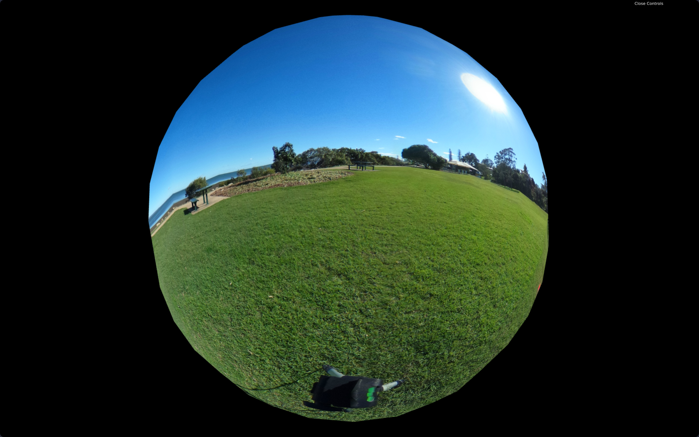
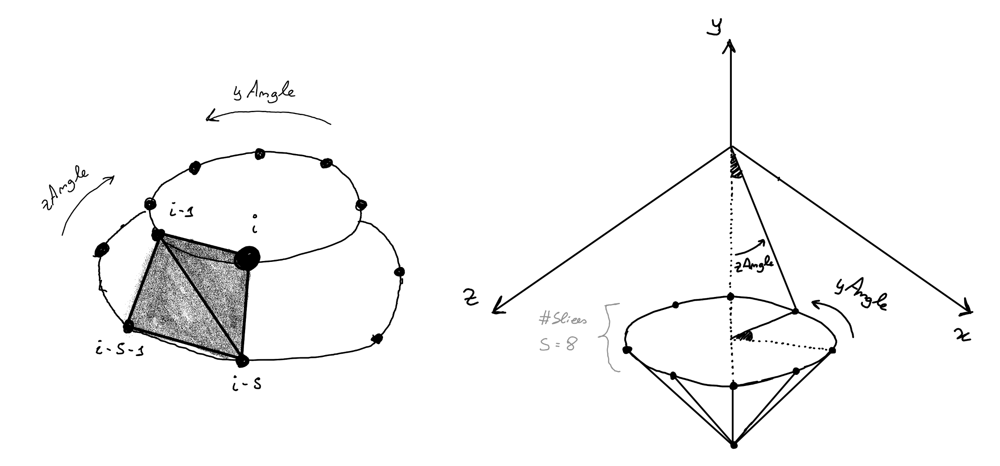
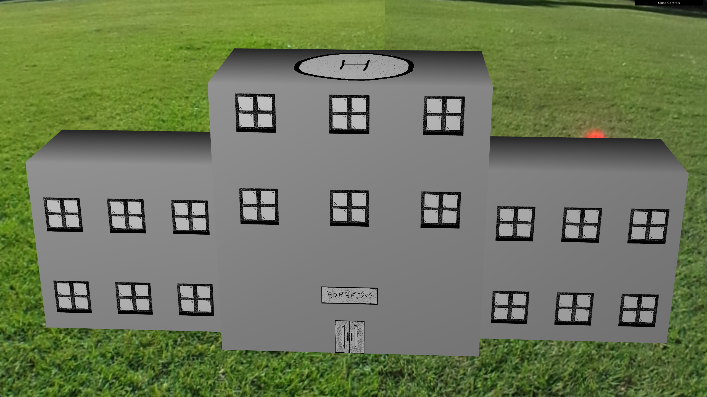
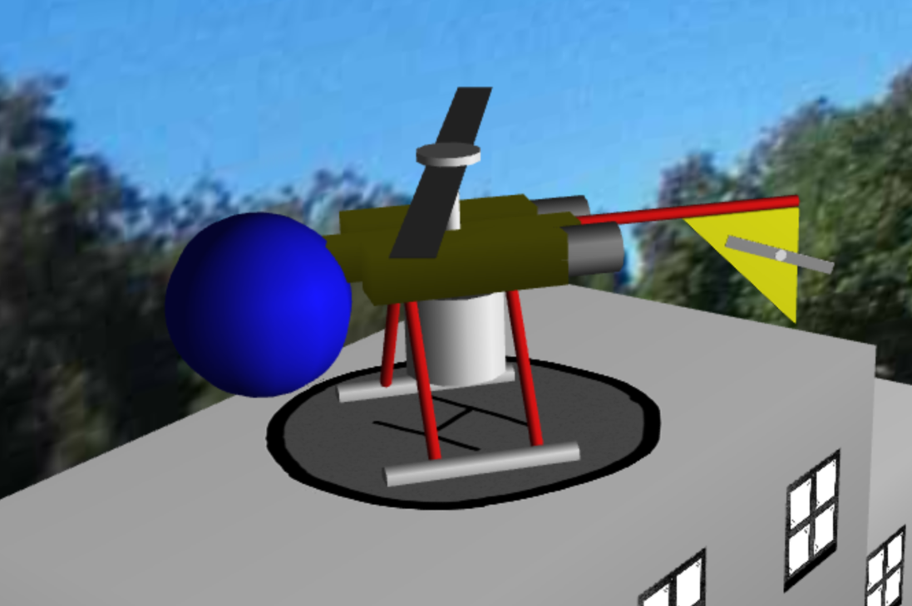
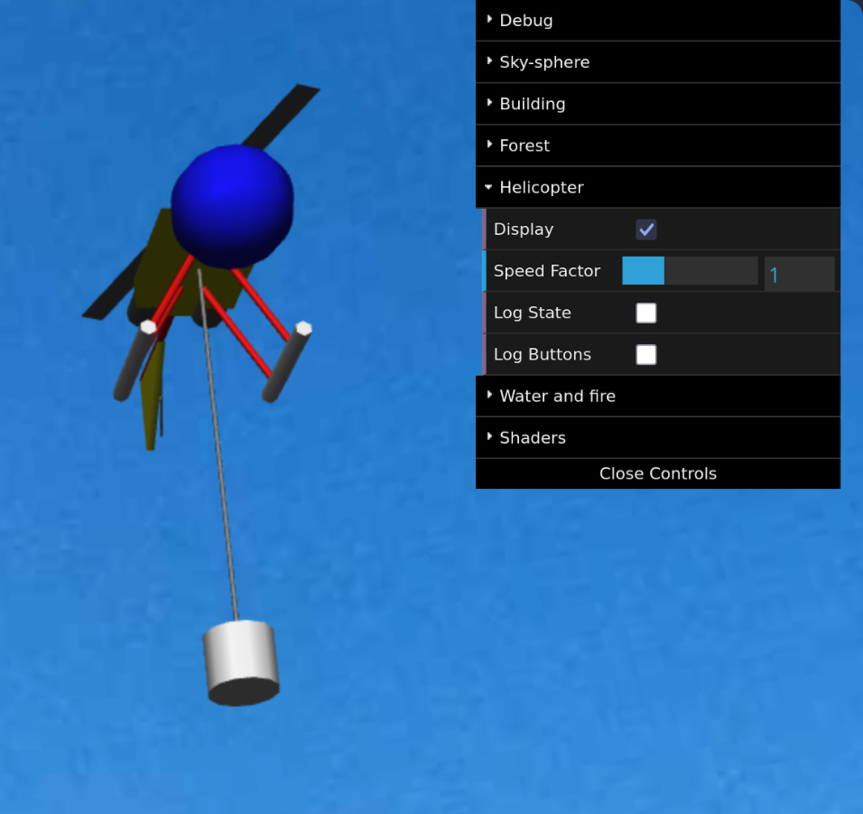
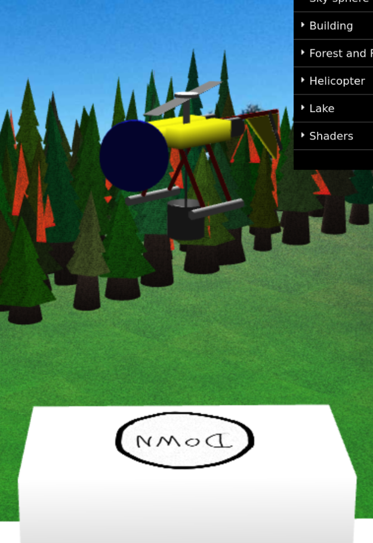
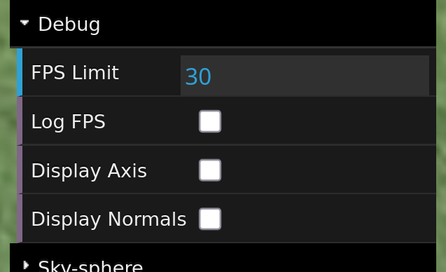

# CG 2024/2025

## Group T09G07

| Name                         | Number    | E-Mail            |
| ---------------------------- | --------- | ----------------- |
| Guilherme Duarte Silva Matos | 202208755 | up202208755@up.pt |
| João Vítor da Costa Ferreira | 202208393 | up202208393@up.pt |

## Project Notes

### Sky-Sphere and Panorama

> [MySphere.js](./panorama/MySphere.js) | [MyPanorama.js](./panorama/MyPanorama.js)

| Inside perspective | Camera outside the sphere |
| ------------------ | ------------------------- |
|  |  |

The sphere is built in the following order:



- All stacks are built, starting from the bottom (z = -1);
- Each stack is built by building all slices, starting from the right
  (x = 1 and y = 0) with a counter clockwise rotation (positive angle);
- Each slice is built by defining:

  - A new vertice:
    ```javascript
    const x = Math.sin(yAngle) * Math.cos(zAngle);
    const y = Math.cos(yAngle) * Math.cos(zAngle);
    const z = Math.sin(zAngle);
    this.vertices.push(x, y, z);
    ```
  - Two new triangles that envolve the new and previous vertices:

    - A lower triangle:

      ```markdown
          i - 1  *
                 | \

      i - s - 1 _ - _ i - s
      ```

    - A higher triangle:
      ```markdown
      i - 1 _ - _ i
      \ | \* i - s
      ```

  - The normal from the new vertice made by normalizing the coordinates:
    ```javascript
    let normal = [x, y, z];
    const vectorLen = Math.sqrt(
      Math.pow(normal[0], 2) + Math.pow(normal[1], 2) + Math.pow(normal[2], 2)
    );
    normal = normal.map((n) => n / vectorLen);
    this.normals.push(normal[0], normal[1], normal[2]);
    ```
  - The texture coordinates:
    - The top of the texture corresponds to the top of the sphere
      (v = 1 => z = 1) and vice-versa for the bottom;
    - The left of the texture corresponds to the back of the sphere
      (u = 0 => yAngle = 0), placing the texture counter-clockwise;
    ```javascript
    const u = 1 - sliceIndex / this.slices;
    const v = 1 - stackIndex / (2 * this.stacks);
    this.texCoords.push(u, v);
    ```

### Fire-fighters Building

> [MyWindow.js](./building/MyWindow.js) | [MyDoor.js](./building/MyDoor.js) | [MyDoorSign.js](./building/MyDoorSign.js) | [MyHeliport.js](./building/MyHeliport.js) | [MyBuildingModule.js](./building/MyBuildingModule.js) | [MyBuilding.js](./building/MyBuilding.js)



- ```javascript
  MyBuilding(scene, width, depth, floors, windows, color);
  ```
  The building is divided into 3 modules: a central module with an extra floor for the door and the door sign, and two lateral modules with 75% of the dimensions.
- ```javascript
  MyBuildingModule(scene, width, depth, floors, windows, isCentral, color);
  ```

  A building module has a number of windows per floor.
  It also has a door and a door sign if the module is central.
  Each floor has a height of 25 units.

- ```javascript
  MyDoor(scene);
  ```

  A rectangle with 8 x 10 x 1 dimensions and the texture [door.jpg](./images/door.jpg).

- ```javascript
  MyDoorSign(scene);
  ```

  A rectangle with 15 x 5 x 1 dimensions and the texture [door_sign.jpg](./images/door_sign.jpg).

- ```javascript
  MyWindow(scene);
  ```

  A rectangle with 10 x 10 x 1 dimensions and the texture [window.jpg](./images/window.jpg).

- ```javascript
  MyHeliport(scene);
  ```
  A rectangle with 10 x 1 x 10 dimensions and the texture [heliport.png](./images/heliport.png). This texture contains transparency, and so, it is necessary to enable blending in the OpenGL context:
  ```javascript
  // Enable transparent textures
  this.gl.enable(this.gl.BLEND);
  this.gl.blendFunc(this.gl.SRC_ALPHA, this.gl.ONE_MINUS_SRC_ALPHA);
  ```

### Forest

> [MyPyramid.js](./pyramid/MyPyramid.js) | [MyTrunk.js](./forest/MyTrunk.js) | [MyCrown.js](./forest/MyCrown.js) | [MyTree.js](./forest/MyTree.js) | [MyForest.js](./forest/MyForest.js)


- A forest is a rectangle of `width` x `height` trees randomly generated and placed.
  Each tree can have a random tilt, radius of the trunk, height of the tree, color
  of the crown and displacement in the plane.
  ```javascript
  this.cellSize = 30;
  this.tiltAngleRange = new Range(-10, 10);
  this.tiltAxisRange = new Range(-1, 1); // < 0 -> AXIS.X; > 0 -> AXIS.Z
  this.radiusRange = new Range(5, 10);
  this.heightRange = new Range(50, 100);
  this.rRange = new Range(0.02, 0.192156862745098);
  this.gRange = new Range(0.15, 0.3294117647058824);
  this.bRange = new Range(0.01, 0.1450980392156863);
  this.xDeltaRange = new Range(-5, 5);
  this.yDeltaRange = new Range(-5, 5);
  ```
- Each tree is made of a trunk of brown material and a list of crowns of green material.
  The number of crowns for each tree is calculated in the function `generateCrownPyramids()`:

  ```javascript
  const zStart = this.height * (1 - this.crownHeightRatio);
  const zStep = this.pyramidHeight * this.pyramidVisibleRatio;
  const zEnd = this.height - this.pyramidHeight;

  const numberCrowns = Math.floor((zEnd - zStart) / zStep);
  ```

  For this and other calculations, each tree has associated this set of constants:

  ```javascript
  // The height of the crown can be 80% of the height of the tree
  this.crownHeightRatio = 0.8;
  // Height units of a pyramid in the crown
  this.pyramidHeight = 20;
  // Ratio of visibility of the pyramid when placed with the other crowns
  this.pyramidVisibleRatio = 0.5;
  // Radius of the pyramid based on the radius of the trunk in the y coordinate of the pyramid base
  this.pyramidToTrunkRadiusRatio = 2.5;
  ```

- A trunk is a pyramid with `2 * radius` of vertices in the base and "Gourand Shading".

- A crown is a pyramid with 6 vertices and "Constant Shading".

- For efficiency, the CGFapperance objects with the texture are created in the
  MyForest and passed down to the auxiliary classes via reference.

### Helicopter

> [helicopter folder](./helicopter) | [MySealedCylinder.js](./cuboid/MySealedCylinder.js)

| Helicopter stopped | Helicopter in motion |
| ------------------ | -------------------- |
|  |  |

The model of this helicopter is inspired from a Sikorsky S-64E Skycrane and a Bell 47.
- The [cockpit](./helicopter/MyCockpit.js) is a blue sphere;
- The [body](./helicopter/MyBody.js) is made of:
  - 3 [cubes](./cuboid/MyUnitCube.js) scaled into parallelepipeds;
  - 2 [cylinders](./cuboid/MyCylinder.js) for the exausts;
  - A [rotor](./helicopter/MyRotor.js) at the top:
    - A [blade](./helicopter/MyBlade.js), i.e., a rectangle;
    - 2 [sealed cylinders](./cuboid/MySealedCylinder.js): one for the rotor base/support and another for the cap at the top.
- The [landing gear](./helicopter/MyLandingGear.js) at the bottom, made of 6 [sealed cylinders](./cuboid/MySealedCylinder.js): 4 red and 2 white;
- The [bucket](./helicopter/MyBucket.js) inside the helicopter is made of:
  - A [cylinder](./cuboid/MyCylinder.js) and a [circle](./cuboid/MyCircle.js) for the bucket body;
  - A [blade](./helicopter/MyBlade.js) for the bucket support/holder;
- The [rope](./helicopter/MyRope.js) used to hold the bucket is made of a [sealed cylinder](./cuboid/MySealedCylinder.js);
- The [tail](./helicopter/MyTail.js) is made of:
  - A red [sealed cylinder](./cuboid/MySealedCylinder.js) for the tail body;
  - A [rotor](./helicopter/MyTailRotor.js) at the end of the tail;
  - A yellow [stabilizer](./helicopter/MyStabilizer.js) made of a [triangle](./helicopter/MyRightAnglePrism.js) 

Note that many of the internal objects are identical, so, internally, only one class is instantiated and the same object is reused.

### Fire and Lake

> [MyLake.js](./lake/MyLake.js) | [MyFire.js](./forest/MyFire.js) | [MyHeli.js](./helicopter/MyHeli.js)


- The lake is made of a two-dimensional circle stretched to the dimensions given
  by the interface;
- Each `TreeCell` inside the forest may have a MyFire instance associated with it;
- The interface makes available the probability for each cell to have a fire object
  and the color of all fire instances;
- When the user asks the helicopter to get water from the lake, the helicopter is
  moved automatically (and smoothly during the animation) to the center of the
  lake;
- When the user asks the helicopter to pour out the fire, the bucket cap is opened 
  and the fire instances around 80 units of the helicopter are slowly faded away.

### Shaders

> [fire.frag](./shaders/fire.frag) | [fire.vert](./shaders/fire.vert)


With random and trignometric functions, all `MyFire` objects are animated:
- In their vertices positions;
- In their color (between red, orange and yellow).

The `MyForest` object is the owner of the `CGFshader`, which shares it with all
fire objects. This is to avoid slowdowns with repetitive textures.

### Heliport and additional development with shaders

> [heliport.frag](./shaders/heliport.frag) | [heliport.vert](./shaders/heliport.vert)



Using shaders, the heliport changes textures with a sin() function when the
heliport is taking off or landing.

### Other notes

- A FPS limiter was implemented to avoid unnecessary computation on high refresh
  rate monitors, since by default, the CGF library limits to the refresh rate of the
  monitor.

  

  To update the limit, just change the value in the debug section of the interface.

  To see the current FPS, turn on the option "Log FPS" and open the browser console.
