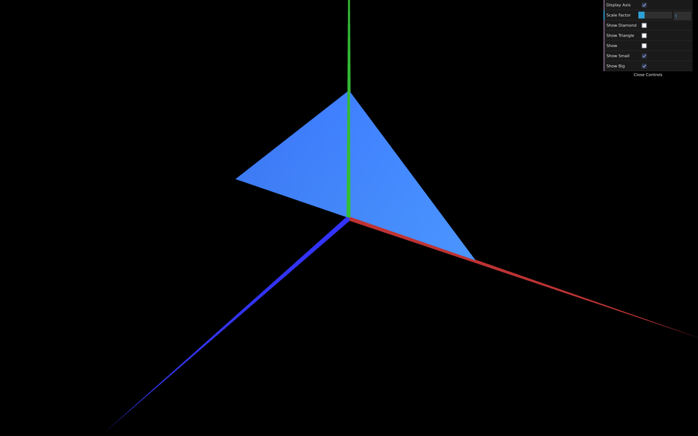

# CG 2024/2025

## Group T09G07

## TP 1 Notes

To create a new object with their respective checkbox in the control panel, it is needed to:

1. Create a new file for the object (e.g. `MyTriangle.js`) with this template code:

```javascript
import { CGFobject } from "../lib/CGF.js";

export class MyTriangle extends CGFobject {     // <!> Change the class name
  constructor(scene) {
    super(scene);
    this.initBuffers();
  }

  initBuffers() {
    this.vertices = [       // <!> Change the vertices coordinates
      -1, -1,  0,     // Vertex 0
       1, -1,  0,     // Vertex 1
      -1,  1,  0,     // Vertex 2
    ];

    //Counter-clockwise reference of vertices
    this.indices = [        // <!> Change the indices
      0, 1, 2,
    ];

    //The defined indices (and corresponding vertices)
    //will be read in groups of three to draw triangles
    this.primitiveType = this.scene.gl.TRIANGLES;

    this.initGLBuffers();
  }
}
```

2. Update the file with the context of the new object:
   1. Change the class name
   2. Change all the vertices coordinates in the `this.vertices` array
      ```javascript
      this.vertices = [x0, y0, z0, x1, y1, z1, ...];
      ```
   3. Change the indices of vertices to show the triangles in the `this.indices` array.
      The indices must be referenced in counter-clockwise order.
      > Note: For the triangle appear on both sides, just add the same indices in the opposite order.
      ```javascript
      this.indices = [0, 1, 2, 2, 1, 0, ...];
      ```
3. In the file `MyScene.js`:
   1. Import the new object file
      ```javascript
      import { MyTriangle } from "./MyTriangle.js"; // <!> Change the object and file names
      ```
   2. Initialize the object in the `init` function
      ```javascript
      this.triangle = new MyTriangle(this); // <!> Change the object name
      ```
   3. Create a new boolean variable in the `init` function to control the object visibility
      ```javascript
      this.triangleCheck = true; // <!> Change the variable name
      ```
   4. Call the display function of the object inside the `display` function of the scene if the boolean is set to true
      ```javascript
      if (this.triangleCheck) this.triangle.display();
      ```
4. In the file `MyInterface.js`, create a new checkbox by referencing the variable name in the second argument.
   ```javascript
   this.gui.add(this.scene, "triangleCheck").name("Show Triangle"); // <!> Change the variable and checkbox names
   ```


