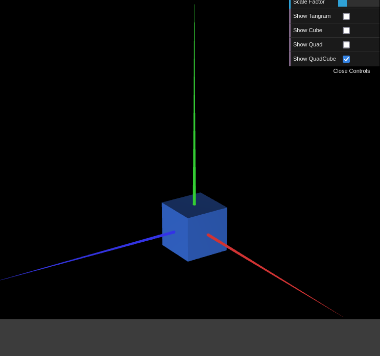

# CG 2024/2025

## Group T09G07

## TP 2 Notes

### #1: MyTangram

#### Proposed Tangram


#### Final Result


- To apply a transformation to a specific object inside a scene, it is necessary to push and pop the matrix from the stack:
  ```javascript
  this.scene.pushMatrix();
  // Apply transformations...
  this.object.display();
  this.scene.popMatrix();
  ```
- `this.scene.multMatrix()` is used to apply a transformation matrix to a scene.
- `this.scene.translate(x, y, z)`: move the scene the specified deltas;
- `this.scene.rotate(angle, x, y, z)`: rotate the scene around the specified axis (x, y, or z must be 0 or 1) (angle must be in radians);
- `this.scene.scale(sx, sy, sz)`: scale the scene by the specified factors.

In the `MyTangram.js` file, the modifications are made inside the `display()` function and each object has an auxiliary function to display and transform itself.

There are also two auxiliary functions:

- `this.changeColor(r, g, b)`: change the apparent color of the object by modifying the ambient, diffuse, and specular components;
- `degToRad(degrees)`: convert degrees to radians.

### #2: MyUnitCube


In `MyUnitCube.js`, a cube was formulated with a list of vertices and indices:

#### Vertices

```javascript
this.vertices = [		// Idx x      y      z
    -0.5, -0.5, -0.5,	// 0 - Left , Bottom, Back
     0.5, -0.5, -0.5,	// 1 - Right, Bottom, Back
    -0.5,  0.5, -0.5,	// 2 - Left , Top   , Back
     0.5,  0.5, -0.5,	// 3 - Right, Top   , Back
    -0.5, -0.5,  0.5,	// 4 - Left , Bottom, Front
     0.5, -0.5,  0.5,	// 5 - Right, Bottom, Front
    -0.5,  0.5,  0.5,	// 6 - Left , Top   , Front
     0.5,  0.5,  0.5	// 7 - Right, Top   , Front
];
```

#### Indices

Just like in `MyDiamond.js`, the indices must be defined in a counter-clockwise order:

```javascript
this.indices = [
    0, 1, 2,	// Back face
    1, 3, 2,	// ''
    1, 5, 3,	// Right face
    5, 7, 3,	// ''
    5, 4, 7,	// Front face
    4, 6, 7,	// ''
    4, 0, 6,	// Left face
    0, 2, 6,	// ''
    2, 3, 6,	// Top face
    3, 7, 6,	// ''
    4, 5, 0,	// Bottom face
    5, 1, 0		// ''
];
```

#### Position

The cube was then moved into behind the tangram, as stated in `MyScene.js`:

```javascript
this.pushMatrix();
this.translate(0.5, -0.5, -0.5);
if (this.displayCube) this.cube.display();
this.popMatrix();
```
### #3: MyUnitCubeQuad


In ['MyUnitCubeQuad.js'](./MyUnitCubeQuad.js) the cube is defined.

In ['MyQuad'](./MyQuad.js) the square is defined. 

#### Details

Since the face is already defined, one can pair two faces (front-back, left-right, top-bottom)
and display them at once.

As such, three functions were defined to display these pairs, based on the backing **MyQuad**.

For the front and back:
```javascript
 frontback() {
    this.scene.pushMatrix();
    this.scene.translate(0, 0, 0.5);

    this.quad.display();
    this.scene.translate(0, 0, -1);
    this.quad.display();
    this.scene.translate(0, 0, 0.5);
    this.scene.popMatrix();
  }
  
```


For the sides:
```javascript
 
 sides() {
    this.scene.pushMatrix();
    this.scene.rotate(degToRad(90),0,1,0);
    this.scene.translate(0, 0, 0.5);
    this.quad.display();
    this.scene.translate(0, 0, -1);
    this.quad.display();
    this.scene.translate(0, 0, 0.5);
    this.scene.rotate(0,degToRad(-90),0,1,0);
    this.scene.popMatrix();
  }
```


For the top and bottom:  
```javascript
 
 lids() {
    this.scene.pushMatrix();
    this.scene.rotate(degToRad(90),1,0,0);
    this.scene.translate(0, 0, 0.5);
    this.quad.display();
    this.scene.translate(0, 0, -1);
    this.quad.display();
    this.scene.translate(0, 0, 0.5);
    this.scene.rotate(0,degToRad(-90),1,0,0);
    this.scene.popMatrix();
  }

```
