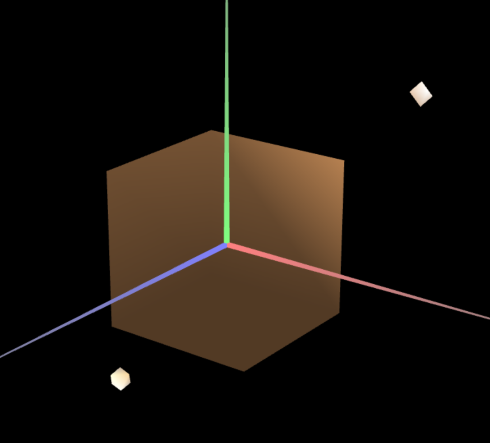
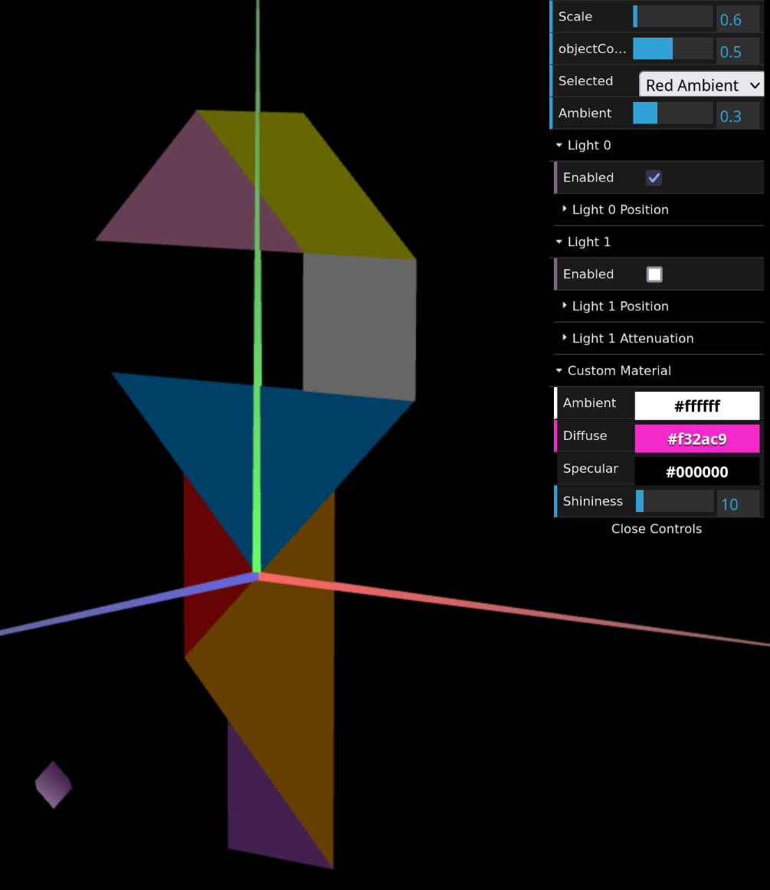
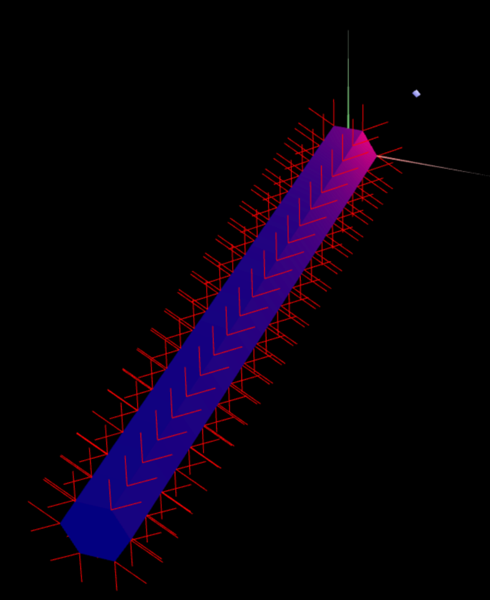
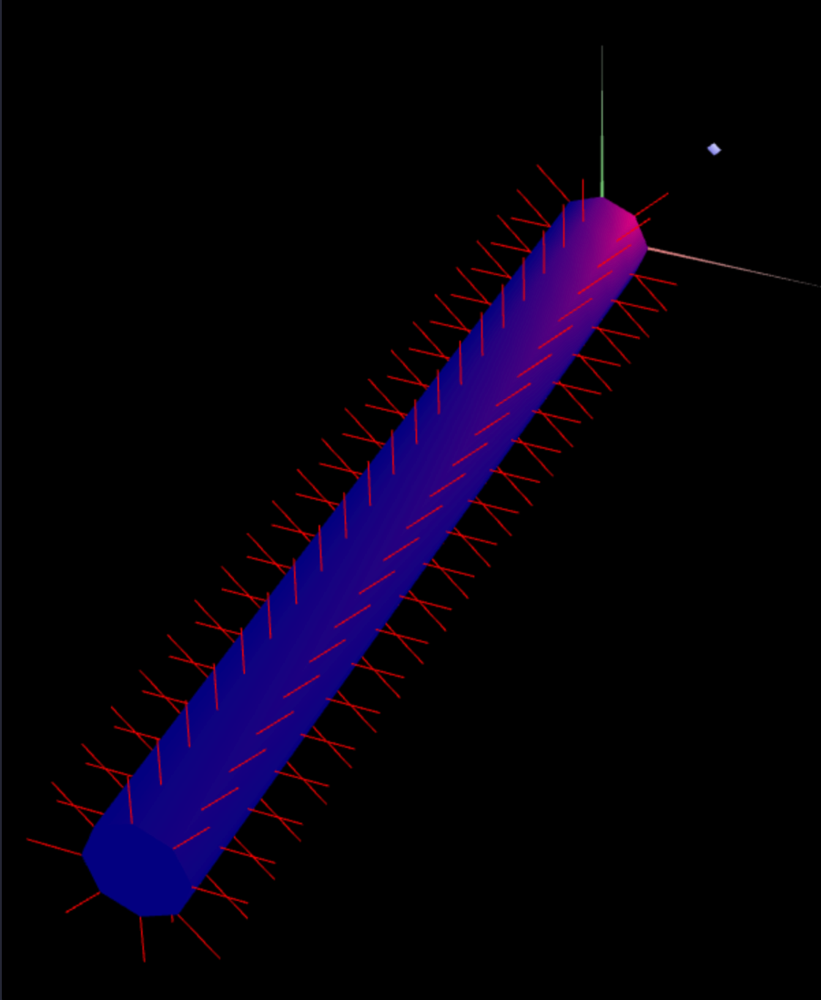

# CG 2024/2025

## Group T09G07

## TP 3 Notes

### #1: Materials and Illumination

The normal vectors of a object are placed in their vertices.
The normal vector must be normalized and it might be necessary to replicate the vertices to apply more than one normal vector to a vertex. `MyUnitCube.js` is an example of this.



To change the material of an object, it is necessary to specify the ambient, diffuse, specular and shininess components in a `CGFappearance` object and apply the material to a scene:

```javascript
this.material = new CGFappearance(scene);
this.material.setAmbient(0.1, 0.1, 0.1, 1); // RGBA components
this.material.setDiffuse(0.9, 0.9, 0.9, 1);
this.material.setSpecular(0.1, 0.1, 0.1, 1);
this.material.setShininess(10.0);
this.material.apply();
```



### #2: Prism



In the prism object, each vertice has two normal vectors because each vertice is associated with two sides of the prism. These vectors are normal to their respective faces.

This method is similar to "Constant Shading", where the illumination for each face is calculated based on the illumination of their vertices.

### #3: Cylindrical Surface



The normal vectors of the cylinder are calculated based on the angle of the vertex instead of the face.

The result is a smooth shading effect that is similar to "Gouraud Shading".
