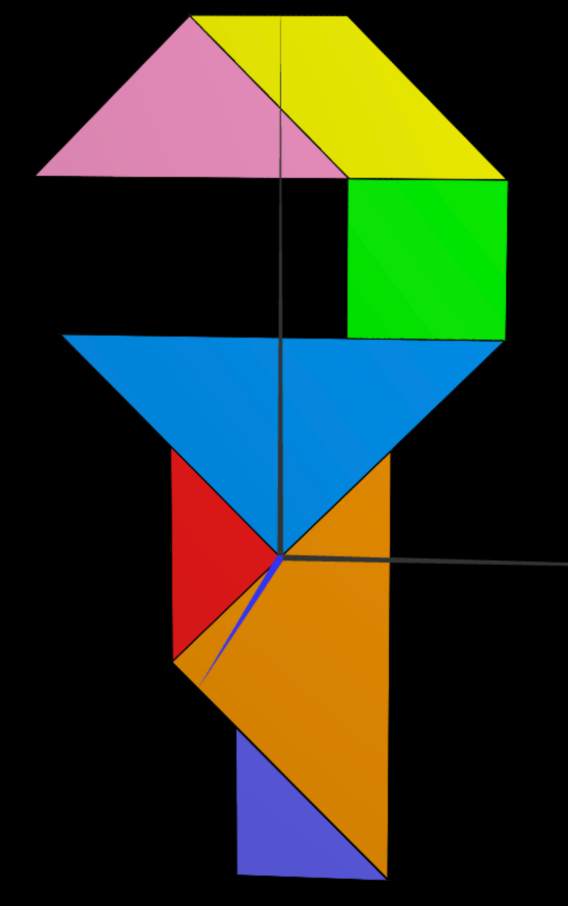
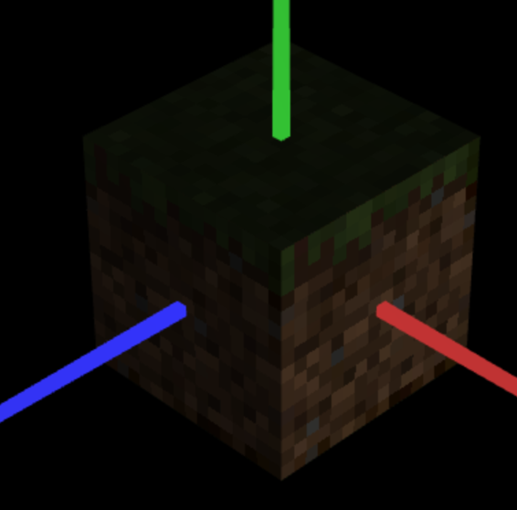

# CG 2024/2025

## Group T09G07

## TP 4 Notes

### #1: Textures in Tangram



For each piece of the tangram, it is defined a list of coordinates that match the texture for each vertice. This definition is done inside the `MyTangram.js` file with the `this.updateTexCoords()` method.

### #2: Textures in Cube



In the case of the cube, instead of defining the texture position for each piece, it is defined the texture file for each face of the cube.

The `MyUnitCubeQuad` class gets all textures for each face in the constructor and then applies them to the cube using the `CGFappearance` class:

```javascript
this.scene.pushMatrix();

const material = new CGFappearance(this.scene);
material.setAmbient(0.9, 0.9, 0.9, 1); // Visible even without light
material.loadTexture(texture); // texture is the path to the .png file
material.apply();
// Nearest neighbor texture filtering (useful for pixel art)
this.scene.gl.texParameteri(
  this.scene.gl.TEXTURE_2D,
  this.scene.gl.TEXTURE_MAG_FILTER,
  this.scene.gl.NEAREST
);

// [...] Other transformations

this.quad.display();
this.scene.popMatrix();
```
