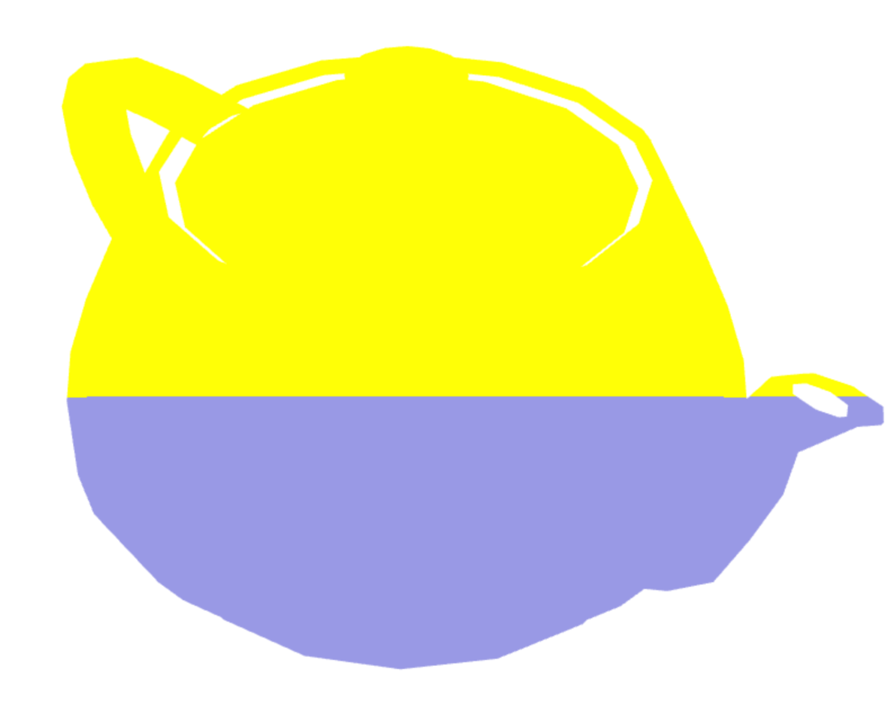
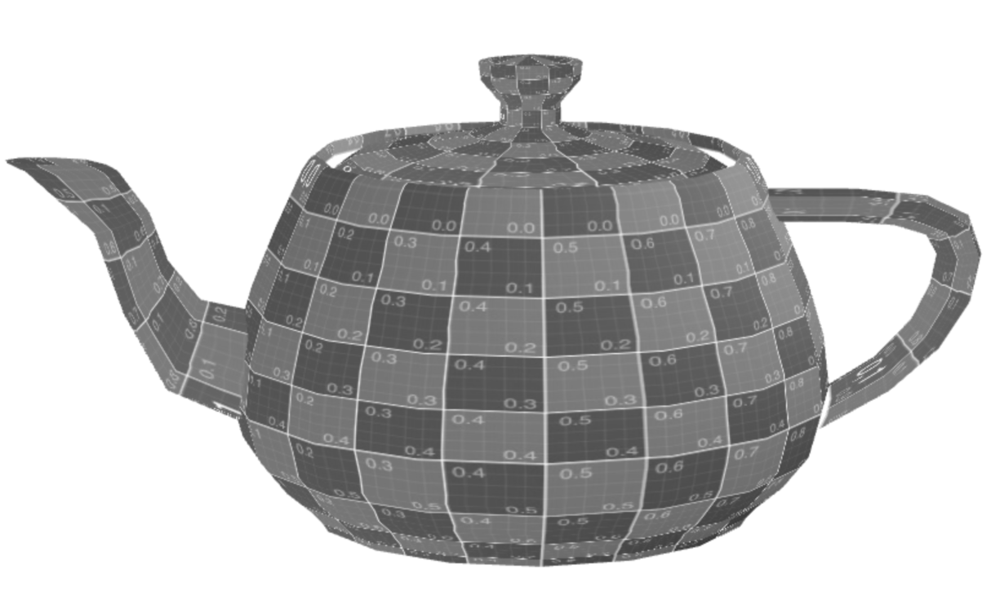
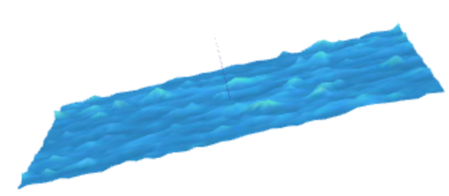

# CG 2024/2025

## Group T09G07

## TP 5 Notes

Shaders are pieces of code that can run on the GPU at the end of the rendering pipeline:
- There are two types of shaders: vertex (`.vert`) for position manipulation and fragment (`.frag`) for textures and color;
- `uniform` variables are passed from the CPU (JavaScript) to the GPU;
- `varying` variables are passed from the vertex shader to the fragment shader;
- `gl_Position` is a built-in variable that holds the position of the vertex;
- `gl_FragColor` is a built-in variable that holds the color of the fragment.

### #1: Shaders in Teapot

### #2: Shaders in a plane (water effect)

