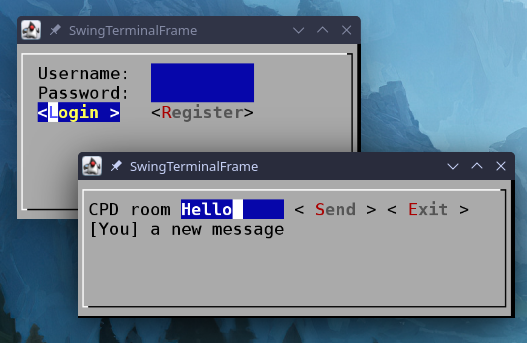
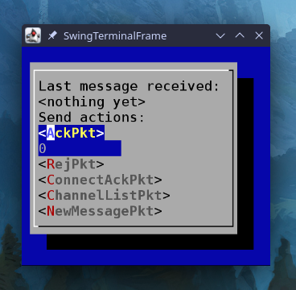

# Distributed System Assignment

A client-server system in Java for real-time chat with rooms and AI support



> Faculty of Engineering at University of Porto  
> Bachelor's Degree in Informatics and Computing Engineering  
> Parallel and Distributed Computing (L.EIC028) 2024/2025
>
> - Carlos Miguel Ferraz Baquero-Moreno (Co-regent of the course)
> - Pedro Alexandre Guimarães Lobo Ferreira Souto (Co-regent of the course)
> - João Miguel Maia Soares de Resende (Co-regent of the course)
> - Bruno Miguel Almeida Cunha (Theoretical-Practical classes)

> **Class 09; Group 13**
>
> - Duarte Souto Assunção (up202208319@up.pt)
> - Guilherme Duarte Silva Matos (up202208755@up.pt)
> - João Vítor da Costa Ferreira (up202208393@up.pt)

## Prerequisites

- Java 21
- Gradle (version 8.10 or higher)
  > There is a `gradlew` available in the project
- Makefile
- Ollama Docker Image running in the URI localhost:11434
  ```bash
  docker pull ollama/ollama
  # CPU only example (see https://hub.docker.com/r/ollama/ollama for other options)
  docker run -d -v ollama:/root/.ollama -p 11434:11434 --name ollama ollama/ollama
  ```

## Usage

### Client

```bash
# Via Makefile with default arguments
make client
```

```bash
# Via gradle / CLI
gradle run --args="client localhost 8080"   # client <Server IP> <Server Port>
```

### Server

```bash
# Via Makefile with default arguments
make server
```

```bash
# Via gradle / CLI
gradle run --args="server 8080 users.csv"   # server <Server Port> <CSV file path>
```

### Server Mock

To test the client against edge cases, a server mock was developed with loosened
restrictions:

- Only handles 1 client;
- Receives any packet send to the server;
- Sends any packet selected by the user:

  

```bash
# Via Makefile with default arguments
make server-mock
```

```bash
# Via gradle / CLI
gradle run --args="server-mock 8080"   # server-mock <Server Port>
```

## Dependencies

- `'org.msgpack:msgpack-core:0.9.9'`:
  [MessagePack](https://msgpack.org/) for the basis of the protocol;
- `'com.googlecode.lanterna:lanterna:3.1.2'`:
  [Lanterna](https://github.com/mabe02/lanterna) for the GUI of the client and the server mock;
- `'org.json:json:20231013'`:
  [JSON Parser](https://mvnrepository.com/artifact/org.json/json) to be used in the Ollama response.
