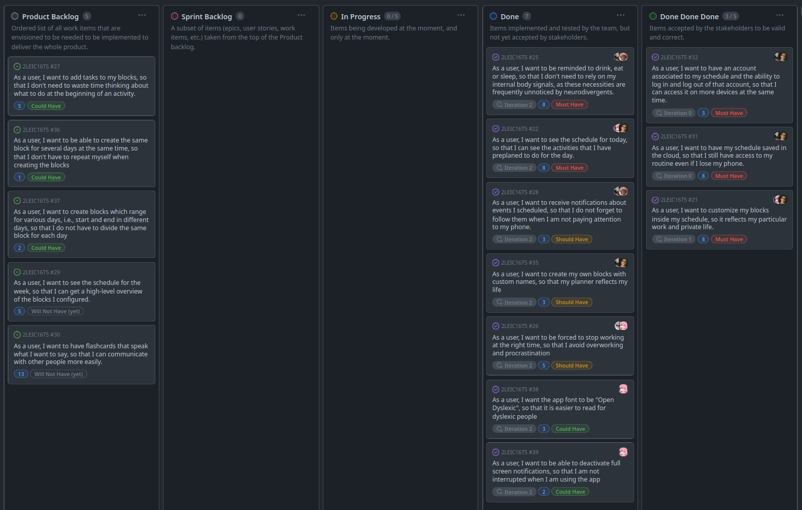

# NeuroChrono App Development Report

Welcome to the documentation pages of the NeuroChrono App!

You can find here details about the NeuroChrono App, from a high-level vision to low-level implementation decisions, a kind of Software Development Report, organized by type of activities: 

- [NeuroChrono App Development Report](#neurochrono-app-development-report)
  - [Business Modelling](#business-modelling)
    - [Product Vision](#product-vision)
    - [Features and Assumptions](#features-and-assumptions)
    - [Elevator Pitch](#elevator-pitch)
  - [Requirements](#requirements)
    - [Domain model](#domain-model)
  - [Architecture and Design](#architecture-and-design)
    - [Logical architecture](#logical-architecture)
    - [Physical architecture](#physical-architecture)
    - [Vertical prototype](#vertical-prototype)
  - [Project Management](#project-management)
    - [Sprint 1](#sprint-1)
      - [Start of the iteration](#start-of-the-iteration)
      - [End of iteration](#end-of-iteration)
      - [Increments made](#increments-made)
      - [Sprint review](#sprint-review)
    - [Sprint 2](#sprint-2)
      - [Start of the iteration](#start-of-the-iteration-1)
      - [End of iteration](#end-of-iteration-1)
      - [Increments made](#increments-made-1)
      - [Sprint review](#sprint-review-1)
    - [Sprint 3](#sprint-3)
      - [Start of the iteration](#start-of-the-iteration-2)
      - [End of iteration](#end-of-iteration-2)
      - [Increments made](#increments-made-2)
      - [Sprint review](#sprint-review-2)

Contributions are expected to be made exclusively by the initial team, but we may open them to the community, after the course, in all areas and topics: requirements, technologies, development, experimentation, testing, etc.

Please contact us!

Thank you!

Duarte Assunção, up202208319@up.pt  
Guilherme Matos, up202208755@up.pt  
João Ferreira, up202208393@up.pt  
Lucas Bessa, up202208396@up.pt  
Pedro Gorobey, up202210292@up.pt

---
## Business Modelling

### Product Vision

In an ever noisier world, it is increasingly more difficult to focus and to take care of ourselves.
_NeuroChrono_ solves exactly that, by offering organization and structure for neurodiverse students through tailored schedules and reminders, empowering them to live a less stressful life.

### Features and Assumptions
- Add/Remove blocks to the schedule;
- Alert the user when: 
  - A certain block is about to finish (and prompt to select completed tasks);
  - A new block is starting (and show the tasks to be completed);
- Add/Remove tasks to blocks;
- See the schedule for today;
- Edit the tasks for each block as the user see fit;
- See, add and remove flashcards;
- Command the app to read a flashcard.

In terms of dependencies, the following Flutter dependencies are used:
- `flutter_tts`, to read the flashcards out loud;
- `flutter_local_notifications`, to send notifications to the user;
- The `firebase` packages to interact with the Firebase database.

### Elevator Pitch
Imagine the noise we usually hear.
Now imagine not being able to separate my voice from that noise.
Now imagine that the noise is as clear as my voice. Could you remember everything you need to do today? 

Many neurodivergent colleagues, in addition to this difficulty, often do not receive signals from their own bodies.
When was the last time you forgot to eat? 

NeuroChrono is a project designed for neurodivergent people that provides a personal organization mechanism focused on translating a mental map of tasks into a simple and effective routine, with reminders about what is most important to you: your health. 
NeuroChrono is not just a agenda, it is an aid to living in an increasingly noisy world.

## Requirements

### Domain model

The app will show an agenda for each user. For each user, the app will store their email and password. The agenda will show all the schedule blocks that user has for that day and each block will store the list of tasks to be done.

## Architecture and Design

### Logical architecture
Our application can be divided into 4 simple components:
* **App UI:** Represents everything related to the interaction between a human user and the product.
* **Business Logic:** Connects the user interface to the backend logic, performing API calls and such.
* **Database Schema**: Represents the structure of the data stored locally.
* **Firebase API**: API to interact with a remote database.

### Physical architecture
This application does not have a lot of external dependencies, making its physical architecture simple:
* **Application:** Allows the interaction with its users, while also storing data like settings and the schedule locally.
* **Firebase Server:** Allows us to store schedules remotely (allowing users to synchronize/restore their data), along with extra data that might not be worth storing locally.

### Vertical prototype
In this vertical prototype, we prepared the foundations for the project, especially the UI, the flow between pages and the Firebase database. This will be fundamental for adding blocks and seeing the schedule, which will be the next steps in the next sprint.

To test the prototype, install the .apk available in this release and sign up using the account:
- Email: `test@neurochrone.pt`
- Password: `TestingPrototype`

  
In the planner page, it should show that this account has 1 block inside the schedule. 
If another account is used, the planner page should say that the schedule is empty. 

## Project Management

### Sprint 1

#### Start of the iteration

#### End of iteration

#### Increments made
- User can now see all of their blocks for each day of the week;
- User can add, modify and delete existing blocks;
- A notification page is open to the user when a new block is starting, i.e., the start time of the block is equal to the current time.

#### Sprint review
**What went well?**
- We were able to create the necessary Flutter elements to have an interface that resembles the mockups;
- We successfully configured the technical elements of the project: local notifications and the Firebase database.
  
**What didn't go so well?**
- The workload of this first sprint (8+8+8) was too much;
- The UI mockups were too ambitious, given our knowledge of Flutter.
  
**What still leaves us in doubt?**
- How to present the blocks as we wanted and as we presented in the mockups;
- Many of the advanced knowledge of Flutter, Firebase and the Dart language are still confusing to us.

### Sprint 2

#### Start of the iteration

#### End of iteration

#### Increments made
- Improvements to the interfaces made in the previous sprint;
- User now receives a notification on their phone when a block is starting;
- User receives a notification and a full screen alert when a block is ending in 5 minutes;
- User can now create, delete and modify their block types;
- When creating an account, the user now has four default block types: Drink, Eat, Sleep and Work;
- The app font was changed to "Open Dyslexic";
- User can now deactivate notifications in the settings page.

#### Sprint review
**What went well?**  
- We did more than we promised at the start of the sprint;
- We held an extra meeting to make sure that the entire team had the same vision for the project, which allowed for greater efficiency in this sprint.

**What didn't go so well?**  
- We needed to restructure the database schema due to blocks with custom types;
- The estimates for the User Stories were not accurate.

**What still leaves us in doubt?**  
- How will we implement the possibility of creating blocks for several days of the week in a row;
- The automation of the acceptance tests.

### Sprint 3

#### Start of the iteration

#### End of iteration
 

#### Increments made
- User now able to see, add or remove tasks for each block;
- The notification for a starting block now shows the tasks to be completed;
- The notification for an ending block now shows a prompt to select the completed tasks;
- User now able to see, add or remove flashcards;
- User can command the app to read a flashcard. 

#### Sprint review
**What went well?**  
- We did more than we were expecting at the start of the sprint;
- The implementation of the Flashcards was faster than we anticipated.

**What didn't go so well?**  
- We had difficulties in maintaining a consistent design (we later solved);

**What still leaves us in doubt?**  
- Unit tests, especially involving the database and/or the application state.
