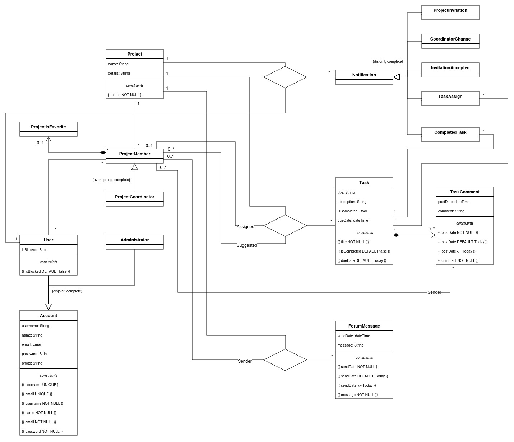

# EBD: Database Specification Component

SyncTask: Project management done easier, keeping everyone up to date.

## A4: Conceptual Data Model

This artifact presents a class diagram and some business rules that detail the entities and their relations that are relevant to the database specification.

### 1. Class diagram



### 2. Additional Business Rules

- BR.108. A project must have at least a project coordinator inside the team.

---

## A5: Relational Schema, validation and schema refinement

This artifact contains the schema and their respective validation intending to document integrity rules, including attributes, keys, and domains.

### 1. Relational Schema

| Relation reference | Relation Compact Notation |
|--------------------|---------------------------|
| R01 | user(<ins>id</ins>, username **UK** **NN**, name **NN**, email **UK** **NN**, password **NN**, photo, is_blocked **DF** false) |
| R02 | administrator(<ins>id</ins>, username **UK** **NN**, name **NN**, email **UK** **NN**, password **NN**, photo) |
| R03 | project(<ins>id</ins>, name **NN**, detail) |
| R04 | project_member(<ins>id</ins>, id_project → project **NN**, id_user → user **NN,** is_favorite **DF** false) |
| R05 | project_coordinator(<ins>id</ins>, id_member → project_member **NN**) |
| R06 | forum_message(<ins>id</ins>, id_project → project **NN**, id_sender → project_member, send_date **NN** **DF** Today **CK** \>= Today, message **NN**) |
| R07 | task(<ins>id</ins>, id_project → project **NN**, title **NN**, description, id_assigned → project_member, is_completed **DF** false, due_date **DF** Today **CK** \>= Today) |
| R08 | suggested(id_task → task **NN**, id_member → project_member **NN**) |
| R09 | task_comment(<ins>id</ins>, id_task → task **NN**, id_sender → project_member, post_date **NN** **DF** Today , comment **NN**) |
| R10 | notification(<ins>id</ins>, notif **NN**, id_project -\> project **NN**, id_user -\> user **NN**) |
| R11 | task_notification(<ins>id</ins>, notif **NN,** id_project -\> project **NN**, id_user -\> user **NN**, task → task **NN**) |

Legend:

- **UK** = UNIQUE KEY
- **NN** = NOT NULL
- **DF** = DEFAULT
- **CK** = CHECK

The mapping of generalization associations to this schema is done in two ways:

- If the generalization is disjoint and complete, it is only considered schemas corresponding to the subclasses and it duplicates the attributes of the superclass in each subclass. This solution is the most performant at the expense of clarity.
- If the generalization is complete but overlapping, all the schemas corresponding to all hierarchy classes are considered. This solution avoids duplication of common attributes at the expense of more JOIN operations in queries.

### 2. Domains

| Domain Name | Domain Specification |
|-------------|----------------------|
| Today | DATE DEFAULT NOW() |
| NOTIF_TYPE | ENUM ('coordinator_change', 'invitation_accepted', 'project_invitation') |
| TASK_NOTIF_TYPE | ENUM ('task_assign', 'task_completed') |

### 3. Schema validation

<table>
<tr>
<th colspan="2">TABLE R01 (user)</th>
</tr>
<tr>
<td colspan="2">

**Keys:** { id }, { email }, { username }
</td>
</tr>
<tr>
<td colspan="2">

**Functional Dependencies:**
</td>
</tr>
<tr>
<td>FD0101</td>
<td>id → {username, name, email, password, photo, is_blocked}</td>
</tr>
<tr>
<td>FD0102</td>
<td>email → {id, username, name, password, photo, is_blocked}</td>
</tr>
<tr>
<td>FD0103</td>
<td>username → {id, name, email, password, photo, is_blocked}</td>
</tr>
<tr>
<td>

**NORMAL FORM**
</td>
<td>BCNF</td>
</tr>
</table>

<table>
<tr>
<th colspan="2">TABLE R02 (administrator)</th>
</tr>
<tr>
<td colspan="2">

**Keys:** { id }, { email }, { username }
</td>
</tr>
<tr>
<td colspan="2">

**Functional Dependencies:**
</td>
</tr>
<tr>
<td>FD0201</td>
<td>id → {username, name, email, password, photo}</td>
</tr>
<tr>
<td>FD0202</td>
<td>email →{id, username, name, password, photo}</td>
</tr>
<tr>
<td>FD0203</td>
<td>username → {id, name, email, password, photo}</td>
</tr>
<tr>
<td>

**NORMAL FORM**
</td>
<td>BCNF</td>
</tr>
</table>

<table>
<tr>
<th colspan="2">TABLE R03 (project)</th>
</tr>
<tr>
<td colspan="2">

**Keys:** { id }
</td>
</tr>
<tr>
<td colspan="2">

**Functional Dependencies:**
</td>
</tr>
<tr>
<td>FD0301</td>
<td>id → {name, detail}</td>
</tr>
<tr>
<td>

**NORMAL FORM**
</td>
<td>BCNF</td>
</tr>
</table>

<table>
<tr>
<th colspan="2">TABLE R04 (project_member)</th>
</tr>
<tr>
<td colspan="2">

**Keys:** { id }
</td>
</tr>
<tr>
<td colspan="2">

**Functional Dependencies:**
</td>
</tr>
<tr>
<td>FD0401</td>
<td>id → {id_project → project, id_user → user}</td>
</tr>
<tr>
<td>

**NORMAL FORM**
</td>
<td>BCNF</td>
</tr>
</table>

<table>
<tr>
<th colspan="2">TABLE R05 (project_coordinator)</th>
</tr>
<tr>
<td colspan="2">

**Keys:** { id }
</td>
</tr>
<tr>
<td colspan="2">

**Functional Dependencies:**
</td>
</tr>
<tr>
<td>FD0501</td>
<td>id → {id_member → project_member}</td>
</tr>
<tr>
<td>

**NORMAL FORM**
</td>
<td>BCNF</td>
</tr>
</table>

<table>
<tr>
<th colspan="2">TABLE R06 (forum_message)</th>
</tr>
<tr>
<td colspan="2">

**Keys:** { id }
</td>
</tr>
<tr>
<td colspan="2">

**Functional Dependencies:**
</td>
</tr>
<tr>
<td>FD0601</td>
<td>id → {id_project → project, id_sender → project_member, send_date, message}</td>
</tr>
<tr>
<td>

**NORMAL FORM**
</td>
<td>BCNF</td>
</tr>
</table>

<table>
<tr>
<th colspan="2">TABLE R07 (task)</th>
</tr>
<tr>
<td colspan="2">

**Keys:** { id }
</td>
</tr>
<tr>
<td colspan="2">

**Functional Dependencies:**
</td>
</tr>
<tr>
<td>FD0701</td>
<td>id → {id_project → project, title, description, id_assigned → project_member, is_completed, due_date}</td>
</tr>
<tr>
<td>

**NORMAL FORM**
</td>
<td>BCNF</td>
</tr>
</table>

<table>
<tr>
<th colspan="2">TABLE R08 (suggested)</th>
</tr>
<tr>
<td colspan="2">

**Keys:** { id_task → task, id_member → project_member }
</td>
</tr>
<tr>
<td>

**NORMAL FORM**
</td>
<td>BCNF</td>
</tr>
</table>

<table>
<tr>
<th colspan="2">TABLE R09 (task_comment)</th>
</tr>
<tr>
<td colspan="2">

**Keys:** { id }
</td>
</tr>
<tr>
<td colspan="2">

**Functional Dependencies:**
</td>
</tr>
<tr>
<td>FD0901</td>
<td>id → {id_task → task, id_sender → project_member, post_date, comment}</td>
</tr>
<tr>
<td>

**NORMAL FORM**
</td>
<td>BCNF</td>
</tr>
</table>

<table>
<tr>
<th colspan="2">TABLE R10 (notification)</th>
</tr>
<tr>
<td colspan="2">

**Keys:** { id }
</td>
</tr>
<tr>
<td colspan="2">

**Functional Dependencies:**
</td>
</tr>
<tr>
<td>FD1201</td>
<td>

id → {notif, id_project -\> project, id_user -\> user}
</td>
</tr>
<tr>
<td>

**NORMAL FORM**
</td>
<td>BCNF</td>
</tr>
</table>

<table>
<tr>
<th colspan="2">TABLE R11 (task_notification)</th>
</tr>
<tr>
<td colspan="2">

**Keys:** { id }
</td>
</tr>
<tr>
<td colspan="2">

**Functional Dependencies:**
</td>
</tr>
<tr>
<td>FD1001</td>
<td>

id → {notif, id_project -\> project, id_user -\> user, task → task}
</td>
</tr>
<tr>
<td>

**NORMAL FORM**
</td>
<td>BCNF</td>
</tr>
</table>

All relations are in BCNF, so the relational schema is also in BCNF and no further normalization is needed.

---

## A6: Indexes, triggers, transactions and database population

The goal of this artifact is to complement the database with indices, transactions, triggers, search, and performance.

### 1. Database Workload

| **Relation reference** | **Relation Name** | **Order of magnitude** | **Estimated growth** |
|------------------------|-------------------|------------------------|----------------------|
| R01 | user | 10k | 10 |
| R02 | administrator | 10 | 1 |
| R03 | project | 1k | 10 |
| R04 | project_member | 10k | 10 |
| R05 | project_coordinator | 1k | 10 |
| R06 | forum_message | 10k | 10 |
| R07 | task | 100k | 100 |
| R08 | suggested | 100k | 100 |
| R09 | task_comment | 100k | 100 |
| R10 | \*notification | 20k | 10 |
| R11 | \*task_notification | 200k | 100 |

\*Each time a user deletes or acknowledges a notification, the respective tuple is removed from the database, so the number of entries in those tables will be lower than the number of notifications sent.

### 2. Proposed Indices

#### 2.1. Performance Indices

| **Index** | IDX01 |
|-----------|-------|
| **Relation** | task |
| **Attribute** | (id_project, id_assigned) |
| **Type** | B-tree |
| **Cardinality** | Medium |
| **Clustering** | Yes |
| **Justification** | "Tasks" are one of the most used tables on the platform and queries of all the tasks from a given project or with a certain assignee are frequently needed. Filtering is done by exact match, the update frequency is medium and the cardinality is medium, so a b-tree index with clustering is best suited. |
| `SQL code` | `CREATE INDEX task_project ON tasks USING btree (id_project, id_assigned); CLUSTER tasks USING task_project;` |

| **Index** | IDX02 |
|-----------|-------|
| **Relation** | task_comment |
| **Attribute** | (id_task, post_date) |
| **Type** | B-tree |
| **Cardinality** | Low |
| **Clustering** | Yes |
| **Justification** | With a large number of task comments inside the platform, it is important to quickly access all comments for a given task in chronological order. Filtering is done by an exact match of id_task, the update frequency is low and the cardinality is low, so a b-tree index with clustering is best suited. |
| `SQL code` | `CREATE INDEX comment_task_time ON task_comment USING btree (id_task, post_date); CLUSTER task_comment USING comment_task_time;` |

| **Index** | IDX03 |
|-----------|-------|
| **Relation** | project_member |
| **Attribute** | id_user |
| **Type** | B-tree |
| **Cardinality** | Medium |
| **Clustering** | Yes |
| **Justification** | A list of all projects a user is participating in is displayed every time in the dashboard, so this query needs to be quick. Filtering is done by exact match, the update frequency is low and the cardinality is medium, so a b-tree index is the only suitable option because of clustering. |
| `SQL code` | `CREATE INDEX member_user ON project_member USING btree (id_user); CLUSTER project_member USING member_user;` |

#### 2.2. Full-text Search Indices

| **Index** | IDX01 |
|-----------|-------|
| **Relation** | project |
| **Attribute** | name |
| **Type** | GIN |
| **Clustering** | No |
| **Justification** | As part of the global search features, searching for projects by name is a common operation for power users. The index type is GIN because the name rarely changes. |

```sql
ALTER TABLE project ADD COLUMN tsvectors TSVECTOR;

CREATE FUNCTION project_search_update() RETURNS TRIGGER AS $$
BEGIN
    IF TG_OP = 'INSERT' THEN
        NEW.tsvectors = to_tsvector('english', NEW.name);
    END IF;
    IF TG_OP = 'UPDATE' THEN
        IF (NEW.name <> OLD.name) THEN
            NEW.tsvectors = to_tsvector('english', NEW.name);
        END IF;
    END IF;
    RETURN NEW;
END $$
LANGUAGE plpgsql;

CREATE TRIGGER project_search_update
    BEFORE INSERT OR UPDATE ON project
    FOR EACH ROW
    EXECUTE PROCEDURE project_search_update();

CREATE INDEX project_search_idx ON project USING GIN (tsvectors);
```

| **Index** | IDX02 |
|-----------|-------|
| **Relation** | users |
| **Attribute** | username, name |
| **Type** | GIN |
| **Clustering** | No |
| **Justification** | Searching for a username in the search bar is a quick way to access someone's profile quickly. The index type is GIN because the account name rarely changes. |

```sql
ALTER TABLE users ADD COLUMN tsvectors TSVECTOR;

CREATE FUNCTION user_search_update() RETURNS TRIGGER AS $$
BEGIN
    IF TG_OP = 'INSERT' THEN
        NEW.tsvectors = (
            setweight(to_tsvector('english', NEW.username), 'A') ||
            setweight(to_tsvector('english', NEW.name), 'B')
        );
    END IF;
    IF TG_OP = 'UPDATE' THEN
        IF (NEW.username <> OLD.username OR NEW.name <> OLD.name) THEN
            NEW.tsvectors = (
                setweight(to_tsvector('english', NEW.username), 'A') ||
                setweight(to_tsvector('english', NEW.name), 'B')
            );
        END IF;
    END IF;
    RETURN NEW;
END $$
LANGUAGE plpgsql;

CREATE TRIGGER user_search_update
    BEFORE INSERT OR UPDATE ON users
    FOR EACH ROW
    EXECUTE PROCEDURE user_search_update();

CREATE INDEX user_search_idx ON users USING GIN (tsvectors);
```

| **Index** | IDX03 |
|-----------|-------|
| **Relation** | tasks |
| **Attribute** | title |
| **Type** | GIST |
| **Clustering** | No |
| **Justification** | To quickly access a task, SyncTask allows power users to just search the name of the task to quickly access it. The index type is GIST because the task name can change at any moment. |

```sql
ALTER TABLE tasks ADD COLUMN tsvectors TSVECTOR;

CREATE FUNCTION task_search_update() RETURNS TRIGGER AS $$
BEGIN
    IF TG_OP = 'INSERT' THEN
        NEW.tsvectors = to_tsvector('english', NEW.title);
    END IF;
    IF TG_OP = 'UPDATE' THEN
        IF (NEW.title <> OLD.title) THEN
            NEW.tsvectors = to_tsvector('english', NEW.title);
        END IF;
    END IF;
    RETURN NEW;
END $$
LANGUAGE plpgsql;

CREATE TRIGGER task_search_update
    BEFORE INSERT OR UPDATE ON tasks
    FOR EACH ROW
    EXECUTE PROCEDURE task_search_update();

CREATE INDEX task_search_idx ON tasks USING GIST (tsvectors);
```

### 3. Triggers

| **Trigger** | TRIGGER01 |
|-------------|-----------|
| **Description** | A project must have at least 1 coordinator, as mentioned in business rule BR.108. |

```sql
CREATE OR REPLACE FUNCTION fn_at_least_one_coordinator() RETURNS trigger AS $$
BEGIN
    IF (
        SELECT COUNT(PM.id_user)
        FROM project_member AS PM, project_coordinator AS PC
        WHERE PC.id_member = PM.id
        AND PM.id_project = ( -- select the project we want to remove the coordinator from
            SELECT project_member.id_project
            FROM project_member, project_coordinator
            WHERE project_member.id = project_coordinator.id_member AND project_coordinator.id = OLD.id
        )
    ) = 0 THEN
        RAISE EXCEPTION 'ERROR: Must be at least one project coordinator per project.';
        INSERT INTO project_coordinator VALUES (OLD.*);
    END IF;
    RETURN NULL;
END;
$$ LANGUAGE plpgsql;

CREATE TRIGGER at_least_one_coordinator
AFTER DELETE ON project_coordinator
FOR EACH ROW
EXECUTE FUNCTION fn_at_least_one_coordinator();
```

| **Trigger** | TRIGGER02 |
|-------------|-----------|
| **Description** | A project cannot have more that 100 members, as mentioned in restriction RT.301. |

```sql
CREATE OR REPLACE FUNCTION fn_max_project_members() RETURNS trigger AS $$
BEGIN
    IF (
        SELECT COUNT(id_user)
        FROM project_member
        WHERE id_project = NEW.id_project
        AND id_user IS NOT NULL
    ) > 100 THEN
        RAISE EXCEPTION 'ERROR: The project is already full.';
        DELETE FROM project_member WHERE id = NEW.id;
    END IF;
    RETURN NULL;
END;
$$ LANGUAGE plpgsql;

CREATE TRIGGER max_project_members
AFTER INSERT ON project_member
FOR EACH ROW
EXECUTE FUNCTION fn_max_project_members();
```

| **Trigger** | TRIGGER03 |
|-------------|-----------|
| **Description** | A project cannot have more that 5000 tasks, as mentioned in restriction RT.302. |

```sql
CREATE OR REPLACE FUNCTION fn_task_limit() RETURNS trigger AS $$
BEGIN
    IF (
        SELECT COUNT(id)
        FROM tasks
        WHERE id_project = NEW.id_project
    ) > 5000 THEN
        RAISE EXCEPTION 'ERROR: The project cannot have more than 5000 tasks';
        DELETE FROM tasks WHERE id = NEW.id;
    END IF;
    RETURN NULL;
END;
$$ LANGUAGE plpgsql;

CREATE TRIGGER task_limit
AFTER INSERT ON tasks
FOR EACH ROW
EXECUTE FUNCTION fn_task_limit();
```

| **Trigger** | TRIGGER04 |
|-------------|-----------|
| **Description** | Notify users when the coordinator(s) of a project is(are) changed |

```sql
CREATE OR REPLACE FUNCTION fn_notify_coordinator_change() RETURNS trigger AS $$
DECLARE
    u record;
    proj int;
BEGIN
    proj = (SELECT id_project FROM project_member WHERE id = NEW.id_member);
    for u in (SELECT id_user FROM project_member WHERE project_member.id_project = proj) loop
        INSERT INTO notification (notif, id_project, id_user) VALUES ('coordinator_change', proj, u);
    end loop;
    RETURN NULL;
END;
$$ LANGUAGE plpgsql;

CREATE TRIGGER notify_coordinator_change
AFTER INSERT OR DELETE ON project_coordinator
FOR EACH ROW
EXECUTE FUNCTION fn_notify_coordinator_change();
```

| **Trigger** | TRIGGER05 |
|-------------|-----------|
| **Description** | Notify users when a task is assigned to them |

```
CREATE OR REPLACE FUNCTION fn_notify_task_assign() RETURNS trigger AS $$
BEGIN
    INSERT INTO task_notification (notif, id_project, id_user, task) VALUES ('task_assign', NEW.id_project, NEW.id_assigned, NEW.id);
    RETURN NULL;
END;
$$ LANGUAGE plpgsql;

CREATE TRIGGER notify_task_assign
AFTER UPDATE ON tasks
FOR EACH ROW
WHEN NEW.id_assigned <> OLD.id_assigned
EXECUTE FUNCTION fn_notify_task_assign();
```

| **Trigger** | TRIGGER06 |
|-------------|-----------|
| **Description** | Notify users when a task is completed |

```sql
CREATE OR REPLACE FUNCTION fn_notify_task_completed() RETURNS trigger AS $$
DECLARE
    u record;
    proj int;
BEGIN
    proj = (SELECT id_project FROM tasks WHERE id = NEW.id);
    for u in (SELECT id_user FROM project_member WHERE project_member.id_project = proj) loop
        INSERT INTO task_notification (notif, id_project, id_user, task) VALUES ('task_completed', proj, u, NEW.id);
    end loop;
    RETURN NULL;
END;
$$ LANGUAGE plpgsql;

CREATE TRIGGER notify_task_completed
AFTER UPDATE ON tasks
FOR EACH ROW
WHEN NEW.is_completed = true AND OLD.is_completed = false
EXECUTE FUNCTION fn_notify_task_completed();
```

### 4. Transactions

| **TRAN01** | **Delete user account** |
|------------|-------------------------|
| Justification | When deleting a user account, their personal information is permanently removed, but tasks, comments, and posts stay intact. |
| Isolation level | Repeatable Read |

```sql
BEGIN;
SET TRANSACTION ISOLATION LEVEL REPEATABLE READ READ WRITE;

DELETE FROM task_assign_notification WHERE id_user = $id_user; 
DELETE FROM completed_task_notification WHERE id_user = $id_user;
DELETE FROM coordinator_change_notification WHERE id_user = $id_user;
DELETE FROM invitation_accepted_notification WHERE id_user = $id_user;
DELETE FROM project_invitation_notification WHERE id_user = $id_user;

UPDATE forum_message SET id_sender = NULL WHERE id_sender = IN (SELECT id FROM project_member WHERE id_user = $id_user);
UPDATE tasks SET id_assigned = NULL WHERE id_assigned = IN (SELECT id FROM project_member WHERE id_user = $id_user);
UPDATE task_comment SET id_sender = NULL WHERE id_sender = IN (SELECT id FROM project_member WHERE id_user = $id_user);
DELETE FROM suggested WHERE id_member = IN (SELECT id FROM project_member WHERE id_user = $id_user);

DELETE FROM project_coordinator WHERE id_member IN (SELECT id FROM project_member WHERE id_user = $id_user);
DELETE FROM project_member WHERE id_user = $id_user;
DELETE FROM users WHERE id = $id_user;

COMMIT;
```

| **TRAN02** | **Create a new project** |
|------------|--------------------------|
| Justification | When a user is creating a new project, they also need to be the project coordinator, because a project must have at least a project coordinator in the team. |
| Isolation level | Read Committed |

```sql
BEGIN;
SET TRANSACTION ISOLATION LEVEL READ COMMITTED READ WRITE;

INSERT INTO project (name, detail) 
       VALUES ($name, $detail);

INSERT INTO project_member (id_project, id_user)
       VALUES (currval('project_id_seq'), $id_user);

INSERT INTO project_coordinator (id_member)
       VALUES (currval('project_member_id_seq'));

COMMIT;
```

## A**nn**ex A. SQL Code

### A.1. Database schema

The full database creation script is available [in the repository](https://gitlab.up.pt/lbaw/lbaw2425/lbaw24023/-/blob/ded069079c202884555dcfe63b05837529a3a9a3/db/db_spec.sql).

```sql
----------------------------------
--  DROP AND SETUP OUR SCHEMA   --
----------------------------------

DROP SCHEMA IF EXISTS lbaw2423 CASCADE;
CREATE SCHEMA lbaw2423;
SET search_path TO lbaw2423;

----------------------------------
--        OUR DEFINITIONS       --
----------------------------------

CREATE TABLE users (
    id SERIAL PRIMARY KEY,
    username TEXT NOT NULL CONSTRAINT users_username_uk UNIQUE,
    name TEXT NOT NULL,
    email TEXT NOT NULL CONSTRAINT users_email_uk UNIQUE,
    password TEXT NOT NULL,
    photo TEXT,
    is_blocked BOOLEAN DEFAULT false
);


CREATE TABLE administrator (
    id SERIAL PRIMARY KEY,
    username TEXT NOT NULL CONSTRAINT administrator_username_uk UNIQUE,
    name TEXT NOT NULL,
    email TEXT NOT NULL CONSTRAINT administrator_email_uk UNIQUE,
    password TEXT NOT NULL,
    photo TEXT
);

CREATE TABLE project (
    id SERIAL PRIMARY KEY,
    name TEXT NOT NULL,
    detail TEXT
);

CREATE TABLE project_member (
    id SERIAL PRIMARY KEY,
    id_project INT NOT NULL REFERENCES project(id),
    id_user INT NOT NULL REFERENCES users(id),
    is_favorite BOOLEAN DEFAULT false
);

CREATE TABLE project_coordinator (
    id SERIAL PRIMARY KEY,
    id_member INT NOT NULL REFERENCES project_member(id)
);

CREATE TABLE forum_message (
    id SERIAL PRIMARY KEY,
    id_project INT NOT NULL REFERENCES project(id),
    id_sender INT REFERENCES project_member(id), 
    send_date TIMESTAMP WITH TIME ZONE DEFAULT now() NOT NULL CHECK (now() >= send_date),
    message TEXT 
);

CREATE TABLE tasks (
    id SERIAL PRIMARY KEY,
    id_project INT NOT NULL REFERENCES project(id),
    title TEXT NOT NULL,
    description TEXT NOT NULL,
    id_assigned INT REFERENCES project_member(id),
    is_completed BOOLEAN DEFAULT false,
    due_date TIMESTAMP WITH TIME ZONE DEFAULT now() 
);

CREATE TABLE suggested (
    id_task INT NOT NULL REFERENCES tasks(id),
    id_member INT NOT NULL REFERENCES project_member(id)
);

CREATE TABLE task_comment (
    id SERIAL PRIMARY KEY,
    id_task INT NOT NULL REFERENCES tasks(id),
    id_sender INT REFERENCES project_member(id),
    post_date TIMESTAMP WITH TIME ZONE DEFAULT now() NOT NULL CHECK (now() >= post_date),
    comment TEXT NOT NULL
);

CREATE TYPE NOTIF_TYPE AS ENUM ('coordinator_change', 'invitation_accepted', 'project_invitation');

CREATE TABLE notification (
    id SERIAL PRIMARY KEY,
    notif NOTIF_TYPE NOT NULL,
    id_project INT NOT NULL REFERENCES project(id),
    id_user INT NOT NULL REFERENCES users(id)
);

CREATE TYPE TASK_NOTIF_TYPE AS ENUM ('task_assign', 'task_completed');

CREATE TABLE task_notification (
    id SERIAL PRIMARY KEY,
    notif TASK_NOTIF_TYPE NOT NULL,
    id_project INT NOT NULL REFERENCES project(id),
    id_user INT NOT NULL REFERENCES users(id),
    task INT NOT NULL REFERENCES tasks(id)
);

----------------------------------
--           TRIGGERS           --
----------------------------------

CREATE OR REPLACE FUNCTION fn_at_least_one_coordinator() RETURNS trigger AS $$
BEGIN
    IF (
        SELECT COUNT(PM.id_user)
        FROM project_member AS PM, project_coordinator AS PC
        WHERE PC.id_member = PM.id
        AND PM.id_project = ( -- select the project we want to remove the coordinator from
            SELECT project_member.id_project
            FROM project_member, project_coordinator
            WHERE project_member.id = project_coordinator.id_member AND project_coordinator.id = OLD.id
        )
    ) = 0 THEN
        RAISE EXCEPTION 'ERROR: Must be at least one project coordinator per project.';
        INSERT INTO project_coordinator VALUES (OLD.*);
    END IF;
    RETURN NULL;
END;
$$ LANGUAGE plpgsql;

CREATE TRIGGER at_least_one_coordinator
AFTER DELETE ON project_coordinator
FOR EACH ROW
EXECUTE FUNCTION fn_at_least_one_coordinator();

CREATE OR REPLACE FUNCTION fn_raise_project_full_error() RETURNS trigger AS $$
BEGIN
    IF (
        SELECT COUNT(id_user)
        FROM project_member
        WHERE id_project = NEW.id_project
        AND id_user IS NOT NULL
    ) > 100 THEN
        RAISE EXCEPTION 'ERROR: The project is already full.';
        DELETE FROM project_member WHERE id = NEW.id;
    END IF;
    RETURN NULL;
END;
$$ LANGUAGE plpgsql;

CREATE TRIGGER max_project_members
AFTER INSERT ON project_member
FOR EACH ROW
EXECUTE FUNCTION fn_raise_project_full_error();

CREATE OR REPLACE FUNCTION fn_task_limit() RETURNS trigger AS $$
BEGIN
    IF (
        SELECT COUNT(id)
        FROM tasks
        WHERE id_project = NEW.id_project
    ) > 5000 THEN
        RAISE EXCEPTION 'ERROR: The project cannot have more than 5000 tasks';
        DELETE FROM tasks WHERE id = NEW.id;
    END IF;
    RETURN NULL;
END;
$$ LANGUAGE plpgsql;

CREATE TRIGGER task_limit
AFTER INSERT ON tasks
FOR EACH ROW
EXECUTE FUNCTION fn_task_limit();

CREATE OR REPLACE FUNCTION fn_notify_coordinator_change() RETURNS trigger AS $$
DECLARE
    u record;
    proj int;
BEGIN
    proj = (SELECT id_project FROM project_member WHERE id = NEW.id_member);
    for u in (SELECT id_user FROM project_member WHERE project_member.id_project = proj) loop
        INSERT INTO notification (notif, id_project, id_user) VALUES ('coordinator_change', proj, u);
    end loop;
    RETURN NULL;
END;
$$ LANGUAGE plpgsql;

CREATE TRIGGER notify_coordinator_change
AFTER INSERT OR DELETE ON project_coordinator
FOR EACH ROW
EXECUTE FUNCTION fn_notify_coordinator_change();

CREATE OR REPLACE FUNCTION fn_notify_task_assign() RETURNS trigger AS $$
BEGIN
    INSERT INTO task_notification (notif, id_project, id_user, task) VALUES ('task_assign', NEW.id_project, NEW.id_assigned, NEW.id);
    RETURN NULL;
END;
$$ LANGUAGE plpgsql;

CREATE TRIGGER notify_task_assign
AFTER UPDATE ON tasks
FOR EACH ROW
WHEN NEW.id_assigned <> OLD.id_assigned
EXECUTE FUNCTION fn_notify_task_assign();

CREATE OR REPLACE FUNCTION fn_notify_task_completed() RETURNS trigger AS $$
DECLARE
    u record;
    proj int;
BEGIN
    proj = (SELECT id_project FROM tasks WHERE id = NEW.id);
    for u in (SELECT id_user FROM project_member WHERE project_member.id_project = proj) loop
        INSERT INTO task_notification (notif, id_project, id_user, task) VALUES ('task_completed', proj, u, NEW.id);
    end loop;
    RETURN NULL;
END;
$$ LANGUAGE plpgsql;

CREATE TRIGGER notify_task_completed
AFTER UPDATE ON tasks
FOR EACH ROW
WHEN NEW.is_completed = true AND OLD.is_completed = false
EXECUTE FUNCTION fn_notify_task_completed();

----------------------------------
--     PERFORMANCE INDICES      --
----------------------------------

CREATE INDEX task_project ON tasks USING btree (id_project, id_assigned);
CLUSTER tasks USING task_project;

CREATE INDEX comment_task_time ON task_comment USING btree (id_task, post_date); 
CLUSTER task_comment USING comment_task_time;

CREATE INDEX member_user ON project_member USING btree (id_user);
CLUSTER project_member USING member_user;

----------------------------------
--        SEARCH INDICES        --
----------------------------------
ALTER TABLE project ADD COLUMN tsvectors TSVECTOR;

CREATE FUNCTION project_search_update() RETURNS TRIGGER AS $$
BEGIN
    IF TG_OP = 'INSERT' THEN
        NEW.tsvectors = to_tsvector('english', NEW.name);
    END IF;
    IF TG_OP = 'UPDATE' THEN
        IF (NEW.name <> OLD.name) THEN
            NEW.tsvectors = to_tsvector('english', NEW.name);
        END IF;
    END IF;
    RETURN NEW;
END $$
LANGUAGE plpgsql;

CREATE TRIGGER project_search_update
    BEFORE INSERT OR UPDATE ON project
    FOR EACH ROW
    EXECUTE PROCEDURE project_search_update();

CREATE INDEX project_search_idx ON project USING GIN (tsvectors);


ALTER TABLE users ADD COLUMN tsvectors TSVECTOR;

CREATE FUNCTION user_search_update() RETURNS TRIGGER AS $$
BEGIN
    IF TG_OP = 'INSERT' THEN
        NEW.tsvectors = (
            setweight(to_tsvector('english', NEW.username), 'A') ||
            setweight(to_tsvector('english', NEW.name), 'B')
        );
    END IF;
    IF TG_OP = 'UPDATE' THEN
        IF (NEW.username <> OLD.username OR NEW.name <> OLD.name) THEN
            NEW.tsvectors = (
                setweight(to_tsvector('english', NEW.username), 'A') ||
                setweight(to_tsvector('english', NEW.name), 'B')
            );
        END IF;
    END IF;
    RETURN NEW;
END $$
LANGUAGE plpgsql;

CREATE TRIGGER user_search_update
    BEFORE INSERT OR UPDATE ON users
    FOR EACH ROW
    EXECUTE PROCEDURE user_search_update();

CREATE INDEX user_search_idx ON users USING GIN (tsvectors);


ALTER TABLE tasks ADD COLUMN tsvectors TSVECTOR;

CREATE FUNCTION task_search_update() RETURNS TRIGGER AS $$
BEGIN
    IF TG_OP = 'INSERT' THEN
        NEW.tsvectors = to_tsvector('english', NEW.title);
    END IF;
    IF TG_OP = 'UPDATE' THEN
        IF (NEW.title <> OLD.title) THEN
            NEW.tsvectors = to_tsvector('english', NEW.title);
        END IF;
    END IF;
    RETURN NEW;
END $$
LANGUAGE plpgsql;

CREATE TRIGGER task_search_update
    BEFORE INSERT OR UPDATE ON tasks
    FOR EACH ROW
    EXECUTE PROCEDURE task_search_update();

CREATE INDEX task_search_idx ON tasks USING GIST (tsvectors);
```

### A.2. Database population

The full population script is available [in the repository](https://gitlab.up.pt/lbaw/lbaw2425/lbaw24023/-/blob/ded069079c202884555dcfe63b05837529a3a9a3/db/db_populate.sql), here is a sample of it:

```sql
INSERT INTO users (username, name, email, password, photo, is_blocked) VALUES
('john_doe', 'John Doe', 'john@example.com', 'password123', NULL, false),
('jane_smith', 'Jane Smith', 'jane@example.com', 'password123', NULL, false),
('alice_jones', 'Alice Jones', 'alice@example.com', 'password123', NULL, false),
('bob_brown', 'Bob Brown', 'bob@example.com', 'password123', NULL, false),
('curious_george', 'Curious George', 'george_curious@another.com', 'muah', NULL, false);

INSERT INTO administrator (username, name, email, password, photo) VALUES
('admin1', 'Admin One', 'admin1@example.com', 'adminpass', NULL),
('admin2', 'Admin Two', 'admin2@example.com', 'adminpass', NULL);

INSERT INTO project (name, detail) VALUES
('Waddler', 'Waddler: a private and ephemeral communication protocol!'),
('RedoxOS Development', 'RedoxOS: A microkernel written in Rust!');

[...]
```

---

## Revision history

Changes made to the submission:

1. \[18/11\] The photo field in the account table is now of type string. It stores the path to the image.
2. \[18/11\] Improved the population script - available in the repository.
3. \[21/11\] Changed multiplicity of the associations between Task and Notification to be one to many instead of one to one: Each task will have many notifications associated to it and each notification refers to only one task.
4. \[25/11\] Added is_favorite column to project_member, which indicates if the project is marked as favorite by the user.
5. \[25/11\] Collapsed the notification tables into two: notification and task_notification (each with their enum).
6. \[25/11\] Created Triggers for the notifications.
7. \[25/11\] Length limit added to a forum message (10k chars).

---

GROUP2423, 07/11/2024

* Duarte Souto Assunção, up202208319@up.pt
* Guilherme Duarte Silva Matos, up202208755@up.pt
* João Vítor da Costa Ferreira, up202208393@up.pt (Editor)
* Pedro Afonso Nunes Fernandes, up202207987@up.pt