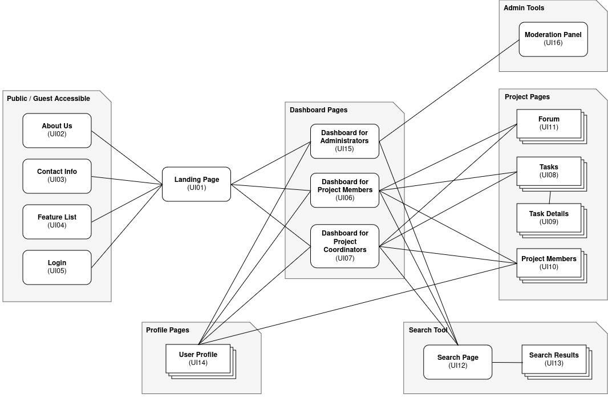
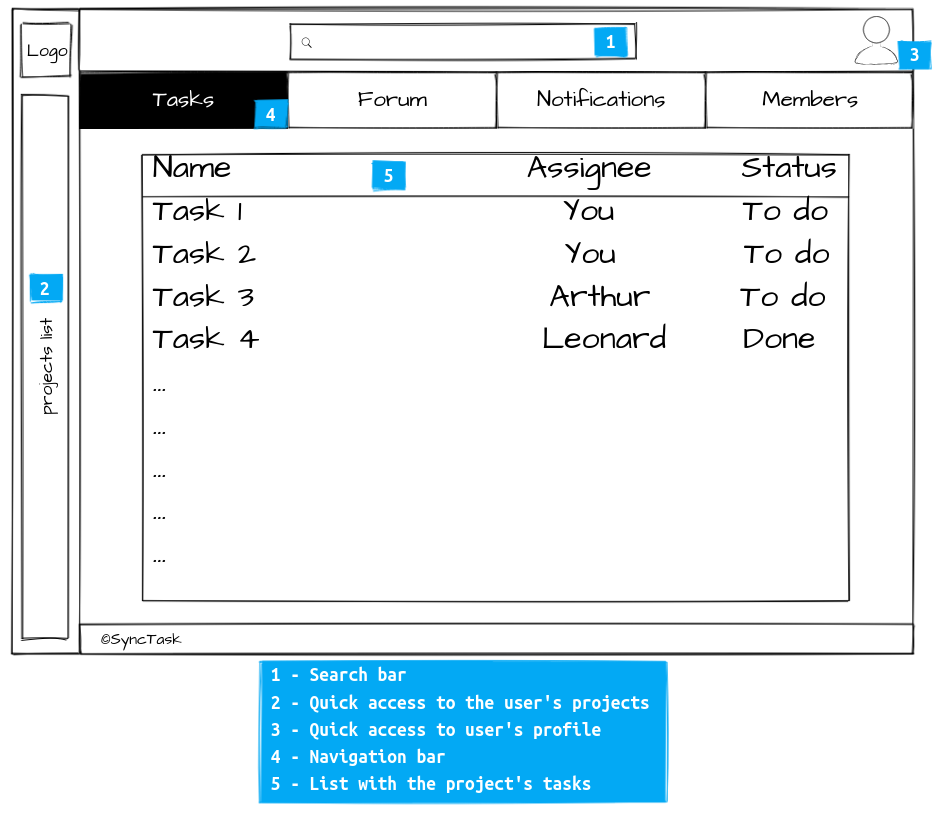
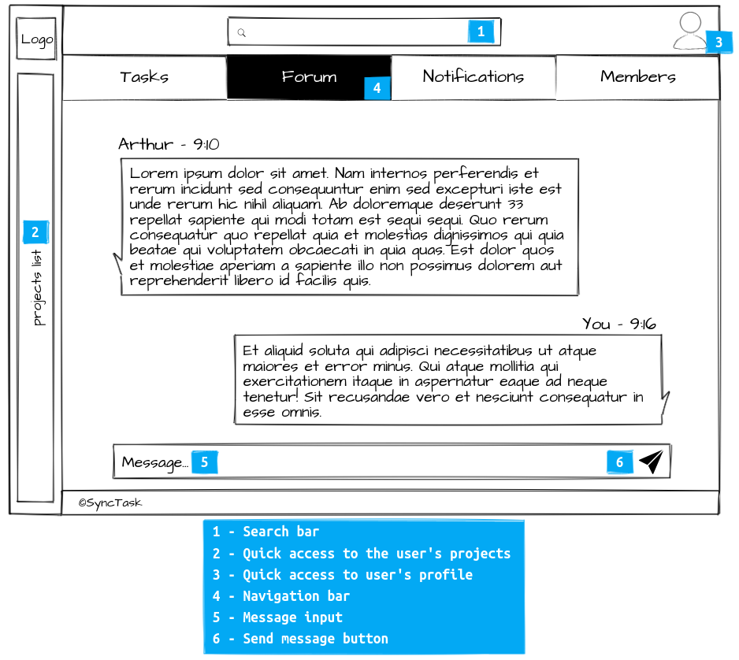

# ER: Requirements Specification Component

SyncTask: Project management done easier, keeping everyone up to date.

## A1: SyncTask

SyncTask is a web app to manage projects in the field of software engineering.

Sometimes, synchronizing the tasks with your team can be a hassle. Many times, the asymmetric delivery of information contributes to the misalignment of the project vision between peers. Well, here is where this is done easier.

SyncTask allows workers to create a list of tasks to be done, providing features for communicating in the context of that task. The coordinators can assign workers to a task that can quickly be searched for with filters for date, assignee, etc. In each task, the workers can share details to keep the others updated about the status of that specific task.

A non-privileged user of the app can contribute to a project as a normal worker but can also be a project coordinator, who manages tasks and workers, including sending invitations to users. There is also the administrator profile, who cannot directly intervene in the project but is privileged, privilege which allows the deletion of projects and tasks, banning users, etc. Every authenticated user can edit their own profile and see the profile of every team member. A guest has access to all public pages about SyncTask (like everybody else), as well as the ability to register and sign in with an email or username and password.

---

## A2: Actors and User stories

This artifact provides details about the features this project will bring and the roles each actor is responsible for. This is a way to document the project's requirements.

### 1. Actors

{width="762" height="1225"}

| Identifier | Description |
|------------|-------------|
| User | A generic user who only has access to public information, such as the About Us page |
| Guest / Visitor | Unauthenticated user that can register and sign in to the platform |
| Authenticated User | A user who has access to his profile and all the projects they are involved in |
| Project Member | An authenticated user that belongs to the project team and can manage, create, and comment on tasks related to said project |
| Project Coordinator | An authenticated user who is responsible for managing the project, including creating invites and managing members permissions |
| Post Author | An authenticated user that belongs to a project and is the author of a comment or post. They can modify or delete a said post. |
| Administrator | An authenticated user that is responsible for the management of projects and users inside the platform and has access to moderation functions |

### 2. User Stories

The following sections describe essential user stories that capture the functional requirements and needs of users within the SyncTask system.

### Functional Requirements

#### User

| Identifier | Name | Priority | Responsible | Description |
|------------|------|----------|-------------|-------------|
| US.001 | Login | High | Pedro Fernandes | As a user, I want to enter my account so that I can access my projects and platform |
| US.004 | Logout | High | Pedro Fernandes | As a user, I want to log out of my account so that I can control when my session is open or not |
| US.005 | Register | High | Pedro Fernandes | As a user, I want to create a new account so that I can start using the platform |
| US.002 | Recover Password | Medium | Pedro Fernandes | As a user, I want to recover my password using my email so that I do not lose access to my account |
| US.003 | Accept Email Invitation | Medium | Guilherme Matos | As a user, I want to accept a project invitation from my email so that I can join and start collaborating with the team |
| US.006 | Modify Password | Low | Pedro Fernandes | As a user, I want to modify my password so that I can keep my account safe |

#### Guest

| Identifier | Name | Priority | Responsible | Description |
|------------|------|----------|-------------|-------------|
| US.101 | About Us Public Page | Medium | João Ferreira | As a guest, I want to access the "About Us" page so that I can learn more about the team and the company behind the product |
| US.102 | Main Features Page | Medium | João Ferreira | As a guest, I want to access the "Main Features" page so that I can learn more about the product before I commit to an account |
| US.103 | Contacts Page | Medium | João Ferreira | As a guest, I want to access the "Contacts" page so that I can talk to the team behind the product in case I have any questions or problems |

#### Authenticated User

| Identifier | Name | Priority | Responsible | Description |
|------------|------|----------|-------------|-------------|
| US.201 | Create Project | High | Duarte Assunção | As an authenticated user, I want to create a new project so that I can organize tasks and collaborate with others |
| US.202 | View My Projects | High | Duarte Assunção | As an authenticated user, I want to view all the projects I’m part of so that I can easily manage my work |
| US.203 | View and Edit my Profile | High | Pedro Fernandes | As an authenticated user, I want to see and modify my public profile, including my name and email, so that everyone has an updated description of who I am |
| US.204 | Profile Picture | Medium | Pedro Fernandes | As an authenticated user, I want to add, modify, and/or remove a picture to my profile so that everyone can recognize me easily on the platform |
| US.205 | Delete Account | Medium | Pedro Fernandes | As an authenticated user, I want to delete my account so that I signal to the platform that this account is no longer being used |
| US.206 | See Pending Notifications | Medium | Duarte Assunção | As an authenticated user, I want to see my pending notifications that I might have missed so that I don't lose track of something |
| US.207 | Mark Project as Favorite | Medium | Duarte Assunção | As an authenticated user, I want to mark a project as a favorite so that I can access it quickly |
| US.208 | Notified for Project Invitation | Medium | João Ferreira | As an authenticated user, I want to be notified when I get invited to a project so that I can accept or decline as fast as possible |
| US.209 | Manage Project Invitation | Low | Duarte Assunção | As an authenticated user, I want to manage project invitations by accepting or declining them so that I can choose the projects I want to participate in |
| US.210 | Appeal for Unblock | Low | Pedro Fernandes | As an authenticated user with their account disabled, I want to have a direct channel of communication with Customer Service so that we can resolve this issue as quickly as possible, if possible |

#### Project Member

| Identifier | Name | Priority | Responsible | Description |
|------------|------|----------|-------------|-------------|
| US.301 | Create Task | High | João Ferreira | As a project member, I want to create tasks so that I can define the work that needs to be done |
| US.302 | Manage Tasks | High | João Ferreira | As a project member, I want to update task details like priority, labels, and due dates so that tasks stay organized and relevant |
| US.303 | View Task Details | High | João Ferreira | As a project member, I want to view task details so that I understand what’s required for each task |
| US.304 | Search Tasks | High | Guilherme Matos | As a project member, I want to search for specific tasks (exact match or full-text) so that I can quickly find what I’m looking for |
| US.305 | Complete an Assigned Task | High | Guilherme Matos | As a project member, I want to mark my assigned tasks as complete so that the team knows they’re done |
| US.306 | Filter Searched Tasks | Medium | Guilherme Matos | As a project member, I want to filter tasks in my search (e.g. assignee, due date, etc.), so that I only find information I find relevant |
| US.307 | Suggest Users to Tasks | Medium | João Ferreira | As a project member, I want to suggest users (namely myself) as assignees to tasks so that I can show the Project Coordinator my intentions and the tasks I am most passionate about |
| US.308 | Comment on Task | Medium | João Ferreira | As a project member, I want to comment on tasks so that I can collaborate with my team and give feedback |
| US.309 | Leave Project | Medium | Duarte Assunção | As a project member, I want to leave a project so that I can stop participating |
| US.310 | View Project Team | Medium | Duarte Assunção | As a project member, I want to view a list of team members so that I know who I’m working with |
| US.311 | View Team Members Profiles | Medium | Pedro Fernandes | As a project member, I want to view team members’ profiles so that I can understand their roles and skills |
| US.312 | Browse the Project Message Forum | Medium | João Ferreira | As a project member, I want to browse the project’s message forum so that I can stay updated on discussions |
| US.313 | Post Message to Project Forum | Medium | João Ferreira | As a project member, I want to post messages to the project forum so that I can share updates or ask questions |
| US.314 | Notified for Completed Task | Medium | Duarte Assunção | As a user, I want to receive notifications when tasks I am involved in are completed so that I stay updated on progress |
| US.315 | Notified for being Assigned to a Task | Medium | Duarte Assunção | As a user, I want to be notified when I am assigned a task so that I can begin working on it |
| US.316 | Notified for Change in Project Coordinator | Medium | Duarte Assunção | As a user, I want to be notified when the project coordinator changes so that I know who’s leading the project |
| US.317 | Order Searched Tasks | Low | Guilherme Matos | As a project member, I want to see the searched tasks ordered by the due date so that I find the most relevant information first |
| US.318 | View Project Timeline | Low | Duarte Assunção | As a project member, I want to view the project timeline so that I can track progress and stay aware of deadlines |

#### Post Author

| Identifier | Name | Priority | Responsible | Description |
|------------|------|----------|-------------|-------------|
| US.401 | Edit Post | Medium | João Ferreira | As a post author, I want to edit Task comments so that I can update or correct information |
| US.402 | Delete Post | Medium | João Ferreira | As a post author, I want to delete my Task comments so that I can remove information that’s no longer relevant |

#### Project Coordinator

| Identifier | Name | Priority | Responsible | Description |
|------------|------|----------|-------------|-------------|
| US.501 | Add User to Project | High | Duarte Assunção | As a project coordinator, I want to add new members to the project so that I can build a complete team |
| US.502 | Assign New Coordinator | Medium | Guilherme Matos | As a project coordinator, I want to assign a new coordinator so that I can transfer leadership to someone else |
| US.503 | Edit Project Details | Medium | Duarte Assunção | As a project coordinator, I want to edit project details so that information stays accurate and up-to-date |
| US.504 | Assign Task to Member | Medium | Guilherme Matos | As a project coordinator, I want to assign tasks to team members so that work is evenly distributed |
| US.505 | Approve or Reject Suggestion for Assignee | Medium | Guilherme Matos | As a project coordinator, I want to see, approve, and/or reject my project members' suggestions for assignees in a given task so that I can ensure everyone is happy with their tasks |
| US.506 | Remove Project Member | Medium | Guilherme Matos | As a project coordinator, I want to remove a project member so that I can adjust the team as needed |
| US.507 | Archive Project | Medium | Guilherme Matos | As a project coordinator, I want to archive a project so that I can close it once it’s complete while keeping the data accessible |
| US.508 | Invite to Project by Email | Medium | Guilherme Matos | As a project coordinator, I want to invite new users to the project by email so that I can easily expand the team |
| US.509 | Notified for Accepted Invitation | Medium | Duarte Assunção | As a project coordinator, I want to be notified when someone accepts my project invitation so that I know when new members join |
| US.510 | Manage Members Permissions | Low | João Ferreira | As a project coordinator, I want to manage team members’ permissions so that I can control their access to project features |

#### Administrator

| Identifier | Name | Priority | Responsible | Description |
|------------|------|----------|-------------|-------------|
| US.601 | See and Search User Accounts | High | Pedro Fernandes | As an administrator, I want to see and search for user accounts so that I can supervise the platform more easily |
| US.605 | Force Edit User Accounts | High | Pedro Fernandes | As an administrator, I want to force edit user accounts so that I can enforce the product's terms and conditions |
| US.606 | Create User Accounts | High | Pedro Fernandes | As an administrator, I want to create new accounts so that I can manage who has access to the platform |
| Us.602 | Block, Delete, and Unblock | Medium | Pedro Fernandes | As an administrator, I want to block and delete bad accounts, as well as unblock accounts per request, so that the product's terms and conditions are enforced |
| US.603 | Browse Projects | Medium | Pedro Fernandes | As an administrator, I want to browse all projects on the platform so that I can monitor activity and maintain oversight |
| US.604 | View Project Details | Medium | Pedro Fernandes | As an administrator, I want to view the details of any project so that I can ensure projects are following platform rules |

### 3. Supplementary Requirements

#### 3.1. Business rules

| Identifier | Name | Description |
|------------|------|-------------|
| BR.101 | Task Completion | Only project members assigned to a task or project coordinators can modify task details |
| BR.102 | Task Assignment | Only the project coordinator can assign a task to project members |
| BR.103 | Comment Availability | Every project member can comment |
| BR.104 | Account Deletion | When a user deletes their account, all shared user data is kept but altered to be anonymous |
| BR.105 | Administrators can't belong to a project | Administrator accounts can't have the role of a Project Member, i.e, they cannot join or participate in projects |
| BR.106 | Valid Timelines | When a task is being created, the due date must be after today, i.e, the day the task is being created |
| BR.107 | Author Comments | The Post Author can comment on their own tasks and/or comments |

#### 3.2. Technical requirements

| Identifier | Name | Description |
|------------|------|-------------|
| **TR.201** | **Real-time feedback** | **The system must support real-time synchronization of tasks between users. SyncTask is a collaborative tool; there is no space for miscommunication due to outdated page renders or browser cache.** |
| **TR.202** | **Accessibility** | **The system must make sure that everyone (with the right permissions) can access the pages, regardless of handicap, operating system, or browser. The developer's computers and needs are diverse, and SyncTask must provide great tooling for everyone** |
| **TR.203** | **Availability** | **The system has a promised availability of 99% in a 24-hour period. SyncTask is used as a professional tool for all time zones and teams, so it cannot afford to have significant downtime.** |
| TR.204 | Scalability | The system must stay operational no matter the number of projects, comments, or accounts. |
| TR.205 | Robustness | The system must have protections for runtime errors |
| TR.206 | Performance | The system should have a response time of 2 seconds at most |

#### 3.3. Restrictions

| Identifier | Name | Description |
|------------|------|-------------|
| RT.301 | Maximum Project Members | A project is limited to 100 members to maintain system performance and effective team management |
| RT.302 | Task limit per project | Each project is capped at 5000 tasks to prevent overwhelming the system or the user interface |
| RT.303 | Data access restriction | Users can only access data for projects they are part of |

---

## A3: Information Architecture

This artifact contains a sitemap and a set of wireframes with the goal of representing how information is structured in each and per page.

### 1. Sitemap

### 2. Wireframes

#### UI08: Tasks for a given project (Dashboard for a Project Member)

#### UI11: Forum for a given project (Dashboard for a Project Member)

---

## Revision history

Changes made to the first submission:

1. \[20/10\] Project vision, user stories and technical requirements were modified based on feedback after the first submission.
2. \[20/11\] Changed A1 title from 'Project Name' to 'SyncTask'.

---

GROUP2423, 20/10/2024

* Duarte Souto Assunção, up202208319@up.pt
* Guilherme Duarte Silva Matos, up202208755@up.pt
* João Vítor da Costa Ferreira, up202208393@up.pt (Editor)
* Pedro Afonso Nunes Fernandes, up202207987@up.pt