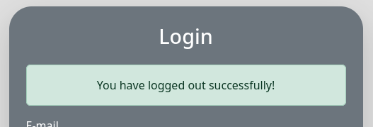
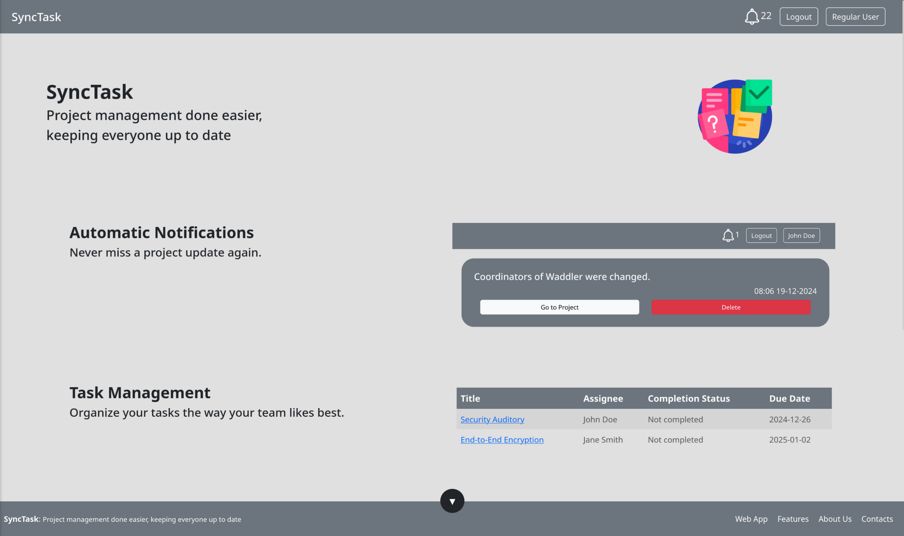

# PA: Product and Presentation

SyncTask: Project management done easier, keeping everyone up to date.

## A9: Product

SyncTask is a web app designed to help small teams manage projects more effectively, ensuring that everyone is on the same page.
This is achieved through notifications across the entire team when a task is completed, the coordinators change, new members are added or tasks are created.

Every user can create or accept an invitation to a project, turning into a project member, which can then complete, comment or suggest assignees to tasks, as well as meeting the team members and the project idea. Project coordinators have the power to mold the project to their team's needs by creating tasks, inviting members, changing coordinators, managing the project's details, and much more. All of this is backed by a team of administrators with the responsibility of managing the entire platform without compromising the privacy for anyone, by blocking users, deleting projects and watching a complete list of all the users and projects inside the database of SyncTask.

### 1. Installation

The final product is available as a Docker image in the [GitLab Container Registry](https://gitlab.up.pt/lbaw/lbaw2425/lbaw24023/container_registry).  
To start the image, connect to the FEUP VPN, login and download the image:

```bash
$ docker login gitlab.up.pt:5050
$ docker run -d --name lbaw24023 -p 8001:80 gitlab.up.pt:5050/lbaw/lbaw2425/lbaw24023
```

The final source code is also available in the [GitLab repository](https://gitlab.up.pt/lbaw/lbaw2425/lbaw24023/-/tree/PA?ref_type=tags).

### 2. Usage

#### 2.1. Administration Credentials

> Administration URL: http://localhost:8001/administrators/dashboard
> \*Note: The administrator is automatically redirected when logged in.

| Email          | Password |
| -------------- | -------- |
| admin@fe.up.pt | password |

#### 2.2. User Credentials

The tailored account has handmade database values, but only has a project and a few tasks, as opposed to the generated account, which was artificially created with dummy data to include lots of database entries.

| Type              | Email            | Password |
| ----------------- | ---------------- | -------- |
| Tailored account  | john@example.com | password |
| Generated account | user@fe.up.pt    | password |

### 3. Application Help

In applicable pages, there is a message box explaining the redirect message after a successful action.
For example, when logging out of the application, the user is redirected to the login page, and a message box appears saying "You have logged out successfully."  


### 4. Input Validation

Every input field from a non-GET HTTP request is validated at a:

- Client level, using HTML input types inside forms.
- Server level, using if checks inside each controller and middlewares.

For example, the route `task.update` (displayed to the user via `task.edit`) is validated in the HTML form via the `type` attribute in the input fields:

```php
<input id="due_date" type="date" name="due_date" value="{{ date('Y-m-d', strtotime($task->due_date)) }}" class="form-control rounded">
```

and inside the controller, every request is validated to ensure type safety and that all id fields correspond to a valid database entry:

```php
public function update(Request $request, $projectId, $taskId) {
    $request->validate([
        'name' => 'nullable|string',
        'description' => 'nullable|string',
        'project_member_id' => 'nullable|exists:project_members,id',
        'due_date' => 'nullable|date',
        'is_completed' => 'nullable|boolean',
    ]);
[...]
```

### 5. Check Accessibility and Usability

- [Accessibility checklist](https://gitlab.up.pt/lbaw/lbaw2425/lbaw24023/-/blob/main/accessibility.pdf?ref_type=heads) from https://ux.sapo.pt/checklists/acessibilidade/
- [Usability checklist](https://gitlab.up.pt/lbaw/lbaw2425/lbaw24023/-/blob/main/usability.pdf?ref_type=heads) from https://ux.sapo.pt/checklists/usabilidade/

### 6. HTML & CSS Validation

The central page of SyncTask is the project page: `project.show`:

- [HTML validation](https://gitlab.up.pt/lbaw/lbaw2425/lbaw24023/-/blob/main/html_validation.pdf?ref_type=heads) from https://validator.w3.org/nu/
- [CSS validation\*](https://gitlab.up.pt/lbaw/lbaw2425/lbaw24023/-/blob/main/css_validation.pdf?ref_type=heads) from https://jigsaw.w3.org/css-validator/
  > \*This project uses Bootstrap for all styling; this report may be inaccurate.

### 7. Revisions to the Project

##### ER: Requirements Specification (#19)

- [x] A1: Project Name
- [ ] A2: Actor UML arrow
- [x] A2: User Stories granularity
- [x] A2: Technical requirements in bold
- [ ] A3: Sitemap inconsistencies
- [ ] A3: Wireframe with breadcrumbs and better footer

##### EBD: Database Specification (#105)

- [x] ProjectIsFavorite in Relational Schema and SQL Script
- [x] A4: TaskAssign and CompletedTask with \*..1 cardinality with Task
- [x] A4: Images are paths to files, not BYTEA
- [x] A6: Generate silver-labelled data
- [x] Optional triggers for notifications
- [x] A4: Restrict size of forum messages (10k chars, for example)
- [x] A5: Turn the 5 notification tables into 2 using enums
- [x] Length limit added to a forum message (10k chars).
- [ ] A6: Multi-fields attributes for full-text search indices

##### EAP: Architecture Specification and Prototype (#117)

- [x] Policies in the form of middlewares
- [x] Views capable of handling a NULL user_id
- [ ] New trigger to delete related items when deleting a task
- [ ] Responsible for each User Story missing from wiki

### 8. Implementation Details

#### 8.1. Libraries Used

- Bootstrap for CSS development:  
  All CSS styling is done using Bootstrap classes in the HTML files. See the [sidebar component](https://gitlab.up.pt/lbaw/lbaw2425/lbaw24023/-/blob/main/resources/views/components/sidebar.blade.php?ref_type=heads) as an example.
- laravel-chartjs for project statistics available for project coordinators:
  In the `project.show` page, a project coordinator can see charts about the percentage of completed tasks and the contributions of each member to the project. See the [`statistics.js` file](https://gitlab.up.pt/lbaw/lbaw2425/lbaw24023/-/blob/charts/public/js/statistics.js?ref_type=heads) for the implementation.

#### 8.2 User Stories

| US ID  | Name                                       | Module              | Priority | Team Members        | State |
| ------ | ------------------------------------------ | ------------------- | -------- | ------------------- | ----- |
| US.001 | Login                                      | User                | High     | **Pedro Fernandes** | 100%  |
| US.004 | Logout                                     | User                | High     | **Pedro Fernandes** | 100%  |
| US.005 | Register                                   | User                | High     | **Pedro Fernandes** | 100%  |
| US.203 | View and Edit my Profile                   | Authenticated User  | High     | **Pedro Fernandes** | 100%  |
| US.606 | Create User Accounts                       | Administrator       | High     | **Pedro Fernandes** | 100%  |
| US.605 | Force Edit User Accounts                   | Administrator       | High     | **Pedro Fernandes** | 100%  |
| US.301 | Create Task                                | Project Member      | High     | **João Ferreira**   | 100%  |
| US.302 | Manage Tasks                               | Project Member      | High     | **João Ferreira**   | 100%  |
| US.303 | View Task Details                          | Project Member      | High     | **João Ferreira**   | 100%  |
| US.305 | Complete an Assigned Task                  | Project Member      | High     | **Guilherme Matos** | 100%  |
| US.304 | Search Tasks                               | Project Member      | High     | **Guilherme Matos** | 100%  |
| US.601 | See and Search User Accounts               | Administrator       | High     | **Pedro Fernandes** | 100%  |
| US.501 | Add User to Project                        | Project Coordinator | High     | **Duarte Assunção** | 100%  |
| US.202 | View My Projects                           | Authenticated User  | High     | **Duarte Assunção** | 100%  |
| US.201 | Create Project                             | Authenticated User  | High     | **Duarte Assunção** | 100%  |
| US.509 | Notified for Accepted Invitation           | Project Coordinator | Medium   | **Duarte Assunção** | 100%  |
| US.316 | Notified for Change in Project Coordinator | Project Member      | Medium   | **Duarte Assunção** | 100%  |
| US.315 | Notified for being Assigned to a Task      | Project Member      | Medium   | **Duarte Assunção** | 100%  |
| US.314 | Notified for Completed Task                | Project Member      | Medium   | **Duarte Assunção** | 100%  |
| US.310 | View Project Team                          | Project Member      | Medium   | **Duarte Assunção** | 100%  |
| US.206 | See Pending Notifications                  | Authenticated User  | Medium   | **Duarte Assunção** | 100%  |
| US.208 | Notified for Project Invitation            | Authenticated User  | Medium   | **João Ferreira**   | 100%  |
| US.504 | Assign Task to Member                      | Project Coordinator | Medium   | **Guilherme Matos** | 100%  |
| US.306 | Filter Searched Tasks                      | Project Member      | Medium   | **Guilherme Matos** | 100%  |
| US.209 | Manage Project Invitation                  | Authenticated User  | Low      | **Duarte Assunção** | 100%  |
| US.603 | Browse Projects                            | Administrator       | Medium   | **Pedro Fernandes** | 100%  |
| US.604 | View Project Details                       | Administrator       | Medium   | **Pedro Fernandes** | 100%  |
| US.307 | Suggest Users to Tasks                     | Project Member      | Medium   | **João Ferreira**   | 100%  |
| US.505 | Approve or Reject Suggestion for Assignee  | Project Coordinator | Medium   | **Guilherme Matos** | 100%  |
| US.311 | View Team Members Profiles                 | Project Member      | Medium   | **Pedro Fernandes** | 100%  |
| US.006 | Modify Password                            | User                | Low      | **Pedro Fernandes** | 100%  |
| US.401 | Edit Post                                  | Post Author         | Medium   | **João Ferreira**   | 100%  |
| US.402 | Delete Post                                | Post Author         | Medium   | **João Ferreira**   | 100%  |
| US.308 | Comment on Task                            | Project Member      | Medium   | **João Ferreira**   | 100%  |
| US.003 | Accept Email Invitation                    | User                | Medium   | **Guilherme Matos** | 100%  |
| US.204 | Profile Picture                            | Authenticated User  | Medium   | **Pedro Fernandes** | 100%  |
| US.103 | Contacts Page                              | Guest               | Medium   | **João Ferreira**   | 100%  |
| US.102 | Main Features Page                         | Guest               | Medium   | **João Ferreira**   | 100%  |
| US.101 | About Us Public Page                       | Guest               | Medium   | **João Ferreira**   | 100%  |
| US.502 | Assign New Coordinator                     | Project Coordinator | Medium   | **Guilherme Matos** | 100%  |
| US.503 | Edit Project Details                       | Project Coordinator | Medium   | **Duarte Assunção** | 100%  |
| US.309 | Leave Project                              | Project Member      | Medium   | **Duarte Assunção** | 100%  |
| US.207 | Mark Project as Favorite                   | Authenticated User  | Medium   | **Duarte Assunção** | 100%  |
| US.002 | Recover Password                           | User                | Medium   | **Pedro Fernandes** | 100%  |
| US.511 | See Project Statistics                     | Project Coordinator | Low      | **Duarte Assunção** | 100%  |
| US.510 | Manage Members Permissions                 | Project Coordinator | Low      | **Guilherme Matos** | 100%  |
| US.506 | Remove Project Member                      | Project Coordinator | Medium   | **Guilherme Matos** | 100%  |
| US.205 | Delete Account                             | Authenticated User  | Medium   | **Pedro Fernandes**, João Ferreira | 100%    |
| US.507 | Archive Project                            | Project Coordinator | Medium   | **Guilherme Matos** | 100%  |
| US.602 | Block, Delete, and Unblock                 | Administrator       | Medium   | **Pedro Fernandes** | 66%   |
| US.210 | Appeal for Unblock                         | Authenticated User  | Low      | **Pedro Fernandes** | 0%    |
| US.312 | Browse the Project Message Forum           | Project Member      | Medium   | **João Ferreira**   | 0%    |
| US.313 | Post Message to Project Forum              | Project Member      | Medium   | **João Ferreira**   | 0%    |
| US.317 | Order Searched Tasks                       | Project Member      | Low      | **Guilherme Matos** | 0%    |
| US.318 | View Project Timeline                      | Project Member      | Low      | **Duarte Assunção** | 0%    |
| US.508 | Invite to Project by Email                 | Project Coordinator | Medium   | **Guilherme Matos** | 0%    |

---

## A10: Presentation

### 1. Product presentation

SyncTask is a web app designed to help small teams manage projects more effectively, ensuring that everyone is on the same page.
This is achieved through notifications across the entire team when a task is completed, the coordinators change, new members are added or tasks are created.

Every user can create or accept an invitation to a project, turning into a project member, which can then complete, comment or suggest assignees to tasks, as well as meeting the team members and the project idea. Project coordinators have the power to mold the project to their team's needs by creating tasks, inviting members, changing coordinators, managing the project's details, and much more. All of this is backed by a team of administrators with the responsibility of managing the entire platform without compromising the privacy for anyone, by blocking users, deleting projects and watching a complete list of all the users and projects inside the database of SyncTask.

### 2. Video presentation



The video presentation can be found in the [Moodle submission](https://moodle2425.up.pt/mod/assign/view.php?id=47587).

---

## Revision history

> This is the first and last submission.

---

GROUP2423, 22/12/2024

- Duarte Souto Assunção, up202208319@up.pt
- Guilherme Duarte Silva Matos, up202208755@up.pt
- João Vítor da Costa Ferreira, up202208393@up.pt (Editor)
- Pedro Afonso Nunes Fernandes, up202207987@up.pt
