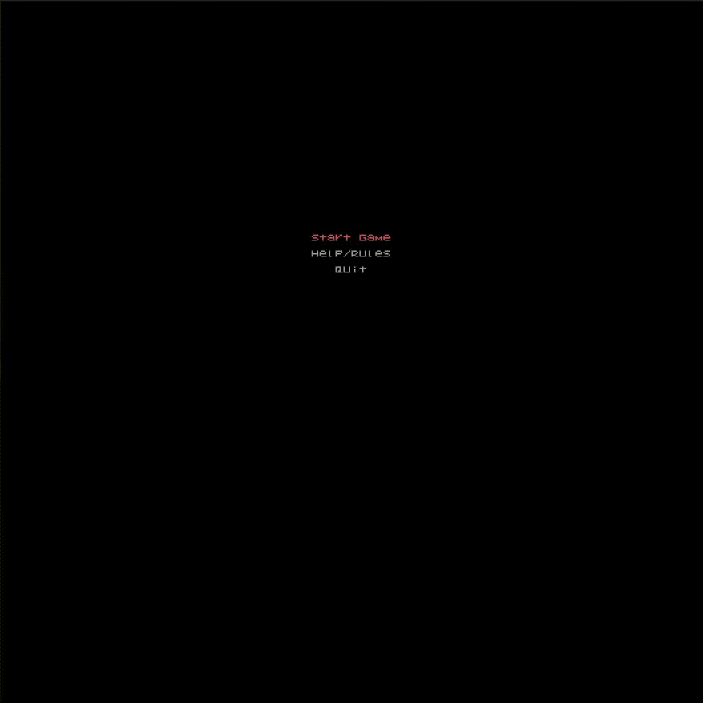

## LDTS_02_08 - Chess

A recreation of the popular game of chess in a terminal interface.  
Two local players play against each other by moving different pieces in a board with the objective of capturing the opponent's king.
Each piece has a different behaviour and can only move in a certain way, but pawns can be upgraded to other pieces if they reach the other side of the board.
This game requires a strategic mindset, but also speed, because each player has a limited amount of time to make their move.

> [!NOTE]
> This project will try to recreate a game of chess, including all of its rules and mechanics.
> For more information on the rules of chess, please visit [this link](https://en.wikipedia.org/wiki/Rules_of_chess).

This project was developed for the LDTS course of 2023/2024 by:
- Duarte Souto Assunção (up202208319@up.pt)
- Guilherme Duarte Silva Matos (up202208755@up.pt)
- João Vítor da Costa Ferreira (up202208393@up.pt)

---

- [Implemented Features](docs/implementedFeatures/implementedFeatures.md)
- [Planned Features](docs/plannedFeatures/plannedFeatures.md)
- [Design](docs/design/design.md)
- [Code Smells](docs/codeSmells/codeSmells.md)
- [Testing](docs/testing/testing.md)

---

### SELF-EVALUATION
Every member of the group contributed equally to the project, in their own way.  
For more details, see the commit history of the project.

- Duarte Assunção | 1/3
- Guilherme Matos | 1/3
- João Ferreira   | 1/3

