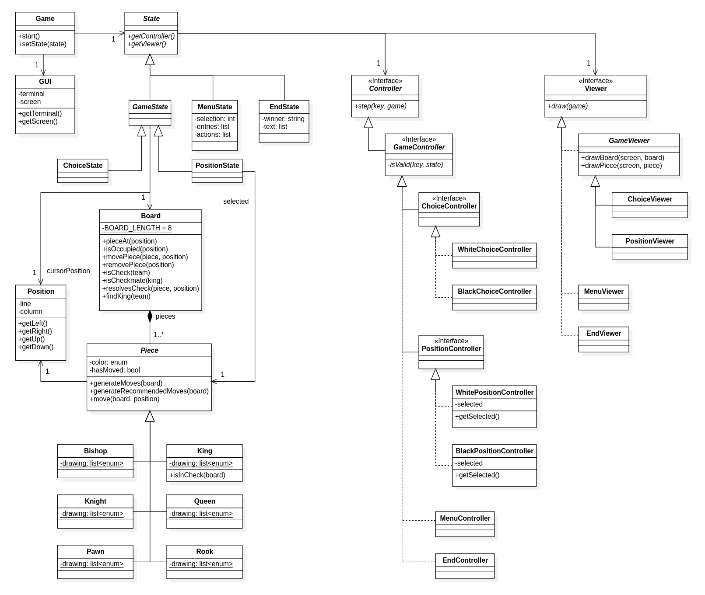

## Design
The following UML diagram shows the design of the entire project:

This design is the result of all the decisions made to solve the following problems:

---

### The same keys represent different actions, depending on the context
**Problem in Context**  
During the whole execution of the program, the user will be encountering different ways to
interact with the application. For example, in the menu, the user can press the up or down
arrow keys to navigate through the options, but when the user is playing the game, the same
keys will be used to move the cursor around the board.

**The Pattern**  
The **State** pattern is used to solve this problem, because it allows the inputs to be 
interpreted differently depending on the current state of the application, including if the
user is in the menu or playing the game.

**Implementation**  
The following classes are involved in this pattern:
- [State](../../src/main/java/com/project/l02gr08/state/State.java)
- [GameState](../../src/main/java/com/project/l02gr08/state/GameState.java)
- [MenuState](../../src/main/java/com/project/l02gr08/state/MenuState.java)
- [EndState](../../src/main/java/com/project/l02gr08/state/EndState.java)

**Consequences**  
This pattern presents the following advantages:
- Avoids the use of if statements or switch cases to see the current context and act accordingly;
- The structure of the code makes more explicit the distinction between the menu and the game;

---

### How to select a valid piece to move
**Problem in Context**  
Inside a terminal, is impossible to select and move a piece using a mouse, so the idea is to
use the arrow keys to move an artificial cursor around the board. The user will first need to
select a piece to move, and then select a valid position to move it to. The mayor issue here
is that the game, especially the controllers, must be able to know in which logical state the 
user is in:
- *WhiteChoice*: The white player is selecting a piece to move;
- *WhitePosition*: The white player is selecting a position to move the selected piece into;
- *BlackChoice*: The black player is selecting a piece to move;
- *BlackPosition*: The black player is selecting a position to move the selected piece into.

**The Pattern**  
The **Strategy** pattern resolves this issue, by having four different strategies that implement 
`GameController`. In this way, this state will be able to change its controller depending on the 
current logical state of the game.

**Implementation**  
This pattern is implemented in the following classes:
- [GameController](../../src/main/java/com/project/l02gr08/controller/GameController.java)
- [WhiteChoiceController](../../src/main/java/com/project/l02gr08/controller/WhiteChoiceController.java)
- [WhitePositionController](../../src/main/java/com/project/l02gr08/controller/WhitePositionController.java)
- [BlackChoiceController](../../src/main/java/com/project/l02gr08/controller/BlackChoiceController.java)
- [BlackPositionController](../../src/main/java/com/project/l02gr08/controller/BlackPositionController.java)

**Consequences**  
This pattern is useful inside of this project because:
- Avoids unnecessary if statements and long functions to take care of these logical states;
- It is more explicit the design decisions regarding the interaction with the user;

---

It is also worth noting the architectural design of this project.  
Since the application is dealing with user input and a terminal interface, the MVC pattern
(Model, View, Controller) is the best choice to keep the code clean and organized.  
In this project:
- The [Model](../../src/main/java/com/project/l02gr08/model) is owner of all the data 
associated with the state and is where all the logic is implemented;
- The [View](../../src/main/java/com/project/l02gr08/viewer) has the responsibility of 
displaying the state of the application to the user, which will need to be done every time 
the user presses a key;
- The [Controller](../../src/main/java/com/project/l02gr08/controller) is the one that 
receives the user input and calls the appropriate methods in the model.
