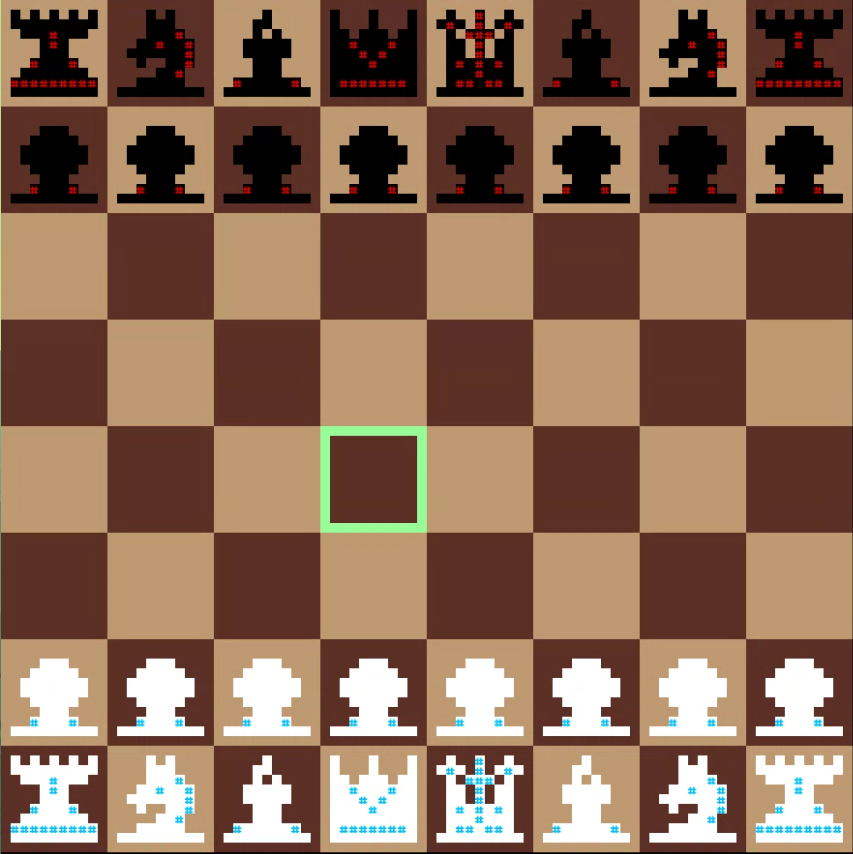
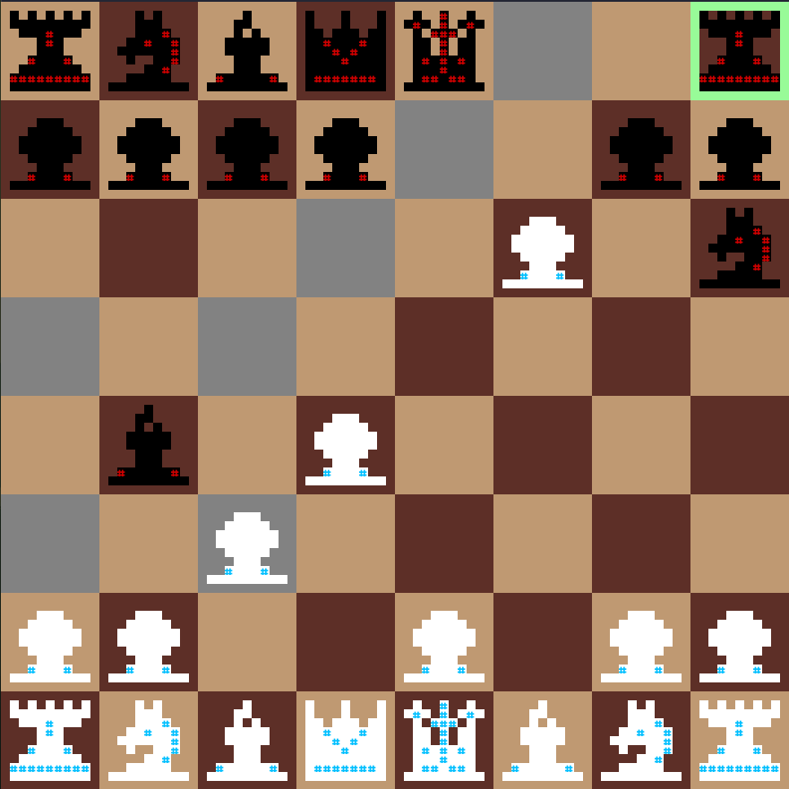
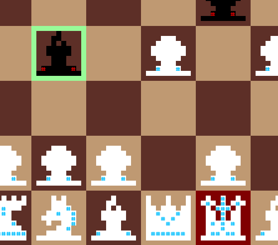
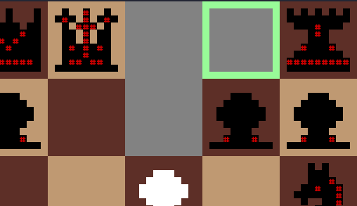

## Implemented Features
- **Board**  
  Using a self-made square font (LeCreme), we print the board, the pieces and the cursor in the terminal.
  The cursor can be moved using the arrow keys and the pieces can be selected using the enter key.  
    

- **Movement of pieces** - Each piece has its own movement rules:
  > - **Pawn** - Can move one square forward, or two if it is the first move.
  > - **Rook** - Can move horizontally or vertically;
  > - **Knight** - Can move in an L shape;
  > - **Bishop** - Can move diagonally;
  > - **Queen** - Can move horizontally, vertically or diagonally;
  > - **King** - Can move one square in any direction.

- **Capture** - A piece can capture another piece if it moves to the square where the other piece is.
  A pawn can only capture a piece that is in a diagonal square in front of it.

- **Movement selection** - The user can select a piece to move, and then select a valid position to
  move it to. The game will only allow the user to select a valid piece and a valid position that 
  does not put the king in check.
  

- **Check warning** - The board will show a warning if the king is being threatened by an enemy piece.
    

- **Checkmate detection** - The game will end automatically if the king is being threatened and there
  is no way to escape from the threat.

- **Castling** - If the king and a rook have not moved yet, and there are no pieces between them, the
  king can move two squares towards the rook, and the rook will move to the other side of the king.  
  

- **Pawns promotion** - If a pawn reaches the other side of the board, it will be promoted to another
  piece of the player's choice.